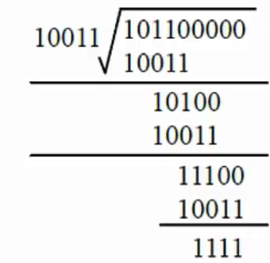
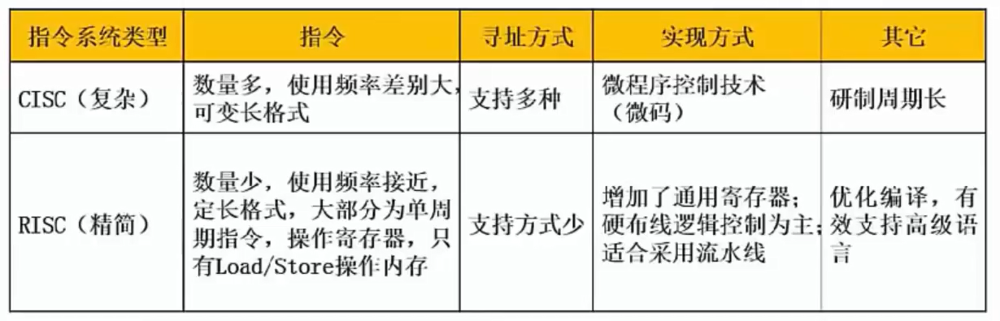
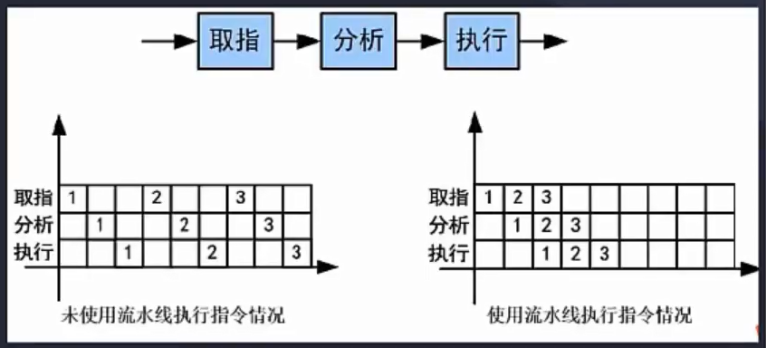
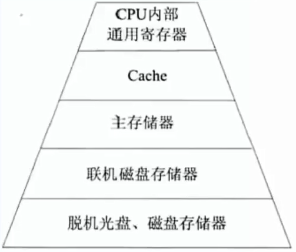
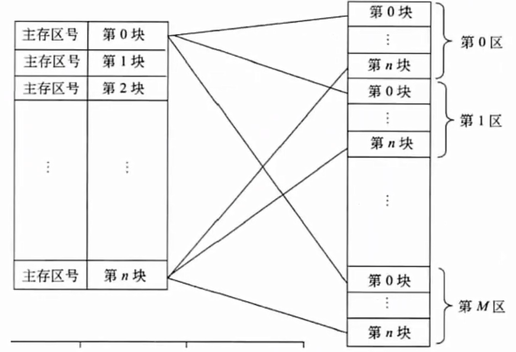
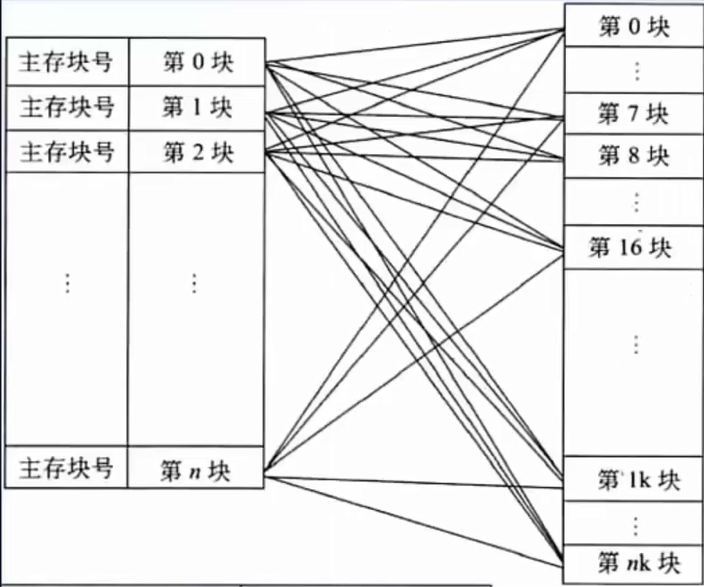

# 计算机硬件

- [计算机硬件](#计算机硬件)
  - [整体情况](#整体情况)
  - [硬件组成](#硬件组成)
  - [校验码](#校验码)
  - [指令系统](#指令系统)
  - [存储系统](#存储系统)
  - [输入/输出技术](#输入输出技术)
  - [总线结构](#总线结构)

## 整体情况
18年之前必考3-5分，19-21年没考过，22年真题考过磁盘调度，根据趋势，以后考的概率很小。

## 硬件组成

计算机的**基本硬件系统**由运算器、控制器、存储器、输入设备和输出设备5大部件组成：
- 运算器、控制器等部件被集成在一起统称为**中央处理单元**(CentralProcessingUnit,CPU)。CPU是硬件系统的核心,用于数据的加工处理,能完成各种算术逻辑运算及控制功能。
- 存储器是计算机系统中的记忆设备,分为**内部存储器和外部存储器**。前者速度高、容量小,一般用于临时存放程序、数据及中间结果。而后者容量大、速度慢,可以长期保存程序和数据。
- 输入设备和输出设备合称为**外部设备**(简称外设),输入设备用于输入原始数据及各种命令,而输出设备则用于输出计算机运行的结果。

**CPU的功能**:

(1)**程序控制**。CPU通过执行指令来控制程序的执行顺序,这是CPU的重要功能。

(2)**操作控制**。一条指令功能的实现需要若干操作信号配合来完成,CPU产生每
条指令的操作信号并将操作信号送往对应的部件,控制相应的部件按指令的功力能要求进行操作。

(3)**时间控制**。CPU对各种操作进行时间上的控制,即指令执行过程中操作信号的出现时间、持续时间及出现的时间顺序都需要进行严格控制。

(4)**数据处理**。CPU通过对数据进行算术运算及逻辑运算等方式进行加工处理,数据加工处理的结果被人们所利用。所以,对数据的加工处理也是CPU最根本的任务。

此外,CPU还需要**对系统内部和外部的中断(异常)做出响应,进行相应的处理**。

**CPU的组成**:

> （⭐掌握哪些寄存器或者部件属于运算器或者控制器，以及寄存器作用）

CPU主要由运算器、控制器、寄存器组和内部总线等部件组成。
- 运算器:由**算术逻辑单元ALU**(实现对数据的算术和逻辑运算)、**累加寄存器AC**(运算结果或源操作数的存放区)、**数据缓冲寄存器DR**(暂时存放内存的指令或数据)、和**状态条件寄存器PSW**(保存指令运行结果的条件码内容,如溢出标志等)组成。执行所有的算术运算,如加减乘除等;执行用所有的逻辑运算并进行逻辑测试,如与、或、非、比较等。
- 控制器:由**指令寄存器IR**(暂存CPU执行指令)、**程序计数器PC**(存放指令执行地址)、**地址寄存器AR**(保存当前CPU所访问的内存地址)、**指令译码器ID**(分析指令操作码)等组成。控制整个CPU的工作,最为重要。
  > 最重要的是PC程序计数器。计算机执行指令时，首先去PC中找到下一个要执行的指令地址，之后去主存/内存中去把指令给取出来，存放在IR指令寄存器中。保存指令之后要对指令进行分析，使用ID指令译码器进行分析。

CPU依据**指令周期的不同阶段来区分二进制的指令和数据**,因为在指令周期
的不同阶段,指令会命令CPU分别去取指令或者数据。
> CPU指令执行过程，取址（取出指令）->分析->执行(过程中才需要取数据)

## 校验码
> 奇偶校验码、循环冗余校验码(CRC)、海明校验码

**基础概念**
码距:就单个编码A:00而言,其码距为1,因为其只需要改变一位就变成另一个编码。在两个编码中,从A码到B码转换所需要改变的位数称你为码距,如A:00要转换为B:11,码距为2。一般来说,码距越大,越利于纠错借和检错。
> 校验的原理就是码距。

**奇偶校验码**

概念：在编码中**增加1位校验位**来使编码中1的个数为奇数(奇校验)或者偶数(偶校验),从而**使码距变为2**。例如:
> 为什么码距为2？因为有1位出错的，还有另1位是由于1位出错而导致的校验位也发送改变。

奇校验:编码中,含有**奇数个1**,发送给接收方,接收方收到后,会计算收到的
编码有多少个1,如果是奇数个,则无误,是偶数个,则有误。

偶校验同理,只是编码中有**偶数个1**,由上述,**奇偶校验只能检1位错,并且无法纠错。**
> 比如，原始信息位为101110，如果采用奇校验，需要保证有奇数个1，则需要添加1位1，最终为1011101;如果采用偶校验，需要保证有偶数个1，本身已满足条件，则添加1位0，最终为1011100。发送方将最终的信息发送给接收方，接收方采用同样的校验方法进行检查数据是否有错误。

**CRC校验码**

CRC**只能检错,不能纠错**。使用CRC编码,需要先约定一个生成多项式G(x)。生成多项式的最高位和最低位必须是1。假设原始信息有m位,则对应多项式M(x)。**生成校验码思想就是在原始信息位后追加若干校验位,使得追加的信息能被G(x)整除。接收方接收到带校验位的信息,然后用G(x)整除。余数为0,则没有错误;反之则发生错误。**
> 一定能检查出错误，而不限制几位错，但不能检查出来错几位，只是知道有错。

例:假设原始信息串为10110,CRC的生成多项式为G(x)=x^4+x+11,求CRC校验码。

(1)**在原始信息位后面添0**,假设**生成多项式的阶为r,则在原始治信息位后添加个0**,本题中,G(x)阶为4,则在原始信息串后加4个0,得到的新串为1011005000作为被除数。

(2)由**多项式得到除数**,多项中**x的幂指数存在的位置1,不存在的位置0。**本题中,x的幂指数为0,1,4的变量都存在,而幂指数为2,3的不存在,因此得到串10011。

(3)**生成CRC校验码**,将**前两步得出的被除数和除数进行模2除法运算**(即不进位也不借位的除法运算)。除法过程如下图所示。
> 模2运算也就是异或运算，即同0非1。

得到余数1111。(也就是校验位。)

⭐注意:**余数不足r,则余数左边用若干个0补齐**。如求得余数为111,r=4,则补两个0得到0011。

(4)**生成最终发送信息串,将余数添加到原始信息后。**上例中,原始信息为10110,添加余数1111后,结果为101101111。发送方将此数据发送给接收方。

(5)**接收方进行校验。**接收方的CRC校验过程与生成过程类似,接收方接收了带校验和的帧后,用多项式G(x)来除。余数为0,则表示信息无错;否则要求发送方进行重传。
注意:**收发信息双方需使用相同的生成多项式。**

## 指令系统

- 计算机指令的组成:一条指令由操作码和操作数两部分组成,操作码决定要完成的操作,操作数指参加运算的数据及其所在的单元地址。
  - 在计算机中,操作要求和操作数地址都由二进制数码表示,分别称作操作码和地址码,整条指令以二进制编码的形式存放在存储器中。
- 计算机指令执行过程:**取指令--分析指令--执行指令**三个步骤,首先将程序计数器PC中的指令地址取出,送入地址总线,CPU依据指令地址去内存中取出指令内容存入指令寄存器IR;而后由指令译码器进行分析,分析指令操作码;最后执行指令,取出指令执行所需的源操作数。

- 指令寻址方式
  - **顺序寻址方式**:当执行一段程序时,是一条指令接着一条指令地顺序执行。
  - **跳跃寻址方式**:指下一条指令的地址码不是由程序计数器给出,而是由本条指令直接给出。程序跳跃后,按新的指令地址开始顺序执行。因此,程序计数器的内容也必须相应改变,以便及时跟踪新的指令地址。

- 指令操作数的寻址方式
  - **立即寻址方式**:指令的地址码字段指出的不是地址,而是操作数本身。
  - **直接寻址方式**:在指令的地址字段中直接指出操作数在主存中的地址:
  - **间接寻址方式**:指令地址码字段所指向的存储单元中存储的是操作数的地址t。
  - **寄存器寻址方式**:指令中的地址码是寄存器的编号。
  - **基址寻址方式**:将基址寄存器的内容加上指令中的形式地址而形成操作数的有效地址,其优点是可以扩大寻址能力。
  - **变址寻址方式**:变址寻址方式计算有效地址的方法与基址寻址方式很相似,它是将变址寄存器的内容加上指令中的形式地址而形成操作数的有效地址

- 两种指令系统
  - CISC是**复杂指令系统**,兼容性强,指令繁多、长度可变,由微程序实现;
  - RISC是**精简指令系统**,指令少,使用频率接近,主要依靠硬件实现(通用寄存器、硬布线逻辑控制)。

具体区别如下:

- **流水线**

指令流水线原理:将**指令分成不同段,每段由不同的部分去处理**,因此可以产生叠加的效果,所有的部件去处理指令的不同段

RISC中的流水线技术:

**(1)超流水线(Super Pipe Line)技术**。它通过细化流水、增加级数和提高主频,使得在每个机器周期内能完成一个甚至两个浮点操作。其实质是**以时间换取空间。**

**(2)超标量(Super Scalar)技术**。它通过内装多条流水线来同时执行多个处理,其时钟频率虽然与一般流水接近,却有更小的CPI。其实质是**以空间换取时间**。

**(3)超长指令字(Very Long Instruction Word,VLIW)技术**。VLIW和超标量都是20世纪80年代出现的概念,其共同点是要同时执行多条指令,其不同在于超标量依靠硬件来实现并行处理的调度,VLIW则充分**发挥软件的作用**,而使硬件简化,性能提高。

**流水线时间计算**（记住）

**流水线周期**:指令分成不同执行段,其中执行时间最长的段为流水线周期。

**流水线执行时间**:1条指令总执行时间+(总指令条数-1)*流水线周期期。

**流水线吞吐率计算**:吞吐率即单位时间内执行的指令条数。
- **公式:指令条数/流水线执行时间。**

**流水线的加速比计算**:加速比即使用流水线后的效率提升度,即即比不使用流水线快了多少倍,越高表明流水线效率越高,

- **公式:不使用流水线执行时间/使用流水线执行时间。**

## 存储系统

计算机采用分级存储体系的主要目的是为了解决存储容量、成本和速度之间的矛盾问题。

- 两级存储:Cache-主存、主存-辅存(虚拟存储体系)。
- **局部性原理**:总的来说,在CPU运行时,所访问的数据会趋向于一个较小的局部空间地址内,包括下面两个方面:

  - 时间局部性原理:如果一个数据项正在被访问,那么在近期它限可能会被
再次访问,即**在相邻的时间里会访问同一个数据项**。

  - 空间局部性原理:在最近的将来会用到的数据的地址和现在正在访问的数
据地址很可能是相近的,即**相邻的空间地址会被连续访问**。

- 高速缓存Cache用来存储当前**最活跃的程序和数据,直接与CPU交互,位于CPU和主存之间**,容量小,速度为内存的5-10倍,由半导体材料构成。其内容是主存内存的副本拷贝,对于程序员来说是透明的。

- Cache由**控制部分和存储器**组成,存储器存储数据,控制部分判断CPU要访问的数据是否在Cache中,在则命中,不在则依据一定的算法从主存中替换。

**地址映射**:在CPU工作时,**送出的是主存单元的地址,而应从Cache存储器中读/写信息。**这就需要**将主存地址转换为Cache存储器地址**,这种地址的转换称为地址映像,由**硬件自动完成映射**,分为下列三种方法:

  - 直接映像:将**Cache存储器等分成块,主存也等分成块并编号**。主存中的块与Cache中的块的对应关系是固定的,也即二者块号相同才能命中。地址变换简单但不灵活,容易造成资源浪费。(如图所示)
  

  - 全相联映像:同样都等分成块并编号。**主存中任意一块都与Cache中任意一块对应。**因此**可以随意调入Cache任意位置**,但地址变换复杂,速度较慢。因为主存可以随意调入Cache任意块,只有当Cache满了才会发生块冲突,**是最不容易发生块冲突的映像方式。**
  

  - 组组相连映像:**前面两种方式的结合**,将Cache存储器先分块再分组,主存也同样先分块再分组,**组间采用直接映像,即主存中组号与Cache中组号相同的组才能命中,但是组内全相联映像,也即组号相同的两个组内的所有块可以任意调换**。

**替换算法**的目标就是**使Cache获得尽可能高的命中率**。常用算法有如下几种:

(1)**随机替换算法**。就是用随机数发生器产生一个要替换的块号,将该块替换出去。

(2)**先进先出算法**。就是将最先进入Cache的信息块替换出去。

(3)**近期最少使用算法**。这种方法是将近期最少使用的Cache中的信息块替换出去。

(4)**优化替换算法**。这种方法必须先执行一次程序,统计Cache的替换情况。有了这样的先验信息,在第二次执行该程序时便可以用最有效的方式来替换

**命中率及平均时间**

Cache有一个命中率的概念,即**当CPU所访问的数据在Cache中的,命中,直接从Cache中读取数据**,设读取一次Cache时间为1ns,若CPU访问的数据**不在Cache中,则需要从内存中读取**,设读取一次内存的时间为1000ns,若在0CPU多次读取数据过程中,有90%命中Cache,则CPU读取一次的平均时间为(90%*1+10%*1000)ns

## 输入/输出技术

## 总线结构
