# 操作系统

- [操作系统](#操作系统)
  - [整体情况](#整体情况)
  - [进程管理](#进程管理)
    - [操作系统概述](#操作系统概述)
    - [进程组成和状态](#进程组成和状态)
    - [前趋图](#前趋图)
    - [进程资源图](#进程资源图)
    - [进程同步和互斥](#进程同步和互斥)
    - [进程调度](#进程调度)
    - [死锁](#死锁)
    - [线程](#线程)
  - [存储管理](#存储管理)
    - [分区存储管理](#分区存储管理)
    - [分页存储管理](#分页存储管理)
    - [分段存储管理](#分段存储管理)
    - [段页式存储管理](#段页式存储管理)
  - [设备管理](#设备管理)
    - [设备管理概述](#设备管理概述)
    - [I/O软件](#io软件)
    - [设备管理技术](#设备管理技术)
  - [文件管理](#文件管理)
    - [文件管理概述](#文件管理概述)
    - [索引文件结构](#索引文件结构)
    - [文件目录](#文件目录)
    - [文件存储空间管理](#文件存储空间管理)

## 整体情况
每年都考3-5分左右。

## 进程管理

### 操作系统概述
操作系统定义:能有效地组织和管理系统中的各种软/硬件资源,合理地组织计算机系统工作流程,控制程序的执行,并且向用户提供一个良好的工作昨环境和友好的接口。

操作系统有三个**重要的作用**:
- 第一,管理计算机中运行的程序和分配各种软硬件资源;
- 第二,为用户提供友善的人机界面。
- 第三,为应用程序的开发和运行提供一个高效率的平台。

操作系统的4个特征是**并发性、共享性、虚拟性和不确定性（异步性）**。

**操作系统的功能:**
- (1)**进程管理**。实质上是对处理机的执行"时间"进行管理,采用多道程序等技术将CPU的时间合理地分配给每个任务,主要包括进程控制、进程同步、进程通信和进程调度。
- (2)**文件管理**。主要包括文件存储空间管理、目录管理、文件的读/写管理和存取控制。
- (3)**存储管理**。存储管理是对主存储器"空间"进行管理,主要包括存储分配与回收、存储保护、地址映射(变换)和主存扩充。
- (4)**设备管理**。实质是对硬件设备的管理,包括对输入/输出设备的分配配启动、完成和回收。
- (5)**作业管理**。包括任务、界面管理、人机交互、图形界面、语音控制和虚拟现实等。

操作系统的分类:
- **批处理操作系统**:单道批处理和多道批处理(主机与外设可并行)。
- **分时操作系统**:一个计算机系统与多个终端设备连接。将CPU的工作时间划分为许多很短的时间片,轮流为各个终端的用户服务。
- **实时操作系统**:实时是指计算机对于外来信息能够以足够快的速度进进行处理并在被控对象允许的时间范围内做出快速反应。实时系统对交互能力要求不高,但要求可靠性有保障。
- **网络操作系统**:是使联网计算机能方便而有效地共享网络资源,为网络用户提供各种服务的软件和有关协议的集合。三种模式:集中模式、客户端/服务器模式、对等模式。
- **分布式操作系统**:分布式计算机系统是由多个分散的计算机经连接而成的计算机系统,系统中的计算机无主、次之分,任意两台计算机可以通过通信交换信息。
- **微型计算机操作系统**:简称微机操作系统,常用的有Winddows、Mac OS,Linux。

嵌入式操作系统主要特点:
- (1)**微型化**。从性能和成本角度考虑,希望占用的资源和系统代码量少,如内存少、字长短、运行速度有限、能源少(用微小型电池)。
- (2)**可定制**。从减少成本和缩短研发周期考虑,要求嵌入式操作系统能运行在不同的微处理器平台上,能针对硬件变化进行结构与功能上的的配置,以满足不同应用需要。
- (3)**实时性**。嵌入式操作系统主要应用于过程控制、数据采集、传输通信、多媒体信息及关键要害领域需要迅速响应的场合,所以对实时性要求较高。
- (4)**可靠性**。系统构件、模块和体系结构必须达到应有的可靠性,对关键要害应用还要提供容错和防故障措施。
- (5)**易移植性**。为了提高系统的易移植性,通常采用硬件抽象层和板级支撑包的底层设计技术。

嵌入式系统**初始化**过程按照自底向上、从硬件到软件的次序依次为:**片级初始化（芯片级别）→板级初始化（各种外设）→系统初始化**。

### 进程组成和状态
**进程的组成**:进程控制块PCB(唯一标志)、程序(描述进程要做什么)、数据(存放进程执行时所需数据)。

进程基础的状态是下左图中的**三态图**。需要**熟练掌握左下图中的的进程三态之间的转换**。
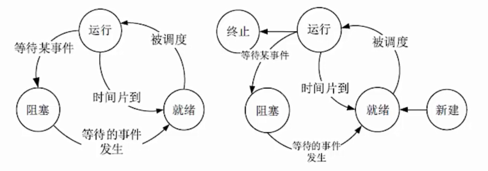

### 前趋图
用来表示哪些任务可以并行执行,哪些任务之间有顺序关系,具体如下图:可知,ABC可以并行执行,但是必须ABC都执行完后,才能执行D,这就确定了两点:**任务间的并行、任务间的先后顺序**。
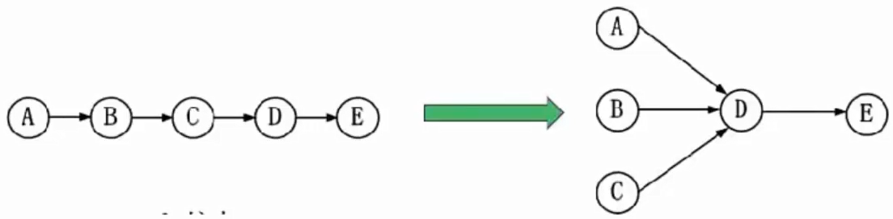

### 进程资源图
用来表示**进程和资源之间的分配和请求关系**,如下图所示:
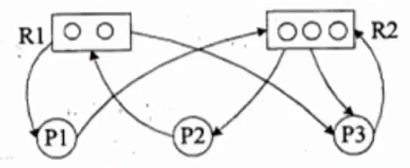

**P代表进程,R代表资源**,R方框中有几个圆球就表示有几个这冲资源,在上图中,R1指向P1,表示R1有一个资源已经分配给了P1,P1指向R2,表示P1还需要请求一个R2资源才能执行。

阻塞节点:某进程**所请求的资源已经全部分配完毕**,无法获取所需资源,该进程被阻塞了无法继续。如上图中P2。

非阻塞节点:某进程所请求的资源还有剩余,可以分配给该进程继续运行。
如上图中P1、P3。

当一个进程资源图中所有进程都是阻塞节点时,即陷入死锁状态。

### 进程同步和互斥

- 临界资源:**各进程间需要以互斥方式对其进行访问**的资源。
- 临界区:指进程中**对临界资源实施操作的那段程序**。本质是一段程序代码。
- 互斥:某资源(即临界资源)在**同一时间内只能由一个任务单独使用**,使用时需要加锁,使用完后解锁才能被其他任务使用;如打印机。
- 同步:**多个任务可以并发执行,只不过有速度上的差异**,在一定情况下停下等待,不存在资源是否单独或共享的问题;如自行车和汽车。
- 互斥信号量:对临界资源采用互斥访问,使用互斥信号量后其他进程无法访问,**初值为1。**
- 同步信号量:对共享资源的访问控制,**初值一般是共享资源的数量**。

- **P操作:申请资源,S=S-1**,若S>=0,则执行P操作的进程继续执行;若s<0,则置该进程为阻塞状态(因为无可用资源),并将其插入阻塞队列。
- **V操作:释放资源,S=S+1**,若S>0,则执行V操作的进程继续执行若s<=0,则从阻塞状态唤醒一个进程,并将其插入就绪队列(此时因为缺少资源被P操作阻塞的进程可以继续执行),然后执行V操作的进程继续。
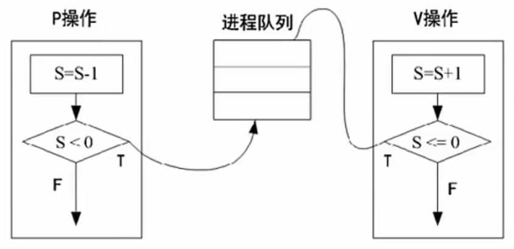

经典问题:**生产者和消费者的问题**

三个信号量:互斥信号量S0(仓库独立使用权),同步信号量s1(仓库空闲个数),同步信号量S2(仓库商品个数)。
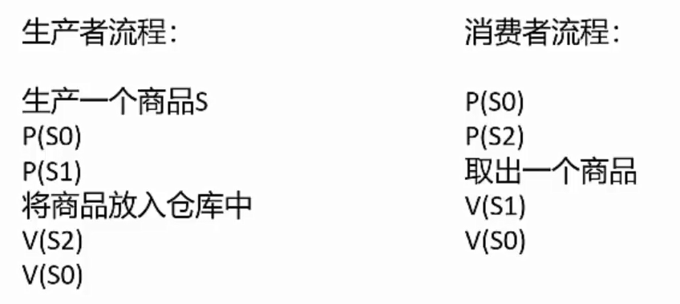

### 进程调度

进程调度方式是**指当有更高优先级的进程到来时如何分配CPU**。分为可剥夺和不可剥夺两种,可剥夺指当有更高优先级进程到来时,强行将正在运行进程的CPU分配给高优先级进程;不可剥夺是指高优先级进程必须等待当前进程自动释放CPU。

在某些操作系统中,一个作业从提交到完成需要经历高、中、低三级调度。
- **(1)高级调度**。高级调度又称"长调度""作业调度"或"接纳调度",它**决定处于输入池中的哪个后备作业可以调入主系统做好运行的准备,**成为一个或一组就绪进程。在系统中一个作业只需经过一次高级调度。
- **(2)中级调度**。中级调度又称"中程调度"或"对换调度",它**决定处于交换区中的哪个就绪进程可以调入内存**,以便直接参与对CPU的竞争。
- **(3)低级调度**。低级调度又称"短程调度"或"进程调度",它**决定处于内存中的哪个就绪进程可以占用CPU**。低级调度是操作系统中最活跃、最重要要的调度程序,对系统的影响很大。

**调度算法**:
- **先来先服务FCFS**:先到达的进程优先分配CPU。用于宏观调度。
- **时间片轮转**:分配给每个进程CPU时间片,轮流使用CPU,每个进程时间片大小相同,很公平,用于微观调度。
- **优先级调度**:每个进程都拥有一个优先级,优先级大的先分配CPU。
- **多级反馈调度**:时间片轮转和优先级调度结合而成,设置多个就绪队列1,2,3...n,每个队列分别赋予不同的优先级,分配不同的时间片长度;新进程先进入队列1的末尾,按FCFS原则,执行队列1的时间片;若未能执行行完进程,则转入队列2的末尾,如此重复。

### 死锁
当一个进程在等待永远不可能发生的事件时,就会产生死锁,若系统中有多进程处于死锁状态,就会造成系统死锁。

死锁产生的四个必要条件:**资源互斥、每个进程占有资源并等待其他资源、系统不能剥夺进程资源、进程资源图是一个环路**。

死锁产生后,**解决措施是打破四大条件**,有下列方法:
- **死锁预防**:采用某种策略限制并发进程对于资源的请求,破坏死锁产生的四个条件之一,使系统任何时刻都不满足死锁的条件。
- **死锁避免**:一般采用银行家算法来避免,银行家算法,就是提前计算出一条不会死锁的资源分配方法,才分配资源,否则不分配资源,相当于借贷,考虑对方还得起才借钱,提前考虑好以后,就可以避免死锁。
- **死锁检测**:允许死锁产生,但系统定时运行一个检测死锁的程序,若检测到系统中发生死锁,则设法加以解除。
- **死锁解除**:即死锁发生后的解除方法,如强制剥夺资源,撤销进程等。

**死锁资源计算**:系统内有n个进程,每个进程都需要R个资源,那么其发生死锁的最大资源数为n*(R-1)。其不发生死锁的最小资源数为n*(R-1)+1。

### 线程
传统的进程有两个属性:**可拥有资源的独立单位;可独立调度和分配的基本
单位**。

引入线程的原因是进程在创建、撤销和切换中,系统必须为之付出较大的时空开销,故在系统中**设置的进程数目不宜过多**,进程切换的频率不宜太高,这就限制了并发程度的提高。引入线程后,将传统进程的两个基本属性分开,**线程作为调度和分配的基本单位,进程作为独立分配资源的单位。**用户可以通过创建线程来完成任务,以减少程序并发执行时付出的时空开销。

线程是进程中的一个实体,是被系统独立分配和调度的基本单位。**线程基本上不拥有资源,只拥有一点运行中必不可少的资源**(如程序计数器、一组寄存器和栈),**它可与同属一个进程的其他线程共享进程所拥有的全部资源**,例如进程的公共数据、全局变量、代码、文件等资源,但**不能共享线程独有的资源**,如线程的栈指针等标识数据。

## 存储管理
### 分区存储管理
所谓分区存储组织,就是**整存**,**将某进程运行所需的内存整体一起分配给它**,然后再执行。有三种分区方式:
- **固定分区**:静态分区方法,将主存分为若干个固定的分区,将要运行的作业装配进去,由于分区固定,大小和作业需要的大小不同,会产生内内部碎片。
- **可变分区**:动态分区方法,主存空间的分区是在作业转入时划分,正好划分为作业需要的大小,这样就不存在内部碎片,但容易将整片主存空间切割成许多块,会产生外部碎片。可变分区的算法如下:
  - 系统分配内存的算法有很多,如下图所示,根据分配前的内存情况,还需要分配9K空间,对不同算法的结果介绍如下:
  - 首次适应法:按内存地址顺序从头查找,找到第一个>=9K空间的的空闲块,即切割9K空间分配给进程。
  - 最佳适应法:将内存中所有空闲内存块按从小到大排序,找到有一个>=9K空间的空闲块,切割分配,这个将会找到与9K空间大小最相近的空空闲块。
  - 最差适应法:和最佳适应法相反,将内存中空闲块空间最大的,切割9K空间分配给进程,这是为了预防系统中产生过多的细小空闲块。
  - 循环首次适应法:按内存地址顺序查找,找到第一个>=9K空|间的空闲块,而后若还需分配,则找下一个,不用每次都从头查找,这是与首次适应法不同的地方。
  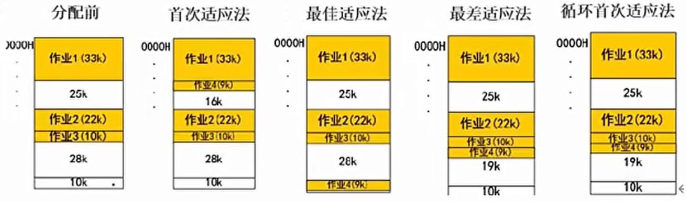
- **可重定位分区**:可以解决碎片问题,移动所有已经分配好的区域,使其成为一个连续的区域,这样其他外部细小的分区碎片可以合并为大的分区,满足作业要求。只在外部作业请求空间得不到满足时进行。

### 分页存储管理
**逻辑页分为页号和页内地址**,页内地址就是物理偏移地址,而页号与物理块号并非按序对应的,需要查询页表,才能得知页号对应的物理决号,再用物理块号加上偏移地址才得出了真正运行时的物理地址。
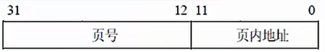
优点:利用率高,碎片小,分配及管理简单。

缺点:增加了系统开销,可能产生抖动现象
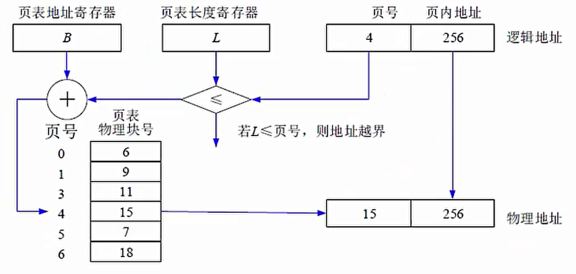

**页面置换算法**
- 最优算法:OPT,**理论上的算法,无法实现**,是在进程执行完后进行的最佳效率计算,用来让其他算法比较差距。原理是选择未来最长时间内不被访问的页面置换,这样可以保证未来执行的都是马上要访问的。
- 先进先出算法:FIFO,先调入内存的页先被置换淘汰,**会产生抖动现象**,即分配的页数越多,缺页率可能越多(即效率越低).
- 最近最少使用:LRU,在最近的过去,进程执行过程中,过去最少使用的页面被置换淘汰,根据局部性原理,这种方式效率高,且不会产生抖动现象,使用大量计数器,但是没有LFU多。

淘汰原则:优先淘汰最近未访问的,而后淘汰最近未被修改的页面。

**快表**，是相对于慢表（页表）讲的
是一块**小容量的相联存储器**,由快速存储器组成,**按内容访问,速度快**,并且可以从硬件上保证按内容并行查找,一般用来**存放当前访问最频繁的少数活动页面的页号**。
快表是将页表**存于Cache中**;慢表是将页表存于内存上。慢表需要访问两次内存才能取出页,而快表是访问一次Cache和一次内存,因此更快。

### 分段存储管理
将进程空间分为一个个段,**每段也有段号和段内地址**,与页式存储不同的是,**每段物理大小不同,分段是根据逻辑整体分段的**,因此,段表也与页表的内容不同,页表中直接是逻辑页号对应物理块号,而下图所示,**段表有段长和基址两个属性**,才能确定一个逻辑段在物理段中的位置。
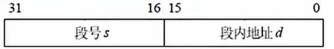
优点:多道程序共享内存,各段程序修改互不影响。

缺点:内存利用率低,内存碎片浪费大。
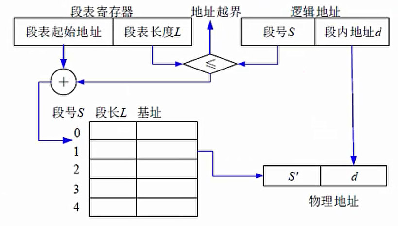

### 段页式存储管理
对进程空间**先分段,后分页**,具体原理图和优缺点如下:

优点:空间浪费小、存储共享容易、存储保护容易、能动态链接。

缺点:由于管理软件的增加,复杂性和开销也随之增加,需要的硬件以及占用的内容也有所增加,使得执行速度大大下降。
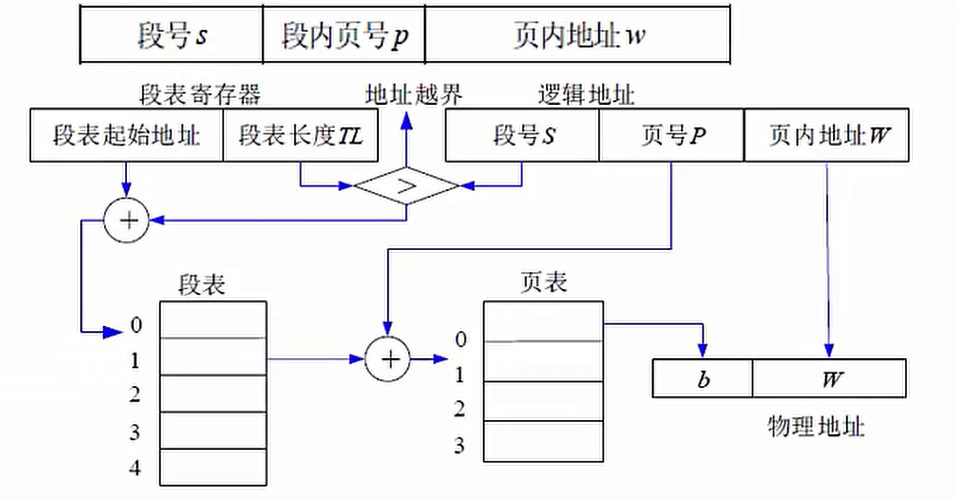

## 设备管理
### 设备管理概述
### I/O软件
### 设备管理技术

## 文件管理
### 文件管理概述
### 索引文件结构
### 文件目录
### 文件存储空间管理