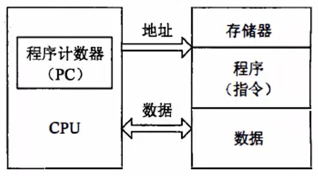
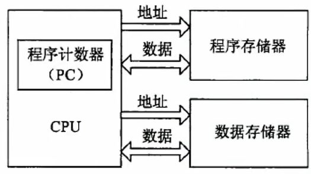

# 嵌入式技术

- [嵌入式技术](#嵌入式技术)
  - [整体情况](#整体情况)
  - [嵌入式微处理器](#嵌入式微处理器)
    - [体系结构](#体系结构)
      - [冯诺依曼结构](#冯诺依曼结构)
      - [哈佛结构](#哈佛结构)
    - [微处理器分类](#微处理器分类)
    - [多核处理器](#多核处理器)
  - [嵌入式软件](#嵌入式软件)
    - [嵌入式系统](#嵌入式系统)
    - [嵌入式实时操作系统](#嵌入式实时操作系统)
    - [嵌入式实时操作系统](#嵌入式实时操作系统-1)
    - [嵌入式软件设计](#嵌入式软件设计)
    - [软件开发工具](#软件开发工具)

## 整体情况
本章节偶尔会考到，比计算机硬件的概率要大。一般是3-5分。不管是选择题还是案例题，考的时候一般都会超纲，基本上50%都会超纲。

## 嵌入式微处理器
### 体系结构
#### 冯诺依曼结构

传统计算机采用冯·诺依曼(Von Neumann)结构,也称**普林斯顿结构**,是一种将**程序指令存储器和数据存储器合并在一起的存储器结构**。

- 冯·诺依曼结构的计算机程序和数据共用一个存储空间,程序指令存储地址和数据存储地址指向**同一个存储器的不同物理位置**。
- 采用**单一的地址及数据总线**,程序指令和数据的宽度相同。
- 处理器执行指令时,**先从储存器中取出指令解码,再取操作数执行运算**,即使单条指令也要耗费几个甚至几十个周期,在高速运算真时,在传输通道上会出现瓶颈效应。

#### 哈佛结构
哈佛结构是一种**并行体系结构**,它的主要特点是将**程序和数据存储在不同的存储空间中**,即程序存储器和数据存储器是**两个相互独立的存储器,每个存储器独立编址、独立访问**。

- 与两个存储器相对应的是系统中的**两套独立的地址总线和数据总线**。
这种分离的程序总线和数据总线可允许在**一个机器周期内同时获取指令字(来自程序存储器)和操作数(来自数据存储器)**,从而提高了执行速度,使数据的吞吐率提高了1倍。

### 微处理器分类
**根据嵌入式微处理器的字长宽度**,可分为4位、8位、16位、32位和64位。一般把16位及以下的称为嵌入式微控制器(Embedded Micro Controller),32位及以上的称为嵌入式微处理器。

如果按**系统集成度划分**,可分为两类:一种是微处理器内部仅包含单纯的中央处理器单元,称为一般用途型微处理器:另一种则是将CPU、ROM、RAM及I/O等部件集成到同一个芯片上,称为单芯片微控制器(Single Chip Microcontroller)

如果**根据用途分类**,一般分为嵌入式微控制器MCU、嵌入式微处理器MPU、嵌入式数字信号处理器DSP、嵌入式片上系统SOC等。

- **嵌入式微控制器MCU的典型代表是单片机**,其片上外设资源比较丰富,适合于控制。MCU芯片内部集成ROM/EPROM、RAM、总线、总线逻辑、定时/计数器、看门狗、I/O、串行口、脉宽调制输出、A/D、D/A、Flash RAM、EEPROM等各种必要功能和外设。和嵌入式微处理器相比,微控制器的最大特点是单片化体积大大减小,从而使功耗和成本下降、可靠性提高,其片上外议资源一般较丰富,适合于控制,是嵌入式系统工业的主流。（**一般用在工业控制中，性能比不上MPU**）
- **嵌入式微处理器MPU由通用计算机中的CPU演变**而来。它的特征是具有**32位以上的处理器**,具有较高的性能,当然其价格也相应较高。但与计算机处理器不同的是,在实际嵌入式应用中,**只保留和嵌入式应用紧密相关的功能硬件去除其他的冗余功能部分,这样就以最低的功耗和资源实现嵌入式应用的特殊要求**。与工业控制计算机相比,嵌入式微处理器具有体积小、重量轻、成本低、可靠性高的优点。目前常见的有ARM、MIPS、POWER PC等。
- **嵌入式数字信号处理器DSP是专门用于信号处理方面的处理器**,其**在系统结构和指令算法方面进行了特殊设计,具有很高的编译效率和指令的的执行速度。采用哈佛结构,流水线处理,其处理速度比最快的CPU还快10-50倍**。在数字滤波、FFT、谱分析等各种仪器上DSP获得了大规模的应用。
- **嵌入式片上系统SOC,是追求产品系统最大包容的集成器件**。SoC最大的特点是成功实现了软硬件无缝结合,直接在处理器片内嵌入操作系统的代码模块。是一个有专用目标的集成电路,其中包含完整系统并有嵌入转你件的全部内容。

### 多核处理器
**多核指多个微处理器内核**,是将两个或更多的微处理器封装在一起,**集成在一个电路中**。多核处理器是**单枚芯片**,能够直接插入单一的处理器插槽中。多核与多CPU相比,**很好的降低了计算机系统的功耗和体积**。在多核技术中,**由操作系统软件进行调度,多进程,多线程并发都可以。**

2个或多个内核工作协调实现方式:
- **对称多处理技术SMP**:将2颗完全一样的处理器封装在一个芯片内,达到双倍或接近双倍的处理性能,节省运算资源。
- **非对称处理技术AMP**:2个处理内核彼此不同,各自处理和执行特定的功能,在软件的协调下分担不同的计算任务。

多核CPU的调度，多核CPU环境下进程的调度算法一般有**全局队列调度和局部队列调度**两种：
- 全局队列调度是指操作系统维护一个**全局的任务等待队列**,当系统中有一个CPU空闲时,操作系统就从全局任务等待队列中选取就绪任务开始执行,CPU核心利用率高。
- 局部队列调度是**操作系统为每个CPU内核维护一个局部的任务等待队列**,当系统中有一个CPU内核空闲时,就从该核心的任务等待队列中选取适当的任务执行行,优点是无需在多个CPU之间切换。

## 嵌入式软件
### 嵌入式系统
### 嵌入式实时操作系统
### 嵌入式实时操作系统
### 嵌入式软件设计
### 软件开发工具