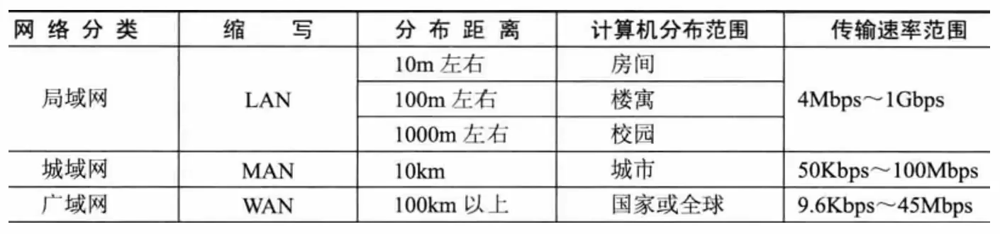
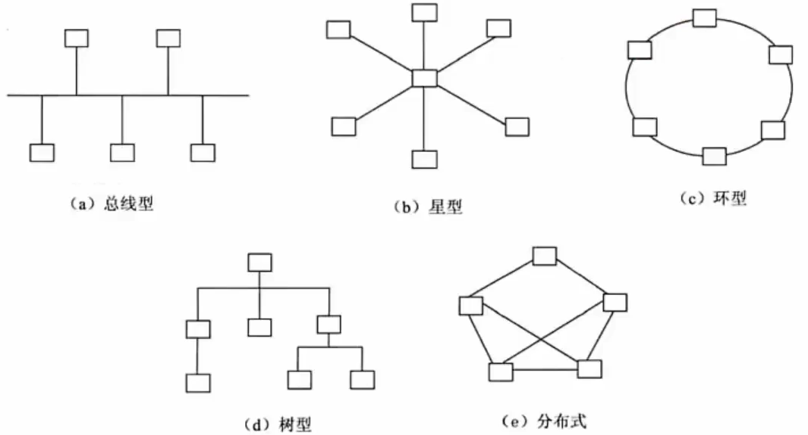
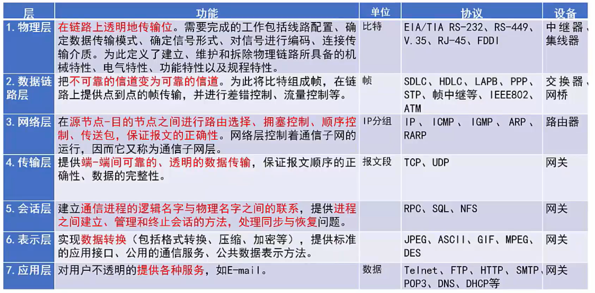
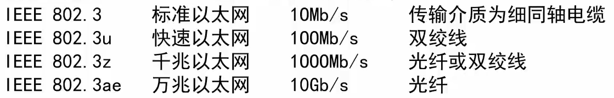
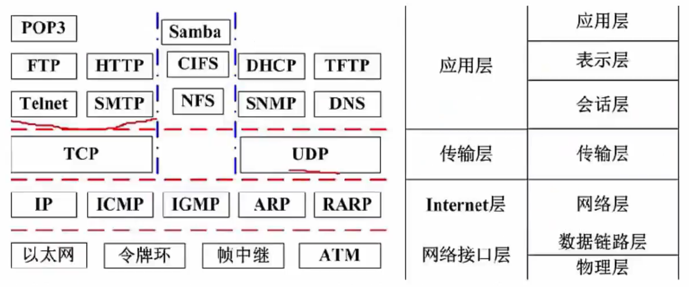
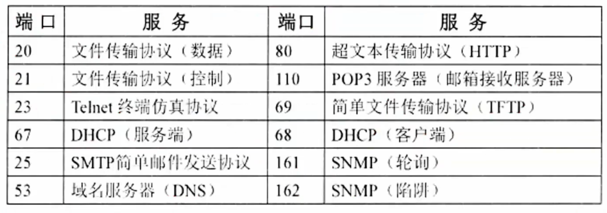

# 计算机网络

- [计算机网络](#计算机网络)
  - [整体情况](#整体情况)
  - [网络功能和分类](#网络功能和分类)
  - [通信技术](#通信技术)
  - [OSI七层模型](#osi七层模型)
  - [局域网和广域网协议](#局域网和广域网协议)
  - [TCP/IP协议](#tcpip协议)
  - [交换技术](#交换技术)
  - [路由技术](#路由技术)
  - [传输介质](#传输介质)
  - [通信方式和交换方式](#通信方式和交换方式)
  - [IP地址](#ip地址)
  - [IPv6](#ipv6)
  - [网络规划和设计](#网络规划和设计)
  - [网络存储技术](#网络存储技术)
  - [其他考点补充](#其他考点补充)

## 整体情况
每年考3-5分。本章节超纲率也有50%。

## 网络功能和分类
计算机网络是计算机技术与通信技术相结合的产物,它实现了远程通信、远程信息处理和资源共享。

计算机网络的功能:**数据通信、资源共享、管理集中化、实现分布式处理、负载均衡**。

网络**性能**指标:速率、带宽(频带宽度或传送线路速率)、吞吐量、时延、往返时间、利用率。

网络**非性能**指标:费用、质量、标准化、可靠性、可扩展性、可升级性、易管理性和可维护性。

计算机网络按分布范围和拓扑结构划分如下图所示:

总线型(利用率低、干扰大、价格低)、星型(交换机形成的局域网、中央单元负荷大)、环型(流动方向固定、效率低扩充难)、树型(总线型的扩充、分级结构)、分布式(任意节点连接、管理难成本高)。

## 通信技术
计算机网络是**利用通信技术将数据从一个结点传送到另一结点的过程**。通信技术是计算机网络的基础。

信道可分为**物理信道和逻辑信道**。物理信道由传输介质和设备组成,根据传输介质的不同,分为无线信道和有线信道。逻辑信道是指在数据发送端和接收端之间存在的一条虚拟线路,可以是有连接的或无连接的。逻辑信道以物理信道为载体。

**发信机进行的信号处理**包括信源编码、信道编码、交织、脉冲成形和调制。相反地,收信机进行的信号处理包括解调、采样判决、去交织、信道译码和信源记择码。

如果**同时传递多路数据就需要复用技术和多址技术**。复用技术是指在一条信道上同时传输多路数据的技术,如TDM时分复用、FDM频分复用和CDM码分复用等等。多址技术是指在一条线上同时传输多个用户数据的技术,在接收端把多个用户的数据分离(TDMA时分多多址、FDMA频分多址和CDMA码分多址)。

作为**新一代的移动通信技术**,5G特征体现在以下方面。
1. 基于OFDM优化的波形和多址接入
2. 实现可扩展的OFDM间隔参数配直
3. FDM加窗提高多路传输效率
4. 灵活框架设计
5. 大规模MIMO:最多256根天线
6. 毫米波:频率大于24GHz以上的频段
7. 频谱共享
8. 先进的信道编码设计

5G网络的主要特征:服务化架构、网络切片。

## OSI七层模型

## 局域网和广域网协议
以太网是一种计算机局域网组网技术。
以太网规范**IEEE 802.3**是重要的局域网协议,包括:

上图依次为:目的MAC地址、源MAC地址、长度/类型、数据填充、校验。

最小帧长:64字节，最大是1518帧长。

无线局域网WLAN技术标准:**IEEE 802.11**

在WLAN中,通常使用的拓扑结构主要有3种形式:点对点型型、HUB型和全分布型。

广域网相关技术:同步光网络(SONET,利用光纤进行数字化化信息通信)、数字数据网(DDN,利用数字信道提供半永久性连接电路以传输数据)、帧中继(IFR,数据包交换技术)、异步传输技术(ATM,以信元为基础的面向连接的一种分组交换和复用技术)。

## TCP/IP协议
网络协议三要素:**语法、语义、时序**。其中语法部分规定传输数据的格式,语义部分规定所要完成的功能,时序部分规定执行各种操作的条件、顺序关系等。

**网络层协议:**
- IP:网络层最重要的核心协议,在源地址和目的地址之间传送数据报,无连接、不可靠。
- ICMP:因特网控制报文协议,用于在IP主机、路由器之间传递控制消息。控制消息是指网络通不通、主机是否可达、路由是否可用等网络本身的消息。
- IGMP:网络组管理协议,允许因特网中的计算机参加多播,是计算机用做向相邻多目路由器
报告多目组成员的协议,支持组播。

**传输层协议:**
- TCP:整个TCP/IP协议族中最重要的协议之一,在IP协议提供的不不可靠数据数据基础上,采用了重发技术,为应用程序提供了一个可靠的、面向连接的、全双工的数据传输服务。一般用于传输数据量比较少,且对可靠性要求高的场合。
- UDP:是一种不可靠、无连接的协议,有助于提高传输速率,一般用于传输数据量大,对可靠性要求不高,但要求速度快的场合。

**应用层协议:** 基于TCP的FTP、HTTP等都是可靠传输。基于UDP的DHCP、DNS等都是不可靠传输。
- FTP:可靠的文件传输协议,用于因特网上的控制文件的双向传输。
- HTTP:超文本传输协议,用于从WWW服务器传输超文本到本地浏览器的传输协议。使用SSL加密后的安全网页协议为HTTPS。
- SMTP和POP3:简单邮件传输协议,是一组用于由源地址到目的地址传送邮件的规则,邮件报文采用ASCII格式表示。
- Telnet:远程连接协议,是因特网远程登录服务的标准协议和主要方式、
- TFTP:不可靠的、开销不大的小文件传输协议。
- SNMP:简单网络管理协议,由一组网络管理的标准协议,包含一个应用层协议、数据库模型和一组资源对象。该协议能够支持网络管理系统,泳衣监测连接到网络上的设备是否有任何引起管理师行关注的情况。
- DHCP:动态主机配置协议,基于UDP,基于C/S模型,为主机动态分配IP地址,有三种方式:固定分配、动态分配、自动分配。
- DNS:域名解析协议,通过域名解析出IP地址。

**协议端口号对照表**

## 交换技术
数据在网络中转发通常离不开**交换机**。人们日常使用的计算机通常就是通过交换机接入网络的。

交换机功能包括:
- 集线功能。提供大量可供线缆连接的端口达到部署星状拓扑网络的目的。
- 中继功能。在转发帧时重新产生不失真的电信号。
- 桥接功能。在内置的端口上使用相同的转发和过滤逻辑。
- 隔离冲突域功能。将部署好的局域网分为多个冲突域,而每个冲突域都有自己独立的带宽,以提高交换机整体宽带利用效率。

交换机需要实现的功能如下所述。
1. 转发路径学习。根据收到数据帧中的源MAC地址建立该:地址同交换机端口的映射,写入MAC地址表中。
2. 数据转发。如果交换机根据数据帧中的目的MAC地址在建立好的MAC地址表中查询到了,就向对应端口进行转发。
3. 数据泛洪。如果数据帧中的目的MAC地址不在MAC地址表中,则向所有端口转发,也就是泛洪。广播帧和组播帧向所有端口(不包括源端口)进行转发。
4. 链路地址更新。MAC地址表会每隔一定时间(如300s)更新一次。

## 路由技术
路由功能由路由器来提供,具体包括:
1. 异种网络互连,比如具有异种子网协议的网络互连。
2. 子网协议转换,不同子网间包括局域网和广域网之间的协议转换。
3. 数据路由,即将数据从一个网络依据路由规则转发到另一个网络。
4. 速率适配,利用缓存和流控协议进行适配。
5. 隔离网络,防止广播风暴,实现防火墙。
6. 报文分片和重组,超过接口的MTU报文被分片,到达目的地之后的报文被重组。
7. 备份、流量控制,如主备线路的切换和复杂流量控制等。

路由器工作在OSI七层协议中的第3层,即网络层。其主要任务是接收来源于一个网络接口的
数据包,通常根据此数据包的目地址决定待转发的下一个地址(即下一跳地址)。路由器中维持着数据转发所需的路由表,所有数据包的发送或转发都通过查找路由表来实现。这个路由表可以静态配置,也可以通过动态路由协议自动生成。

一般来说,路由协议可分为内部网关协议(IGP)和外部网关协议(EGP)两类。

网络建设工程可分为网络规划、网络设计和网络实施三个环节。

## 传输介质
## 通信方式和交换方式
## IP地址
## IPv6
## 网络规划和设计
## 网络存储技术
## 其他考点补充