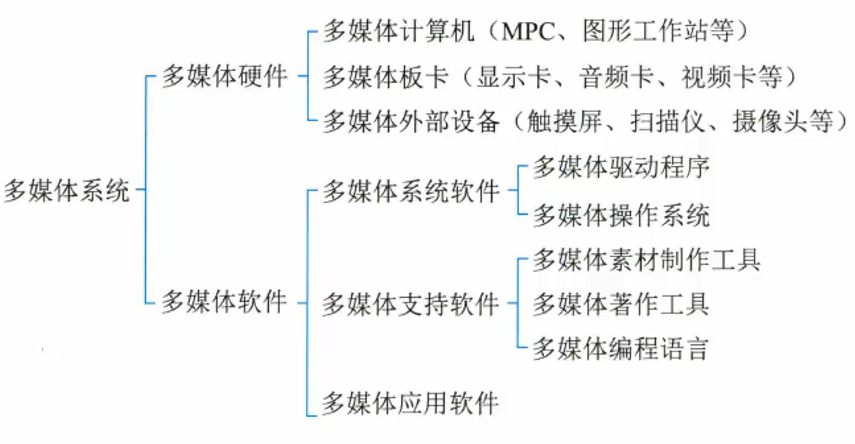
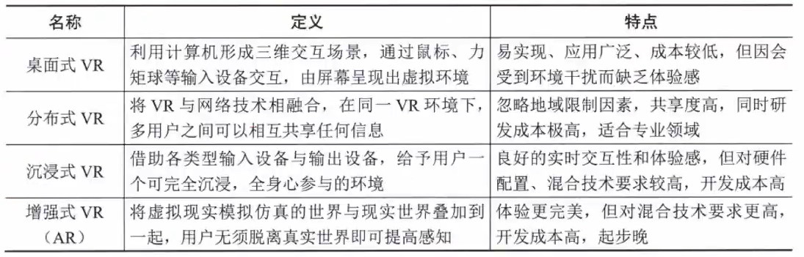

# 其他计算机基础知识

- [其他计算机基础知识](#其他计算机基础知识)
  - [整体情况](#整体情况)
  - [计算机语言](#计算机语言)
  - [多媒体](#多媒体)
  - [系统工程](#系统工程)

## 整体情况
几乎不考，如果考，系统工程概论大一些。

## 计算机语言
计算机语言是指用于人与计算机之间交流的一种语言,是人与计算机之间传递信息的媒介。计算机语言主要由一套指令组成,而这种指令一般包括**表达式、流程控制和集合**三大部分内容:
- 表达式又包含**变量、常量、字面量和运算符**。
- 流程控制有**分支、循环、函数和异常**。
- 集合包括**字符串、数组、散列表**等数据结构。

计算机语言的分类
1. 机器语言:最早使用,**第一代**计算机语言,计算机自身语言,**二进制代码串**。
   - 机器语言指令必须包括:**操作码、操作数的地址、操作结果的存储地址、下条指令的地址**。
   - **常见的指令格式**:三地址指令(2个操作数+1个结果地址)、二地址指令(1操作数+1操作数和结果地址)、单地址指令(1操作数+固定寄存器存放)、零地址指令(堆栈顶指示操作数和结果地址)可变地址数指令(0-6个)。
2. 汇编语言:用一些简洁的英文字母、符号串来替代一个特定指令的二进制串。**第二代**,仍然是面向机器的语言。通过**汇编程序**将汇编语言翻译成机器语言。
   - 汇编语言3种语句:**指令**(汇编后直接产生机器代码)、**伪指令**(指示汇编源程序时完成的操作,汇编后不产生机器代码)、**宏指令**(多次重复使用的程序段,宏的引用)。
   - 指令语句和伪指令语句格式:**名字(标号,第一个字节单元地址)、操作符、操作数、注释**。
3. 高级语言:一类语言统称,符合人类习惯,如C、C++、Java、VB、C#、Python等。
4. 建模语言:主导地位是面向对象的建模技术,主要使用UML作为建模语言。
5. 形式化语言:形式化方法是把概念、判断、推理转化成特定的形式符号后,对形式符号表达系统进行研究的方法,是用具有精确语义的形式语言书写的程序功能描述,它是设计和编制程序的出发点,也是验证程序是否正确的依据。
   - 形式化方法的开发过程:**可行性分析、需求分析、体系结构设计、详细设计、编码、测试发布**。

## 多媒体
媒体是承载信息的载体,即**信息的表现形式**(或者传播形式),如文字、声音、图像、动画和视频等。按照ITU-T建议的定义,媒体可分为**感觉媒体、表示媒体、显示媒体、存储媒体和传输媒体**。
1. 感觉媒体,指的是**用户接触信息的感觉形式**,如视觉、听觉和触觉等。
2. 表示媒体,指的是信息的**表示形式**,如图像、声音、视频等
3. 表现媒体,也称为**显示媒体,指表现和获取信息的物理设备**,如键盘、鼠标、扫描仪、话筒和摄像机等为输入媒体;显示器、打印机和音箱等为输出媒体。
4. 存储媒体,指用于**存储表示媒体的物理介质**,如硬盘、车软盘、磁盘、光盘、ROM及RAM等
5. 传输媒体,指**传输表示媒体的物理介质**,如电缆、光缆和电磁波等。

多媒体有4个重要的特征。
1. 多维化。多维化是指**媒体的多样化**。它提供了多维化信,息空间下的交互能力和获得多维化信息空间的方法,如输入、输出、传输、存储和处理的手段没与方法等。
2. **集成性**。集成性不仅指多媒体设备集成,而且指多媒体信息集成或表现集成。
3. **交互性**。交互性是人们获取和使用信息时变被动为主动的最重要的标志。交互性可向用户提供更有效地控制和使用信息的手段,可增加人们对信息的约注意和理解。
4. **实时性**。实时性是指多媒体技术中涉及的一些媒体。例如,音频和视频信息具有很强的时间特性,会随着时间的变化而变化。

多媒体系统的基本组成

多媒体系统的关键技术：
1. **视音频技术**:视频技术包括视频数字化和视频编码技术两个方面。音频技术包括音频数字化、语音处理、语音合成及语音识别4个方面。
2. **通信技术**。是多媒体系统中的一项关键技术,是指将信息息从一个地点传送到另一个地点所采取的方法和措施。通信技术通常包括了数据传输信道技术和数据传输技术。
3. **数据压缩技术**。数据压缩算法分为下面三类:
   - **即时压缩和非即时压缩**。即时/非即时压缩的区别在于信言息在传输过程中被压缩还是信息压缩后再传输。即时压缩一般应用在影像、声音数据的传送中。即时压缩常用到专门的硬件设备,如压缩卡等。
   - **数据压缩和文件压缩**。数据压缩是专指一些具有时间性的数据,这些数据常常是即时采集即时处理或传输的。而文件压缩是指对将要保存在磁盘等物理介质的数据进行压缩。
   - **无损压缩与有损压缩**。无损压缩是利用数据的统计元余进行压缩,通常无员压缩的压缩比比较低。而有损压缩是利用了人类对视觉、听觉对图像、声音中的某些频率成分不敏感的特性,允许压缩的过程中损失一定的信息。
   - 压缩编码格式:联合图像专家小组标准(JPEG)、动态图像视频编码马标准(MPEG)、视频编解码器标准(H.26L)
4. **虚拟现实(VR)/增强现实(AR)技术**：
   - VR是一种可以创建和体验虚拟世界的计算机仿真系统,它利用计算机生成一种模拟环境,使用户沉浸到该环境中,让人有种身临其境的感觉。
   - VR采用计算机技术生成一个逼真的视觉、听觉、触觉、味觉及嗅觉的感知系统,用户可以用人的自然技能与这个生成的虚拟实体进行交互操作,其概念包含3层含义：
     - 虚拟实体是用计算机生成的一个逼真的实体。
     - 用户可以通过人的自然技能(头部转动、眼动、手势或其他身体动作)与该环境交互。
     - 要借助一些三维传感设备来完成交互动作,常用的有头盔立体显示器、数据于套、数据服装和三维鼠标等。
   - AR增强现实技术是指把原本在现实世界的一定时间和空间范围内很难体验到的实体信息(视觉信息、声音、味道和触觉等),通过模拟仿真后,再叠加到现实世是界中被人类感官所感知,从而达到超越现实的感官体验。包括下面技术:
     - 计算机图形图像技术。增强现实的用户可以戴上透明的护目镜,透过它看到整个世界,连同计算机生成而投射到这一世界表面的图像,从而使物理世界的景象超出用户的日常经验之外。这种增强的信息可以是在真实环境中与之共存的虚拟物体,也可以是实际存在的物体的非几何信息。
     - 空间定位技术。为了改善效果,增强现实所投射的图像必须在空间定位上与用户相关。当用户转动或移动头部时,视野变动,计算机产生的增强信息随之做相应的变化。
     - 人文智能。该技术以将处理设备和人的身心能力结合起来为特点,并非仿真人的智能,而是试图发挥传感器、可穿戴计算等技术的优势,使人们能够捕获自己的日常经历、记忆及所见所闻,并与他人进行更有效的交流。
   - VR/AR 技术主要分为桌面式、分布式、沉浸式和增强式4种。

## 系统工程
系统工程是利用计算机作为工具,对**系统的结构、元素、信息和反馈等进行分析**,以达到**最优规划、最优设计、最优管理和最优控制**的目的。

系统之系统(SoS)适用于其系统元素本身也是系统的情况。

系统工程方法是一种**现代的科学决策方法**,也是一门基本的决策技术。它针对主要问题、主要情
况和全过程,运用有效工具进行全面的分析和处理。包括:
1. **霍尔的三维结构**。集中体现了系统工程方法的系统化、综合化、最优化、程序化和标准化等特点,是系统工程方法论的重要基础内容。
   - 霍尔三维结构是将系统工程整个活动过程分为前后紧密衔接的7个阶段和7个步骤,同时还考虑了为完成这些阶段和步骤所需要的各种专业知识和技能。这样,就形成了由**时间维、逻辑维和知识维**组成的三维空间结构。
   - 其中,时间维表示系统工程活动**从开始到结束按时间顺序排列的全过程**,分为规划、拟订方案、研制、生产、安装、运行、更新7个时间阶段。
   - 逻辑维是指时间维的**每个阶段内所要进行的工作内容和应该遵循的思维程序**,包括明确问题、确定目标、系统综合、系统分析、优化、决策、实施7个逻辑步骤
   - 知识维需要运用包括工程、医学、建筑、商业、法律、管管理、社会科学、艺术等**各种知识和技能**
2. 切克兰德方法。社会经济系统中的问题往往很难和工程技术系统中的问题一样,事先将需求确定清楚,难以按价值系统的评价准则设计出符合这种需求的最优系统方案。切克兰德方法论的**核心不是"最优化"而是"比较"与"探寻"**。从**模型和现状的比较中来学习改善现状的途径**。切克兰德方法将工作过程分为7个步骤。
   1. **认识问题**。收集与问题有关的信息,表达问题现状,寻找构成和影响因素及其关系,以便明确系统问题结构、现存过程及其相互之间的不适应之处,确定有关的行为主体和利益主体
   2. **根底定义**。初步弄清、改善与现状有关的各种因素及其相互关系。根底定义的目的是弄清系统问题的关键要素以及关联因素,为系统的发展及其研究确立各种基本的看法,并尽可能选择出最合适的基本观点。
   3. **建立概念模型**。在不能建立精确数学模型的情况下,用结构模型或语言模型来描述系统的现状。概念模型来自于根底定义,是通过系统化语言对问题抽象描述的结果,其结构及要素必须符合根底定义的思想,并能实现其要求。
   4. **比较及探寻**。将现实问题和概念模型进行对比,找出符合决策者意图且可行的方案或途径。有时通过比较,需要对根底定义的结果进行适当修正。
   5. **选择**。针对比较的结果,考虑有关人员的态度及其他社会、行为等因素,选出现实可行的改善方案。
   6. **设计与实施**。通过详尽和有针对性的设计,形成具有可操作性的方案,并使得有关人员乐于接受和愿意为方案的实现竭尽全力。
   7. **评估与反馈**。根据在实施过程中获得的新认识,修正问题描述、根底定义及概念模型等。
3. 并行工程方法。是**对产品及其相关过程(包括制造过程和支持过程)进行并行、集成化处理的系统方法和综合技术**。它要求产品开发人员从设计开始就考虑产品生命周期的全过程,不仅考虑产品的各项性能,如质量、成本和用户要求,还应考虑与产品品有关的各工艺过程的质量及服务的质量。
   - 并行工程的目标是**提高质量、降低成本、缩短产品开发周期和产品上市时间**。
   - 并行工程强调以下3点。
     1. **在产品的设计开发期间**,将概念设计、结构设计、工艺设计、最终需求等结合起来,保证以最快的速度按要求的质量完成。
     2. **各项工作由与此相关的项目小组完成**。进程中小组成员各自安排自身的工作,但可以随时或定期反馈信息,并对出现的问题协调解决。
     3. **依据适当的信息系统工具,反馈与协调整个项目的进行**。利用现代CIM技术,在产品的研制与开发期间,辅助项目进程的并行化。
4. 综合集成法。钱学森等首次把处理**开放的复杂巨系统(子系统数量巨大、种类多关联复杂、开放)**的方法命名为从**定性到定量的综合集成法**。综合集成是**从整体上考虑并解决问题**的方法论。是现代科学条件下认识方法论上的一次飞跃。
   - 开放的复杂巨系统的一般基本原则与一般系统论的原则相一致:**一是整体论原则;二是相互联系的原则;三是有序性原则;四是动态原则**。
   - 开放的复杂巨系统主要性质:**开放性、复杂性、进化与涌现性、层次性、巨量性。**
   - 综合集成方法的主要特点有:
     1. **定性研究与定量研究**有机结合,贯穿全过程。
     2. **科学理论与经验知识**结合,把人们对客观事物的知识综合集成解决问题。
     3. 应用系统思想把多种学科结合起来进行综合研究。
     4. 根据复杂巨系统的层次结构,把宏观研究与微观研究统一起来。
     5. 必须有大型计算机系统支持,不仅有管理信息系统、决策支持系统等功能,而且还要有综合集成的功能。
5. **WSR(物理-事理-人理)**系统方法。WSR 是物理、事理和人理三者如何巧妙配置、有效利用以解决问题的一种系统方法论。"**懂物理、明事理、通人理**"就是是WSR方法论的实践准则,
   - WSR方法论一般工作过程可理解为这样的7步:**理解意图、制定目标、调查分析、构造策略、选择方案、协调关系和实现构想**。

系统工程生命周期7阶段：
1. **探索性研究**阶段:目的是识别利益攸关者的需求,探索创意和技术。
2. **概念**阶段:目的是细化利益攸关者的需求,探索可行概念,提出有望实现的解决方案。
3. **开发**阶段:目的是细化系统需求,创建解决方案的描述,构建系统,验证并确认系统
4. **生产**阶段:目的是生产系统并进行检验和验证。
5. **使用**阶段:目的是运行系统以满足用户需求。
6. **保障**阶段:目的是提供持续的系统能力。
7. **退役**阶段:目的是存储、归档或退出系统。

生命周期方法
1. **计划驱动方法**:特征在于整个过程始终遵守规定流程的系统化方法。特别关注文档的完整性、需求的可追溯性以及每种表示的事后验证。
2. **渐进迭代式开发**:允许为项目提供一个初始能力,随之提供连续交付以达到期望的系统。目标在于快速产生价值并提供快速响应能力。适合需求不清晰,较小的,不太复杂的系统。
3. **精益开发**:精益思想是一种整体性的范式,聚焦于向客户交付最大价值并使浪费活动最小化。是一个动态的、知识驱动的、以客户为中心的过程,通过过这一过程使特定企业的所有人员以创造价值为目标不断地消除浪费。
4.**敏捷开发**:敏捷的关键目标在于灵活性,当风险可接受时2允许从序列中排除选定的事件。适用于系统工程的敏捷原则如下:
   - 最高的优先级是通过尽早地和持续地交付有价值的软件来满足客户。
   - 欢迎需求变更,即使是在项目开发后期。敏捷流程利用需求变更帮助客户获得竞争优势。
   - 不断交付可用的软件,周期从几周到几个月不等,且越短越好。
   - 在项目中业务人员与开发人员每天在一起工作,业务人员始终参与到开发工作中。
   - 在开发团队内部和团队之间,传递信息最有效的方法是面对面交谈
   - 工作软件是进展的主要度量。
   - 对技术的精益求精以及对设计的不断完善将提升敏捷性。
   - 简单性(尽最大可能减少不必要的工作的艺术)是精髓。
   - 最佳的架构、需求和设计出自于自组织的团队。
   - 团队要定期反省如何能够做到更加高效,并相应地调整团队的行为。

基于模型的系统工程(MBSE)
- 是**建模方法的形式化应用**,以使建模方法支持系统需求、分析、设计、验证和确认等活动,这些活动从概念性设计阶段开始,持续贯穿到设计开发以及后来的所有生命周期阶段
- 系统工程过程的**三个阶段分别产生三种图形**:**在需求分析阶段,产生需求图、用例图及包图;在功能分析与分配阶段,产生顺序图、活动图及状态机图:在设计综合阶段,产生模块定义图、内部块图及参数图等**。
- MBSE的三大支柱分别是**建模语言(SysML)、建模工具**(支持系统建模语言画图的计算机和网络环境)和**建模思路**(如何利用建模语言的图形来建模)
