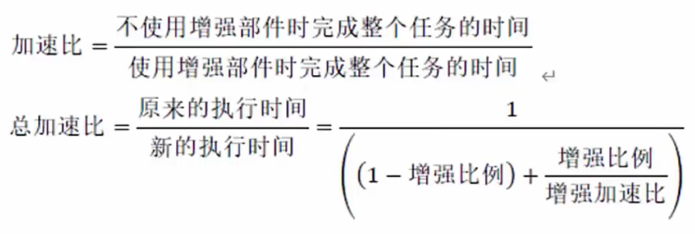

# 系统配置与性能评价

- [系统配置与性能评价](#系统配置与性能评价)
  - [整体情况](#整体情况)
  - [性能指标](#性能指标)
  - [性能评价方法](#性能评价方法)
  - [阿姆达尔解决方案](#阿姆达尔解决方案)

## 整体情况
偶尔会考到，1-2分。

## 性能指标

1. 计算机

对计算机评价的主要性能指标有:**时钟频率(主频);运算速度;运算精度:内存的存储容量;存储器的存取周期;数据处理速率PDR(processingdatarate)；吞吐率;各种响应时间;各种利用率;RASIS特性(即:可靠性Reliability、可用性Availability、可维护性Sericeability、完整性和安全性Integraity and Security);平均故障响应时间;兼容性;可扩充性;性能价格比**。

2. 路由器

对路由器评价的主要性能指标有:**设备吞吐量、端口吞吐量**、全双双工线速转发能力、背靠背帧数、路由表能力、背板能力、**丢包率、时延、时延科动**、VPN支持能力、内部时钟精度、队列管理机制、端口硬件队列数、分类业务带宽保证、RSVP、IP Diff Serv、CAR支持、冗余、热插拔组件、路由器冗余协义、网管、基于Web的管理、网管类型、带外网管支持、网管粒度、计费能力/协议、分组语音支持方式、协议支持、语音压缩能力、端口密度、信令支持。

3. 交换机

对交换机评价的主要性能指标有:交换机类型、配置、支持的网络类型、最大ATM端口数、最大SONET端口数、最大FDDI端口数、背板吞吐量、缓冲区大小、最大MAC地址表大小、最大电源数、支持协议和标准、路由信息息协议RIP、RIP2开放式最短路径优先第2版、边界网关协议BGP、无类域间路由CIDR、互联网成组管理协议IGMP、距离矢量多播路由协议DVMRP、开放式最短路径优先多播路由协议MOSPF、协议无关的多播协议PIM、资源预留协议RSVP、802.1p优先级标记,多队列、路由、支持第3层交换、支持多层(4到7层)交换、支持多协议路由、支持路由缓存、可支持最大路由表数、VLAN、最大VLAN数量、网管营、支持网管类型、支持端口镜像、QoS、支持基于策略的第2层交换、每端口最大优先级队列数、支持基于策略的第3层交换、支持基于策略的应用级QoS支持最小/最大带宽分配、冗余、热交换组件(管理卡,交换结构,接口模块,电源,冷却系统)、支持端口链路聚集协议、负载均衡。

4. 网络

评价网络的性能指标有:**设备级性能指标;网络级性能指标;应用级性能指旨标;用户级性能指标;吞吐量**。

5. 操作系统

评价操作系统的性能指标有:**系统的可靠性、系统的吞吐率(量)、系统响应时间、系统资源利用率、可移植性**。

6. 数据库管理系统

衡量数据库管理系统的主要性能指标**包括数据库本身和管理系统两部分**,有**数据库的大小、数据库中表的数量、单个表的大小、表中允许的记录(行)数量、单个记录(行)的大小、表上所允许的索引数量、数据库所允许的索引数量、最大并发事务处理能力、负载均衡能力、最大连接数等等**。

7. WEB服务器

评价Web服务器的主要性能指标有:**最大并发连接数、响应延迟、吞吐量**。

## 性能评价方法
性能评测的常用方法：
1. **时钟频率**。一般来讲,主频越高,速度越快。
2. **指令执行速度**。计量单位KIPS、MIPS。
3. **等效指令速度法**。统计各类指令在程序中所占比例,并进行折算,是一种固定比例法。
4. **数据处理速率(Processing Data Rate,PDR)法**。采用计算PDR值的方法来衡量机器性能,PDR值越大,机器性能越好。PDR与每条指令和每个操作数的平均位数以及每条指令的平均运算速度有关。

**基准程序法(Benchmark)**:把**应用程序中用得最多、最频繁的那部分核心程序作为评价计算机性能的标准程序,称为基准测试程序(benchmark)**。是目前被用户一致承认的测试性能的较好方法,有多种多样的基准程字,包括:
1. **整数测试程序。**同一厂家的机器,采用相同的体系结构,用相同的基准程序测试,得到的MIPS值越大,一般说明机器速度越快。
2. **浮点测试程序。**指标MFLOPS(理论峰值浮点速度)。
3. **SPEC基准程序(SPEC Benchmark)**。重点面向处理器性能的基准程序集, 将被测计算机的执行时间标准化,即将被测计算机的执行时间除以一个参考处理器的执行时间。
4. **TPC基准程序。**用于评测计算机在事务处理、数据库处理、企业管理与决策支持系统等方面的性能。其中,**TPC-C是在线事务处理(On-line Trannsaction Processing,OLTP)的基准程序,TPC-D是决策支持的基准程序。TPC-E作为大型企业信息服务的基准程序**。

大多数情况下,为测试新系统的性能,用户必须依靠评价程序来评价机器的性能。下面列出了4种评价程序,它们评测的准确程度依次递减:**真实的程序、核心程序、小型基准程序、合成基准程序**。

## 阿姆达尔解决方案
阿姆达尔(Amdahl)定律主要用于系统性能改进的计算中。阿姆达尔定律是指**计算机系统中对某一部件采用某种更快的执行方式所获得的系统性能改变程度取决于这种方式被使用的频率,或所占总执行时间的比例**。

阿姆达尔定律定义了**采用特定部件所取得的加速比**。假定我们使用某种增强部
件,计算机的性能就会得到提高,那么加速比就是下式所定义的比率:
