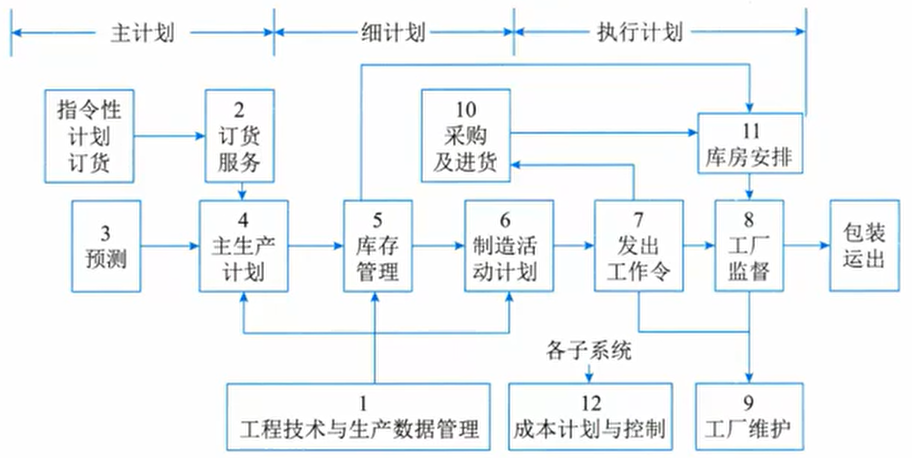
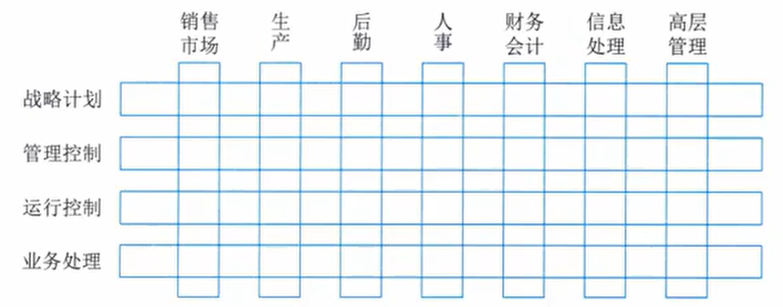
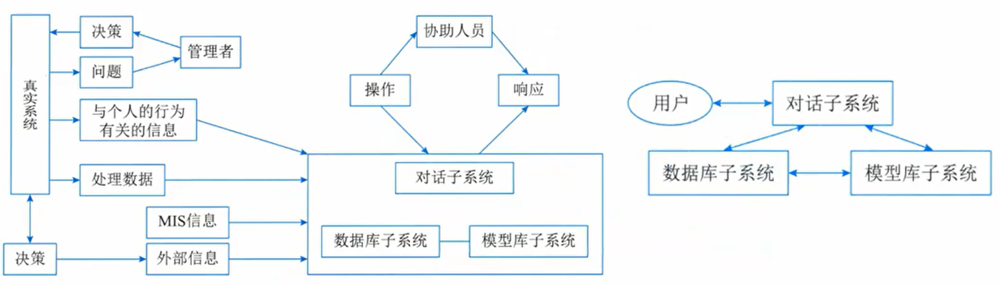

# 信息系统基础知识

- [信息系统基础知识](#信息系统基础知识)
  - [整体情况](#整体情况)
  - [信息系统概述](#信息系统概述)
    - [**信息系统的生命周期(产生、开发、运行、消亡)**](#信息系统的生命周期产生开发运行消亡)
    - [信息系统开发方法](#信息系统开发方法)
  - [业务处理系统TPS](#业务处理系统tps)
  - [管理信息系统MIS](#管理信息系统mis)
  - [决策支持系统DSS](#决策支持系统dss)
  - [专家系统](#专家系统)
  - [办公自动化系统](#办公自动化系统)
  - [企业资源规划ERP](#企业资源规划erp)
  - [典型信息系统架构模型](#典型信息系统架构模型)
  - [信息化战略体系](#信息化战略体系)
  - [信息系统战略规划](#信息系统战略规划)
  - [客户关系管理CRM](#客户关系管理crm)
  - [供应链管理SCM](#供应链管理scm)
  - [企业应用集成](#企业应用集成)
  - [电子商务](#电子商务)

## 整体情况
每年3分左右，超纲率50%。

> 以下为新教材全部内容
## 信息系统概述
**信息系统**是由计算机硬件、网络和通信设备、计算机软件、信息资源、信息用户和规章制度组成的**以处理信息流为目的的人机一体化系统**。

**信息系统的5个基本功能:输入、存储、处理、输出和控制**。

**信息系统的性质**影响着系统开发者和系统用户的知识需求。"**以计算机为基础**"要求系统设计者必须具备计算机及其在信息处理中的应用知识。"**人机交互**"要求系统设计者还需要了解人作为系统组成部分的能力以及人作为信息使用者的各种行为。

**诺兰模型**:信息系统进化的阶段模型。将计算机信息系统的发展道道路划分为6个阶段:
1. **初始**阶段:计算机刚进入企业时**只作为办公设备使用,应用非常少**。一般仅用于财务部门。
2. **传播**阶段:企业对计算机有了一定了解,想利用计算机解决工作中的问题,比如进行更多的数据处理,给管理工作和业务带来便利。会**大幅度增加软件投入,盲目目投入产生问题,效率低**。
3. **控制**阶段:从整体上控制计算机信息系统的发展,在客观上要求组织协调、**解决数据共享问题**。信息系统呈现**单点、分散的特点**,系统和资源利用率不高。是**计算机管理变为数据管理的关键**。
4. **集成**阶段:在控制的基础上,企业开始重新进行规划设计,**建立基础数据库,并建成统一的信息管理系统**。使**人、财、物等资源信息能够在企业集成共享**,更有效敢地利用现有的IT系统和资源。
5. **数据管理**阶段:企业高层意识到**信息战略的重要**,信息成为企业的重要资源,企业的信息化建设也真正进入到数据处理阶段。**使用统一平台,各部门、各系统基本实现资源整合和信息共享**。
6. **成熟**阶段:信息系统已经可以满足企业各个层次的需求,从简单的事事务处理到支持高效管理的决策。企业真正把IT与管理过程结合起来,将组织内部、外部的资源充分整合和利用。

信息系统的分类(低级到高级)：
1. **业务(数据)处理系统(TPS/DPS)**:随着企业业务需求的增长和技术条件的发展,人们逐步将计算机应用于**企业局部业务(数据)的管理**,如财会管理、销售管理、物资管理和生产管理等,即计算机应用发展到对企业的局部事务的管理。
2. **管理信息系统(MIS)**:由人和计算机等组成的,能进行**管理信息的收集**、传输、存储、加工、维护和使用的系统。形成了对企业**全局性的、整体性的**计算机应用。能提供企业各级领导从事管理需要的信息,但其收集信息的范围还更多地侧重于**企业内部**。
3. **决策支持系统(DSS)**:帮助决策者利用数据和模型去解决**半结构化决策问题和非结构化决策问题的交互式系统**。服务于高层决策的管理信息系统,按功能可分为专用DSS、DSS工具和DSS生成器。
4. **专家系统(ES)**:一个智能计算机程序系统,其内部含有某个领域具有专家水平的大量知识与经验,能够**利用人类专家的知识和解决问题的方法**来处理该领域的的问题
5. **办公自动化系统(OAS)**:人机结合的**综合性的办公事务管理系统**,或称办公事务处理系统。该系统将当代各种先进技术和设备应用于办公室的**办公活动**中,使办公活动实现科学化、自动化,以达到改善工作环境、最大限度地提高办公事务工作质量和工作效效率。

目前企业主要使用的信息化系统主要有ERP系统(企业资源管理)、WMS系统(仓储管理系统)、MES系统(也称之为SFC,即制造过程管理系统)和产品数据管理里系统(PDM)：
1. ERP系统:主要**管理公司的各种资源**,负责处理进销存、供应链、生产计划MPS、MRP计算、生产订单、管理会计,是财务数据的强力支撑。
2. WMS系统:主要包括**库房货位管理**,主要有收发料,通过扫码进出库,对库存进行库位、先进先出与盘点;栈板出货管控、库龄管理等内容,主要是立体仓库或大批量仓库数据需求。
3. MES系统:负责**生产过程和生产过程中防呆、自动化设备集成**,是各个客户审核的重点,是生产全流程管控,也有企业称之为SFC,其实大同小异,但是它是生产过程、生产工艺、生产设备、自动化生产直接的核心。
4. PDM系统:**管理研发阶段的物料、BOM、工程变更数据,负责产品数据为主**。PDM系统是产品研发全过程管理,主要涉及协同研发等能力。

### **信息系统的生命周期(产生、开发、运行、消亡)**
1. 信息系统的产生阶段,也是信息系统的**概念阶段或者是信息系统的需求分析阶段**。这一阶段又分为两个过程,**一是概念的产生过程**,即根据企业经营管理的需要,提出建设信息系统的**初步想法**;**二是需求分析过程**,即对企业信息系统的需求进行深入地调研和分析,**并形成需求分析报告**。
2. 信息系统的开发阶段:**最重要、关键的阶段**。包括**总体规划、系统分析、系统设计、系统实施和系统验收**这5个阶段：
   1. 总体规划阶段。信息系统总体规划是系统开发的起始阶段,它的**基础是需求分析**。作用主要有:指明信息系统在企业经营**战略中的作用和地位**;指导信息系统的开发;优化配置和利用各种资源,包括内部资源和外部资源。总体规划产出包括**信息系统的开发目标、信息系统的总体架构、信息系统的组织结构和管理流程、信息系统的实施计划、信息系统的技术规范**等。
   2. 系统分析阶段。目标是**为系统设计阶段提供系统的逻辑模型**。以企业的业务流程分析为基础,规划即将建设的信息系统的基本架构,它是**企业的管理流程和信息流程的交汇点。**内容主要包括**组织结构及功能分析、业务流程分析、数据和数据流程分析、系统初步方案**等。
   3. 系统设计阶段。根据系统分析的结果,**设计出信息系统的实施方案**。主要内容包括系统架构设计、数据库设计、处理流程设计、功能模块设计、安全控制方案设计、系统组织和队伍设计、系统管理流程设计等。
   4. 系统实施阶段。将设计阶段的结果在**计算机和网络上具体实现**,也就是将设计文本变成能在计算机上运行的软件系统。由于系统实施阶段是对以前的全部工作的检验,因此,**系统实施阶段用户的参与特别重要**。系统实施阶段以后,用户逐步变为系统的主导地位。
   5. 系统验收阶段。信息系统实施阶段结束以后,系统就要进入**试运行**。通过试运行,系统性能的优劣以及是否做到了用户友好等问题都会暴露在用户面前,这时就进入了系统验收阶段。
3. 信息系统的运行阶段:当信息系统通过验收,**正式移交给用户以后,系统就进入了运行阶段**。系统**维护**包括即排错性维护、适应性维护、完善性维护和预防性维护。
4. 信息系统的消亡阶段:在**信息系统建设的初期企业就应当注意系统的消亡条件和时机**,以及由此而花费的成本。

信息系统建设的原则:**高层管理人员介入原则、用户参与开发原则、自顶向下规划原则、工程化原则、其他原则(创新性,整体性,发展性,经济性等)**。

### 信息系统开发方法
1. **结构化方法**

结构是指系统内各个组成要素之间的相互联系、相互作用的框架。结构化方法是一种传统的信息系统开发方法,由结构化分析(SA)、结构化设计(SD)和结构化程序设计(SP)三部分有机组合而成,其精髓是**自顶向下、逐步求精和模块化设计**。

结构化方法的主要特点:
- **开发目标清晰化**。结构化方法的系统开发遵循"用户第一"的原则。
- **开发工作阶段化**。每个阶段工作完成后,要根据阶段工作目标和要求进行审查,这使各阶段工作有条不紊地进行,便于项目管理与控制。
- **开发文档规范化**。结构化方法每个阶段工作完成后,要按照要求完成相应的文档,以保证各个工作阶段的衔接与系统维护工作的遍历。
- **设计方法结构化**。在系统分析与设计时,从整体和全局考虑,自顶向下地分解;在系统实现时,根据设计的要求,先编写各个具体的功能模块,然后自底向上逐步实现整个系统。

结构化方法的不足和局限
- **开发周期长**:按顺序经历各个阶段,直到实施阶段结束后,用用户才能使用系统。
- **难以适应需求变化**:不适用于需求不明确或经常变更的项目。
- **很少考虑数据结构**:结构化方法是一种面向数据流的开发方法,很少考虑数据结构结构化方法一般利用图形表达用户需求,**常用工具有数据流图、数据字典结构化语言、判定表以及判定树等**。

2. **原型化方法**

也称为快速原型法,或者简称为原型法。它是一种中根据用户初步需求,利用系统开发工具,**快速地建立一个系统模型展示给用户,在此基础上与用户交流**,最终实现用户需求的信息系统快速开发的方法。

按是否实现功能分类:分为水平原型(行为原型,功能的导航)、垂直原型(结构化原型,实现了部分功能)。

按最终结果分类:分为抛弃式原型、演化式原型。

原型法可以使**系统开发的周期缩短、成本和风险降低、速度加快,获得较高的综合开发效益**。

原型法是以用户为中心来开发系统的,用户参与的程度大大提高,开发的系统符合用户的需求,因而**增加了用户的满意度,提高了系统开发的成功率**。

由于用户参与了系统开发的全过程,对系统的功能和结构容易理解和接受,**有利于系统的移交,有利于系统的运行与维护**。

原型法的不足之处:**开发的环境要求高。管理水平要求高**。

由以上的分析可以看出,原型法的优点主要在于能更有效地确认用户需求。从直观上来看,原型法适用于那些需求不明确的系统开发。事实上,对于分析层面难度大、技术层面难度不大的系统,适合于原型法开发。

3. **面向对象方法**
面向对象(OO)方法认为,**客观世界是由各种又对象组成的**,任何事物都是对象,每一个对象都有自己的运动规律和内部状态,都属于某个对象类,是该对象类的一个元素。复杂的对象可由相对简单的各种对象以某种方式而构成,不同对象的组合及相互作用就构成了系统。

使用OO方法构造的系统具有**更好的复用性**,其关键在于建立一个全面、合理、统一的模型。
OO方法也划分阶段,但其中的系统分析、系统设计和系统实现**三个阶段之间已经没有"缝隙"**。也就是说,这三个阶段的界限变得不明确,某项工作既可以在前一个阶段完成我,也可以在后一个阶段完成;前一个阶段工作做得不够细,在后一个阶段可以补充。

面向对象方法可以**普遍适用于各类信息系统的开发**。

面向对象方法的不足之处:**必须依靠一定的面向对象技术支持**,在大型项目的开发上具有一定的局限性,不能涉足系统分析以前的开发环节。

当前,一些大型信息系统的开发,通常是将**结构化方法和OO方法结合起来**。首先,使用结构化方法进行自顶向下的整体划分;然后,自底向上地采用OO方法进行开发。因此,结构化方法和OO方法仍是两种在系统开发领域中相互依存的、不可替代的方法。

4. **面向服务的方法**
面向服务(Service-Oriented,SO)的方法:**进一步将接口的定义与实现进行解耦,则催生了服务和面向服务**(Service-Oriented,SO)的开发方法。

从应用的角度来看,组织内部、组织之间各种应用系统的互相通言和互操作性直接影响着组织对信息的掌握程度和处理速度。如何**使信息系统快速响应需求与环境竟变化,提高系统可复用性、信息资源共享和系统之间的互操作性**,成为影响信息化建设效率的关键建问题,而SO的思维方式恰好满足了这种需求。

## 业务处理系统TPS
又可称为**电子数据处理系统**(EDP),**最初级**形式的信息系统。针对管理中**具体的事务**(如财会、销售、库存等)来辅助管理人员将所发生的数据进行记录、传票、记账、统计和分类,并制成报表等活动,为经营决策提供有效信息的基于计算机的信息系统。

由于TPS的主要功能就是对企业管理中**日常事务所发生的数据进行输入、处理和输出**。因此,TPS的数据处理周期由5个阶段构成:**数据输入、数据处理、数据库的维护、文件报表的生成和查询处理**：
1. 数据输入。主要解决如何将企业经营活动中产生的大量**原始数据准确、迅速地输入到计算机系统**中并存储起来,这是信息系统进行信息处理的"瓶颈"。因此,数居的输入方式和进度是这个阶段的关键问题。常见的数据输入方式有3种,即人工、自动及二者结合,
2. 数据处理。TPS中常见的数据处理方式有两种,一种是**批处理方式**(将事务数据积累到一段时间后进行定期处理);另一种是**联机事务处理方式**(OLTP,实时处理)。
3. 数据库的维护。一个组织的数据库通过TPS来更新,**以确保数据库中的数据能及时**、正确地反映当前最新的经营状况,因此数据库的维护是TPS的一项主要功能。对数据库的访问形式基本有4种:检索、修改、存入和删除。
4. 文件报表的产生。TPS的**输出就是为终端用户提供所需的有关文件和报表**,这些文件和报表根据其用途不同可分为:行动文件(该文件的接收者持有文件后可进行某项事务各处理)、信息文件(类文件向其持有者表明某项业务己发生了)、周转文件(交给接受者之后通常还要返回到发送者手中)。
5. 查询处理。TPS支持**终端用户的批次查询或联机实时查询**,典型的查询方式是用户通过屏幕显示获得查询结果。

特点:TPS是**其他类型信息系统的信息产生器**,企业在推进全面信信息化的过程中往往是从开发TPS入手的。许多TPS是**处于企业系统的边界**,它是将企业与外部环境镜联系起来的"桥梁"。因此,TPS性能的好坏将直接影响着组织的整体形象,是提高企业市场竞争力的重要因素。由于TPS面对的是**结构化程度很高的管理问题**,因此可以采用结构化生命周期去来进行开发。

## 管理信息系统MIS
由业务处理系统发展而成的,是**在TPS基础上引进大量管理方法对企业整体信息进行处理**,并**利用信息进行预测、控制、计划、辅助企业全面管理**的信息系统。

管理信息系统由四大部件组成,即**信息源、信息处理器、信息用户和信息管理者**。

根据各部件之间的联系可分为开环(不收集外部信息不反馈)和谐闭环(不断收集信息反馈调整)。

根据处理的内容及决策的层次来看,我们可以把管理信息系统看成一个金字塔式的结构。分为**战略计划、管理控制和运行控制**3层。

管理信息系统的功能:**职能的完成往往是通过"过程"实现**,过程是**逻辑上相关活动的集合**,因而往往把管理信息系统的功能结构表示成**功能-过程**结构,如下图。

管理信息系统的组成(用**功能/层次矩阵表示**)
1. 销售市场子系统。它包括销售和推销,在运行控制方面包括雇用和训练销售人员、销售和推销的日常调度,还包括按区域、产品、顾客销售数量的定期分析等。
2. 生产子系统。它包括产品设计、生产设备计划、生产设备的调度和运行、生产人员的雇用和训练、质量控制和检查等。
3. 后勤子系统。它包括采购、收货、库存控制和分发。
4. 人事子系统。它包括雇用、培训、考核记录、工资和解雇等。
5. 财务和会计子系统。财务的目标是保证企业的财务要求,并使其花费尽可能的低;会计则是把财务业务分类、总结,填入标准财务报告,准备预算、成本数据的分析与分类等。
6. 信息处理子系统。该系统的作用是保证企业的信息需要。典型的任务是处理请求、收集数据、改变数据和程序的请求、报告硬件和软件的故障及规划建议等。
7. 高层管理子系统。为高层领导服务。业务包括查询信息和支诗决策,编写文件和信件,向公司其他部门发送指令。

## 决策支持系统DSS
DSS应当是一个交互式的、灵活的、适应性强的基于计算机的信息系统,能够为**解决非结构化管理问题提供支持**,以改善决策的质量。

DSS的**基本模式反映DSS的形式及其与"真实系统"、人和外部环境的关系**,如图所示。其中**管理者处于核心地位**,运用自己的知识和经验,结合决策支持系统提供的支持,对其管理的"真实系统"进行决策。

DSS的两种基本结构形式是**两库结构和基于知识的结构**,实际中的DSS由这两种基本结构通过分解或增加某些部件演变而来。两库结构由**数据库子系统、模型库子系系统和对话子系统**形成三角形分布的结构:

决策支持系统的**总体功能是支持各种层次的人们进行决策**。具体可细分为：
1. 决策支持系统用来整理和提供本系统与决策问题有关的各种数据。
2. 决策支持系统要尽可能地收集、存储和及时提供与决策有关的外部信息。
3. 决策支持系统能及时收集和提供有关各项活动的反馈信息。
4. 决策支持系统对各种与决策有关的模型具有存储和管理的能力。
5. 决策支持系统提供对常用的数学方法、统计方法和运筹方法的存储和管管理。
6. 决策支持系统能对各种数据、模型、方法进行有效管理,为用户提供查找、变更、增加、删除等操作功能。
7. 决策支持系统运用所提供的模型和方法对数据进行加工,并得出有效支持决策的信息。
8. 决策支持系统具有人-机对话接口和图形加工、输出功能,不仅用户可以对所需要的数据进行查询,而且可以输出相应的图形。
9. 决策支持系统应能支持分布使用方式,提供有效的传输功能,以保证分散在不同地点的用户能共享系统所提供的模型、方法和可共享的数据

决策支持系统的特点：
1. 决策支持系统面向决策者。
2. 决策支持系统支持对半结构化问题的决策。
3. 决策支持系统的作用是辅助决策者、支持决策者。
4. 决策支持系统体现决策过程的动态性。
5. 决策支持系统提倡交互式处理。

决策支持系统的组成：
1. **数据的重组和确认**。与决策支持系统相关的数据库的问题是,**获得正确的数据并且可用理想的形式操作这些数据**。这个问题可以通过数据仓库的概念解决。
2. 数据字典的建立。数据仓库是一个与作业层系统分离存在的数据库。通过**对数据仓库的存取**,管理者可以做出以事实为根据的决策来解决许多业务问题。
3. 数据挖掘和智能体。一旦建成数据仓库,管理者们需要**运用工具进行数据存取和查询,使用的工具称为智能体**。数据挖掘的**结果类型**包括:
   1. 联合:把各个事件联系在一起的过程。例如,将学生们经常同时选修的两门课程联系起来以便这两门课程不被安排在同一时间。
   2. 定序:识别模式的过程。例如,识别学生们多个学期课程的次序。
   3. 分类:根据模式组织数据的过程。例如,以学生完成学业的时间(4年以内,4年以上)为标准分成几个小组。
   4. 聚类:推导特定小组与其他小组相区分的判断规则的过程。例如,通过兴趣盘、年龄、工作经验来划分学生。
4. 模型建立。模型管理的目的就是**帮助决策者理解与选择有关的现象**。建立模型的方法有穷枚举法、算法、启发式和模拟法。

## 专家系统
## 办公自动化系统
## 企业资源规划ERP
## 典型信息系统架构模型

> 以下为老教材保留的内容

## 信息化战略体系
## 信息系统战略规划
## 客户关系管理CRM
## 供应链管理SCM
## 企业应用集成
## 电子商务
