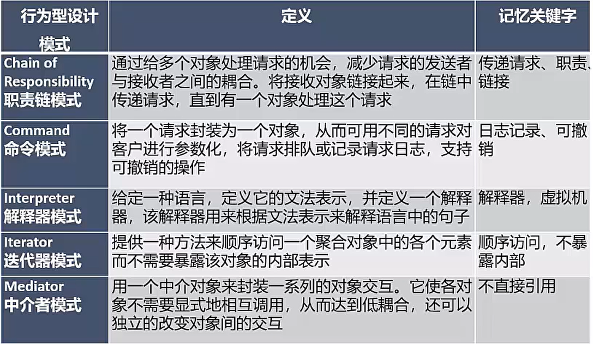

# 面向对象技术

- [面向对象技术](#面向对象技术)
  - [整体情况](#整体情况)
  - [面向对象开发](#面向对象开发)
    - [基本概念](#基本概念)
    - [生命周期](#生命周期)
    - [面向对象设计](#面向对象设计)
    - [面向对象测试](#面向对象测试)
  - [统一建模语言UML](#统一建模语言uml)
    - [基本概念](#基本概念-1)
    - [事物](#事物)
    - [关系](#关系)
    - [图](#图)
    - [4+1视图](#41视图)
  - [设计模式](#设计模式)
    - [概述](#概述)
    - [设计模式分类](#设计模式分类)

## 整体情况
第二版没有单独章节，内容少，且没有设计模式内容（近几年考的也少）。每年3-5分左右。

## 面向对象开发
### 基本概念
1. 对象:由**数据及其操作所构成的封装体**,是系统中用来**描述客观事务的一个实体**,是构成系统的一个基本单位。一个对象通常可以由**对象名、属性和方法**3个部分组成。
2. 类:现实世界中**实体的形式化描述**,类将该实体的属性(数据)和操作(函数)封装在一起。**对象是类的实例,类是对象的模板**。类可以分为三种:**实体类、接口类(边界类)和控制类**：
   - 实体类的对象表示**现实世界中真实的实体**,如人、物等。
   - 接口类(边界类)的对象**为用户提供一种与系统合作交互的方式,**分为人和系统两大类,其中人的接口可以是显示屏、窗口、Web窗体、对话框、菜单、列表框、其他显示控制、条形码、二维码或者用户与系统交互的其他方法。系统接口涉及到把数据发送到其他系统,或者从其他系统接收数据。
   - 控制类的对象用来**控制活动流,充当协调者**。
3. 抽象:通过**特定的实例抽取共同特征以后形成概念的过程**。它**强调主要特征,忽略次要特征**。一个对象是现实世界中一个实体的抽象,一个类是一组对象的抽象,抽象是一种单一化的描述,它强调给出与应用相关的特性,抛弃不相关的特性。
4. 封装:是一种**信息隐蔽技术**,将相关的概念组成一个单元模填,并通过一个名称来引用。面向对象封装是将数据和基于数据的操作封装成一个整体对象对数据的访问或修改只能通过对象对外提供的接口进行。
5. 继承:表示**类之间的层次关系(父类与子类)**,这种关系使得某类对象可以继承另外一类对象的特征,又可分为单继承和多继承。
6. 多态:**不同的对象收到同一个消息时产生完全不同的结果**。包括**参数多态(不同类型参数多种结构类型)、包含多态(父子类型关系)、过载多态(类似于重载,一个名字不同含义)、强制多态(强制类型转换)**四种类型。多态由继承机制支持,将通用消息放在抽象层,具体不同的功能实现现放在低层。
7. 接口:描述对操作规范的说明,其**只说明操作应该做什么**,并没有定义操作如何做。
8. 消息:体现**对象间的交互**,通过它向目标对象发送操作请求求。
9. 覆盖:子类在原有父类接口的基础上,用**适合于自己要求的实现去置换父类中的相应实现**。即在子类中重定义一个与父类同名同参的方法。
10. 函数重载:与覆盖要区分开,函数重载与子类父类无关,且**函数是同名不同参数**。
11. 绑定是一个**把过程调用和响应调用所需要执行的代码加以结合的过程**。在一般的程序设计语言中,绑定是**在编译时进行的,叫作静态绑定**。动态绑定则是**在运行时进行**的,因此,一个给定的过程调用和代码的结合直到调用发生时才进行。

### 生命周期
**面向对象的分析**:是为了**确定问题域,理解问题**。包含五个活动:**认定对象组织对象、描述对象间的相互作用、确定对象的操作、定义对象的内部信息**。

面向对象需求建模:

两种模型：用例模型和分析模型

### 面向对象设计
面向对象的设计:是**设计分析模型和实现相应源代码**,设计问题域的解决方案,与技术相关。OOD同样应遵循抽象、信息隐蔽、功能独立、模块化等设计准则。

面向对象的**分析模型**主要由**顶层架构图、用例与用例图、领域概念模型**构成;**设计模型则包含以包图表示的软件体系结构图、以交互图表示的用例实现图、完整精确的类图、针对复杂对象的状态图和用以描述流程化处理过程的活动图**等。

面向对象的设计原则（不止5个,只挑选了重点的讲）:
1. **单一责任原则**。就一个类而言,应该**仅有一个引起它变化的原因**。即,当需要修改某个类的时候原因有且只有一个,让一个类只做一种类型责任。
2. **开放-封闭原则**。软件实体(类、模块、函数等)应该是**可以扩展的,即开放的;但是不可修改的,即封闭的**。
3. **里氏替换原则**。**子类型必须能够替换掉他们的基类型**。即,不在任何父类可以出现的地方,都可以用子类的实例来赋值给父类型的引用。
4. **依赖倒置原则**。**抽象不应该依赖于细节,细节应该依赖于抽象**。即,高层模块不应该依赖于低层模块,二者都应该依赖于抽象。
5. **接口分离原则**。不应该强迫客户依赖于它们不用的方法。接口属于客户,不属于它所在的类层次结构。即:**依赖于抽象,不要依赖于具体**,同时在抽象级别不应该有对于细节的依赖。这样做的好处就在于可以最大限度地应对可能的变化。

### 面向对象测试
一般来说,对面向对象软件的测试可分为下列4个层次进行：
1. **算法层**。测试**类中定义的每个方法**,基本上相当于传统软件测试中的单元测试。
2. **类层**。测试封装**在同一个类中的所有方法与属性之间的相互作用**。在向面对象软件中类是基本模块,因此可以认为这是面向对象测试中所特不有的模块测试。
3. **模板层**。测试**一组协同工作的类之间的相互作用**,大体上相当于传统软件测试中的集成测试,但是也有面向对象软件的特点(例如,对象之间通过发送消息相互作用)。
4. **系统层**。把**各个子系统组装成完整的面向对象软件系统**,在组装过程中同时进行测试。

## 统一建模语言UML
### 基本概念
UML(统一建模语言):是一种**可视化的建模语言,而非程序设计语言**,支持从需求分析开始的软件开发的全过程。

从总体上来看,UML的结构包括**构造块、规则和公共机制**三个部分：
1. 构造块。UML有三种基本的构造块,分别是**事物(thing)、关系(relationship)和图(diagram)**。事物是UML的重要组成部分,关关系把事物紧密联系在一起,图是多个相互关联的事物的集合。
2. 公共机制。公共机制是指达到特定目标的公共UML方法去。
3. 规则。规则是构造块如何放在一起的规定。

主要对结构块进行展开讲解，公共机制和规则没考过。

### 事物
图形由事物组成，事物有四种类型：
- **结构事物**:模型的静态部分,如类、接口、用例、构件等;
- **行为事物**:模型的动态部分,如交互、活动、状态机;
- **分组事物**:模型的组织部分,如包;
- **注释事物**:模型的解释部分,依附于一个元素或组元素之上对其进行约束或解释的简单符号。

### 关系
类/事物之间的关系，分为四大类（包含6种）：
- **依赖**:**一个事物的语义依赖于另一个事物的语义的变化而变化**。
- **关联**:是一种结构关系,描述了一组链,链是对象之间的连妾。分为**组合和聚合**,都是**部分和整体的关系**,其中组合事物之间关系更强。两个多美之间的关联,实际上是两个类所扮演角色的关联,因此,两个类之间可以有多个由不同角色标识的关联。
- **泛化**:**一般/特殊的关系**,子类和父类之间的关系。
- **实现**:**一个类元指定了另一个类元保证执行的契约**。

### 图
UML2.0图,书上是13种,有的说法还包含制品图,一共14种,了解即可,总分类如下:

- **类图**

类图:静态图,为系统的**静态设计视图**,展现**一组对象、接口、协作和它们之间的关系**。UML类图如下:

（聚集中的符号标错了，应该是空心的菱形）

- 对象图

对象图:静态图,展现**某一时刻一组对象及它们之间的关系**,为**类图的某一快照**。在没有类图的前提下,对象图就是静态设计视图。如下:

- 用例图⭐

用例图:静态图,展现了一组**用例、参与者以及它们之间的关系**。用例图中的参与者是人、硬件或其他系统可以扮演的角色;用例是参与者完完成的一系列操作,用例之间的关系有**扩展、包含、泛化**。如下:

- 序列图

序列图:即**顺序图**,**动态图**,是场景的图形化表示,描述了**以时间顺序组织的对象之间的交互活动**。有**同步消息**(进行阻塞调用,调用者中止执行,等待控制权返回,需要等待返回消息,用实心三角箭头表示),**异步消息**(发出消息后继续执行,不引起调用者阻塞,也不等待返回消息,由空心箭头表示)、**返回消息**(由从右到左的虚线箭头表示)三种。如下:

- 通信图

通信图:动态图,即**协作图,强调参加交互的对象的组织**（反映对象之间的消息传递，且消息之间是有编号的）。如下:

- 状态图⭐

状态图:动态图,展现了一个状态机,描述**单个对象在多个用例中的行为**，包括简单状态和组合状态。转换可以**通过事件触发器触发**,事件触发后相应的**监护条件**会进行检查。状态图中转换和状态是两个独立的概念,如下:图中方框代表状态,箭头上的代表触发事件,实心圆点为起点和终点。

- 活动图

活动图:动态图,是一种**特殊的状态图**,展现了在**系统内从一个活动到另一个活动的流程**。活动的分岔和汇合线是一条水平粗线。牢记下图中**并发分岔、并发汇合、监护表达式、分支、流等名词及含义**。每个分岔的分支数代表了可同时运行的线程数。活动图中能够并行执行的是在一个分岔粗线下的分支上的活动。

- 构件图

构件图(组件图):静态图,为系统**静态实现视图,展现了一组构件之间的组织和依赖**。如下:

- 部署图

部署图:静态图,为**系统静态部署视图**,部署图**物理模块**的节点分布。它与构件图相关,通常一个结点包含一个或多个构件。其依赖关系类似于包依赖，因此部署组件之间的依赖是单向的类似于包含关系。如下:

### 4+1视图
> 视图是一种逻辑上的概念，比图更加抽象，视图是由图来实现的。

1. 逻辑视图。逻辑视图也称为**设计视图**,它表示了设计模型中在架构方面具有重要意义的部分,即**类、子系统、包和用例实现的子集**。
2. 进程视图。进程视图是**可执行线程和进程作为活动类的建模**,它是**逻辑视图的一次执行实例,描述了并发与同步结构**。
3. 实现视图。实现视图对组成基于系统的**物理代码的文件和构件进行建模**。
4. 部署视图。部署视图**把构件部署到一组物理节点上**,表示软件到硬件的映射和分布结构。
5. 用例视图。用例视图**是最基本的需求分析模型**。

## 设计模式
### 概述 
系统的模式分为三层：从高到底为架构模式、设计模式和惯用法：
- 架构模式:软件设计中的**高层决策**,例如C/S结构就属于架构模式,架构模式反映了开发软件系统过程中所作的基本设计决策。
- 设计模式:每一个设计模式描述了一个在我们周围**不断重复发生的问题,以及该问题的解决方案的核心**。这样,你就能一次又一次地使用该方案而不必做重复劳动。设计模式的核心在于提供了相关问题的解决方案,使得人们可以更加简单方便的复用成功的的设计和体系结构。四个基本要素:**模式名称、问题(应该在何时使用模式)、解决方案(设计的内容)、效果(模式应用的效果)**。
- 惯用法:是最低层的模式,关注**软件系统的设计与实现,实现时通过某种特定的程序设计语言**来描述构件与构件之间的关系。每种编程语言都有它自己特定的模式,即语言的惯用法。例如引用一计数就是C++语言中的一种惯用法。

### 设计模式分类
> 如何考：1.问一种模式属于哪一种设计模式（记住分类）; 2.考应用场景,问一个场景应该用哪种设计模式（掌握设计模式定义、理解设计模式应用场景）;3.考设计模式的图形（考的比较少,有的设计模式的图是一模一样的,因此题中会有所提示，比如概念或者图形中有英文）

- 创建型设计模式

就是用来创建对象的一种设计模式。

- 结构型设计模式

描述类和对象之间是如何组织的，如何组成一个结构。

- 行为型设计模式

反映类和对象的行为。

