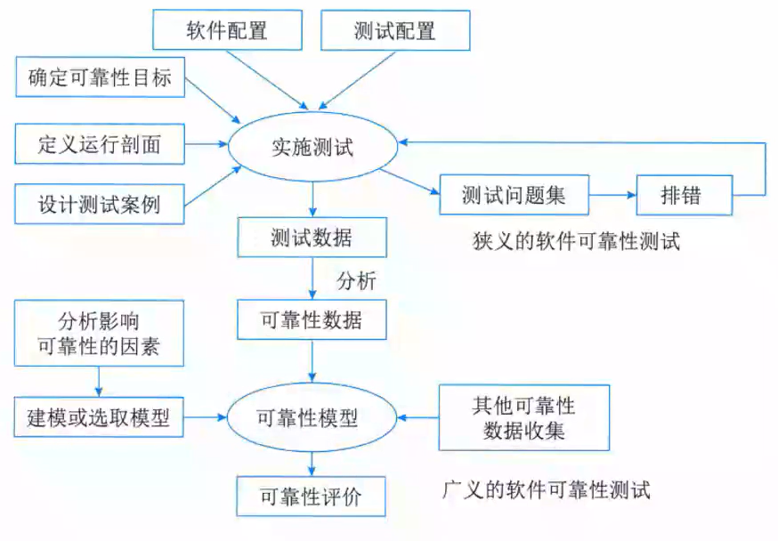

# 软件可靠性基础

## 整体情况
选择题可能考察2分，非重点章节。

## 软件可靠性基本概念⭐
软件可靠性是软件产品**在规定的条件下和规定的时间区间完成规定功能**的能力。

**软件可靠性和硬件可靠性区别：**
1. 复杂性:**软件复杂性比硬件高**,大部分失效来自于软件失效。
2. 物理退化:硬件失效主要是物理退化所致,**软件不存在物理退化**
3. 唯一性:**软件是唯一的**,每个COPY版本都一样,而两个硬件不可能完全一样。
4. 版本更新周期:**硬件较慢,软件较快**。

软件可靠性的**定量描述**
1. 规定时间:自然时间、运行时间、执行时间(占用CPU)。
2. 失效概率:软件运行初始时为0,随着时间增加单调递增,不断趋|向于1
3. 可靠度:软件系统在规定的条件下、规定的时间内不发生失效的概率。等于1-失效概率。
4. 失效强度:单位时间软件系统出现失效的概率。
5. **平均失效前时间(MTTF)**:平均无故障时间,发生故障前正常运行的时间。
6. **平均恢复前时间(MTTR)**:平均故障修复时间,发生故障后的修复夏时间
7. **平均故障间隔时间(MTBF)**:失效或维护中所需的平均时间,包括故障时间以及检测和维护设备的时间。MTBF=MTTF+MTTR。

系统可用性=MTTF/(MTTF+MTTR)*100%。

**串并联系统可靠性**

无论什么系统,都是由多个设备组成的,协同工作,而这多个设备的组合方式可以是串联、并联,也可以是混合模式,假设每个设备的可靠性为R1,R2...Rn,则不同的系统的可靠性公式如下:
- 串联系统,一个设备不可靠,整个系统崩溃,整个系统可靠性**R=R1*R2*... *Rn**;

- 并联系统,所有设备都不可靠,整个系统才崩溃,整个系统可靠性**R=1-(1-R1)\*(1-R2)\*...\*(1-Rn)**。

**可靠性测试的意义:**
1. 软件失效可能造成灾难性的后果。
2. 软件的失效在整个计算机系统失效中的比例较高。
3. 软件可靠性技术很不成熟,加剧了软件可靠性问题的重要性。
4. 软件可靠性问题是造成费用增长的主要原因之一。
5. 软件对生产活动和社会生活的影响越来越大,从而增加了软件可靠性问题在软件工程领域乃至整个计算机工程领域的重要性。

- 广义的软件可靠性测试是指为了最终评价软件系统的可靠性而运用建模、统计、试验、分析和评价等一系列手段对软件系统实施的一种测试。
- 狭义的软件可靠性测试是指为了获取可靠性数据,按预先确定的测试用例,在软件的预期使用环境中,对软件实施的一种测试。它是面向缺陷的测试,以用户将要使用的方式来测试软件。

## 软件可靠性建模
软件可靠性模型是指**为预计或估算软件的可靠性所建立的可靠性框图和数学模型**。

从技术的角度来看,影响软件可靠性的主要因素包括:**运行环境、软件规模、软件内部结构、软件的开发方法和开发环境、软件的可靠性投入**。

一个软件可靠性模型通常(但不是绝对)由以下几部分组成:
1. **模型假设**。模型是实际情况的简化或规范化,总要包含若干假设,例如测试的选取代表实际运行剖面,不同软件失效独立发生等。
2. **性能度量**。软件可靠性模型的输出量就是性能度量,如失效强度、残留缺陷数等。在软件可靠性模型中性能度量通常以数学表达式给出。
3. **参数估计方法**。某些可靠性度量的实际值无法直接获得,例如残留缺陷数,这时需通过一定的方法估计参数的值,从而间接确定可靠性度量的值。
4. **数据要求**。一个软件可靠性模型要求一定的输入数据,即软件可靠性数据。

绝大多数的模型包含3个共同假设:
1. **代表性假设**。是指可以用测试产生的软件可靠性数据预测运行阶段的软件可靠性行为。
2. **独立性假设**。此假设认为软件失效是独立发生于不同时刻,一个软件失效的发生不影响另一个软件失效的发生。
3. **相同性假设**。此假设认为所有软件失效的后果(等级)相同,即建模过程只考虑软件失效的具体发生时刻,不区分软件的失效严重等级。

软件的可靠性模型分类: 
1. 种子法模型。利用捕获一再捕获抽样技术估计程序中的错误数,在程序中预先有意"播种"一些设定的错误"种子",然后根据测试出的原始错误数和发现的诱导错误的比例,来估计程序中残留的错误数。
2. 失效率类模型。用来研究程序的失效率。
3. 曲线拟合类模型。用回归分析的方法研究软件复杂性、程岸中的缺陷数、失效率、失效间隔时间。
4. 可靠性增长模型。这类模型预测软件在检错过程中的可靠性改进,用增长函数来描述软件的改进过程。
5. 程序结构分析模型。是根据程序、子程序及其相互间的调用关系,形成一个可靠性分析网络。
6. 输入域分类模型。选取软件输入域中的某些样本"点"运行程序,根据这些样本点在"实际"使用环境中的使用概率的测试运行时的成功/失效率,推断软件的使用可靠性。
7. 执行路径分析方法模型。分析方法与上面的模型相似,失计算程序各逻辑路径的执行概率和程序中错误路径的执行概率,再综合出该软件的使用可靠性。
8. 非齐次泊松过程模型。是以软件测试过程中单位时间的失效次数为独立泊松随机变量,来预测在今后软件的某使用时间点的累计失效数。
9. 马尔可夫过程模型。
10. 贝叶斯模型。是利用失效率的试验前分布和当前的测测试失效信息,来评估软件的可靠性。

## 软件可靠性管理
软件可靠性管理是**软件工程管理的一部分**,它以**全面提高和保证软件可靠性为目标**,以**软件可靠性活动为主要对象**,是把现代管理理论用于软件生命周期中的可靠性保障活动的一种管理形式。

软件可靠性管理的内容**包括软件工程各个阶段的可靠性活动的目标、计划、进度、任务和修正措施**等。可靠性各阶段设计任务如下:
- 需求分析阶段:确定可靠性目标、分析影响因素、确定验收标准、制定框架、制定文档编写规范、制定初步计划、确定数据收集规范。
- 概要设计阶段:确定可靠性度量、制定详细验收方案、可靠性设计、收集数据、调整计划、明确后续阶段详细计划、编制文档。
- 详细设计阶段:可靠性设计、预测、调整计划、收集数据、I明确后续阶段详细计划、编制文档。
- 编码阶段:可靠性测试(单元)、排错、调整计划、收集集数据、明确后续阶段详细计划、编制文档。
- 测试阶段:可靠性测试(集成和系统)、排错、可靠性建模、、评价、调整计划、收集数据、明确后续阶段详细计划、编制文档。
- 实施阶段:可靠性测试(验收)、排错、收集数据、调整整模型、评价、编制文档。

## 软件可靠性设计⭐
实践证明,保障软件可靠性最有效、最经济、最重要的手段是**在软件设计阶段采取措施**进行可靠性控制。

可靠性设计其实就是**在常规的软件设计中**,应用各种方法和技术,使程序设计在兼顾用户的功能和性能需求的同时,**全面满足软件的可靠性要求**。

软件可靠性设计原则:
1. 软件可靠性设计是**软件设计的一部分**,必须在软件的总体设计框架中使用,并且不能与其他设计原则相冲突。
2. 软件可靠性设计在满足提高软件质量要求的前提下,以**提高和保障软件可靠性为最终目标**。
3. 软件可靠性设计应**确定软件的可靠性目标**,不能无限扩大化,并且排在功能度、用户需求和开发费用之后考虑。

软件可靠性设计技术主要有**容错设计、检错设计和降低复杂度设计**等技术。

提高系统可靠性的技术可以分为**避错(排错)技术和容错技术**。避错是通过**技术评审、系统测试和正确性证明等技术**,在系统**正式运行之前避免、发现和改正错误**。

容错是指系统**在运行过程中发生一定的硬件故障或软件错误时,仍能保持正常工作而不影响正确结果**的一种性能或措施。容错技术主要是采用**冗余方法**来消除故障的影响。

冗余是指在正常系统运行所需的基础上加上一定数量的资源,包括信息、时间、硬件和软件。**冗余是容错技术的基础**,通过冗余资源的加入,可以使系统的可靠性得得到较大的提高。主要的冗余技术有结构冗余(静态、动态、混合)、信息冗余、时间冗余和冗余附加4种。

**软件容错**的主要方法是**提供足够的冗余信息和算法程序,使系统在实际还运行时能够及时发现程序设计错误,采取补救措施,**以提高系统可靠性,保证整个系统的正常运行。

**软件容错技术**主要有N版本程序设计、恢复块方法和防卫式程序设计等：
- N版本程序设计:其设计思想是用**N个具有相同功能的程序同时执行一项计算**,结果通过**多数表决来选择**。其中N个版本的程序必须由**不同的人独立设计,使用不同的方法、设计语言、开发环境和工具来实现**,目的是减少N个版本的程序在表决点上相关错误的概率。

- 恢复块设计(动态冗余):动态冗余又称为主动冗余,它是通过故障检测、故障定位及故障恢复等手段达到容错的目的。其主要方式是**多重模块待机储备**,当系统检测到某工作模块出现错误时,就**用一个备用的模块来替代它并重新运行**。各备用模块在其待机时,**可与主模块一样工作,也可以不工作**。前者叫热备份系统(双重系统),后者叫冷备份系统(双工系统、双份系统)。
 

- 防卫式程序设计:是一种**不采用任何传统的容错技术就能实现软件容错的方法**,对于程序中存在的错误和不一致性,防卫式程序设计的基本思想是通过**在程序中包含错误检查代码和错误恢复代码,使得一旦发生错误,程序就能撤销错误状态,恢复到一个已知的正确状态中去**。其实现策略包括错误检测、破坏估计和错误恢复三个方面。
- 双机容错技术:是一种**软硬件结合**的容错应用方案。该方案是由**两台服务器和一个外接共享磁盘阵列及相应的双机软件组成**。
  - 双机容错系统**采用"心跳"方法**保证主系统与备用系统的联系。所谓谓心跳,是指主从系统之间相互按照**一定的时间间隔发送通信信号**,表明各自系统当前的运行状大态。一旦心跳信号表明主机系统发生故障,或者备用系统无法收到主系统的心跳信号,则系统的高可用性管理软件认为主系统发生故障,立即将系统资源转移到备用系统上,备用系统替代主系统工作,以保证系统正常运行和网络服务不间断。
  - 工作模式:**双机热备模式;双机互备模式;双机双工模式**。
- 集群技术就是将**多台计算机组织起来进行协同工作**,它是提高系统可用性和可靠性的一种技术。在集群系统中,每台计算机均**承担部分计算任务和容错任务**,当其中一台计算机出现故障时,系统使用集群软件将这台计算机从系统中隔出离去,通过各计算机之间的负载转嫁机制**完成新的负载分担**,同时向系统管理人员发出警报。集群系统通过功能整合和故障过渡,实现了系统的高可用性和可靠性。
  - 特点:可伸缩性、高可用性、可管理性、高性价比、高透明性。
  - 分类:高性能计算集群、负载均衡集群、高可用性集群。
- 负载均衡是**集群系统中的一项重要技术**,可以提高集群系统的整体处理能力,也提高了系统的可靠性,最终目的**是加快集群系统的响应速度,提高客户端访问的成功概率**。集群的最大特征是多个节点的**并行和共同工作,如何让所有节点承受的负荷平均**,不出现局部过大负载或过轻负载的情况,是负载均衡的重要目的。比较常用的负载均衡实现技术主要有以下几种:
  1. **基于特定软件的负载均衡(应用层)**。很多网络协议都支持重定定向功能,例如,基于HTTP**重定向服务**,其主要原理是服务器使用HTTP重定向指令,将一个客户端重新定位到另一个位置。服务器返回一个重定向响应,而不是返回请求的对象。客户端确认新地址然后重发请求,从而达到负载均衡的目的。
  2. **基于DNS的负载均衡属于传输层负载均衡技术**,其主要原理是在DNS服务器中为同一个主机名配置多个地址,在应答DNS查询时,DNS服务器对每个查询将以DNS文件P中主机记录的IP地址按顺序返回不同的解析结果,将客户端的访问引导到不同的节点上去,使得不同的客户端访问不同的节点,从而达到负载均衡的目的。
  3. **基于NAT的负载均衡**。将一个外部IP地址映射为多个内部IP地地址,对每次连接需求动态地转换为一个内部节点的地址,将外部连接请求引到转换得到地址的那个节点点,上从而达到负载均衡的目的。
  4. **反向代理负载均衡**。将来自Internet上的连接请求以反向代理的的方式动态地转发给内部网络上的多个节点进行处理,从而达到负载均衡的目的。
  5. **混合型负载均衡。**

## 软件可靠性测试与评价
软件可靠性测试由**可靠性目标的确定、运行剖面的开发、测试用例的设计、测试实施、测试结果的分析**等主要活动组成。

测试步骤:**定义软件运行剖面**(为软件的使用行为建模)--**设计可靠性测试用例**--**实施可靠性测试**。

软件可靠性评价3个过程:**选择可靠性模型、收集可靠性数据、可靠性评估和预测**。

选择可靠性模型考虑因素:模型假设的适用性、预测的能力与质量、模型输出值能否满足可靠性评价需求、模型使用的简便性。

可靠性数据的收集:可靠性数据主要是指**软件失效数据**,是软件可靠性评价的基础,主要是在软件测试、实施阶段收集的。应采用的解决方法:及早确定所采用的的可靠性模型、制订可实施性较强的可靠性数据收集计划、重视软件测试数据的整理和分析、充分利用数据库来完成可靠性数据的存储和统计分析。

可靠性评估和预测:**判断是否达到了可靠性目标**;如未能达到要再投入多少;在软件系统投入实际运行一年或若干时间后,经过维护、升级和修改,软件能否达到交付或部分交付用户使用的可靠性水平。辅助方法:失效数据的图形分析法、试探性数据分析技术。
