# 数据库系统

- [数据库系统](#数据库系统)
  - [整体情况](#整体情况)
  - [数据库基本概念](#数据库基本概念)
    - [数据库系统](#数据库系统-1)
    - [三级模式-两级映像](#三级模式-两级映像)
    - [数据库设计](#数据库设计)
    - [数据模型](#数据模型)
      - [E-R模型](#e-r模型)
      - [关系模型](#关系模型)
      - [E-R模型转换关系模型](#e-r模型转换关系模型)
    - [关系代数](#关系代数)
  - [规范化和并发](#规范化和并发)
    - [函数依赖](#函数依赖)
    - [键与约束](#键与约束)
    - [范式](#范式)
      - [第一范式1NF](#第一范式1nf)
      - [第二范式2NF](#第二范式2nf)
      - [第三范式3NF](#第三范式3nf)
      - [BC范式BCNF](#bc范式bcnf)
    - [模式分解](#模式分解)
    - [并发控制](#并发控制)
    - [封锁协议](#封锁协议)
  - [数据库新技术](#数据库新技术)
    - [数据库安全](#数据库安全)
    - [分布式数据库](#分布式数据库)
    - [数据仓库](#数据仓库)
    - [反规范化技术](#反规范化技术)
    - [大数据](#大数据)
    - [SQL语言](#sql语言)

## 整体情况
选择题每年考3-5分左右。案例分析每年都有一道。

教材新改动主要在数据设计部分，新增了NoSQL（主要考案例）。

## 数据库基本概念
### 数据库系统

数据:是数据库中存储的基本对象,是描述事物的符号记录。

数据的种类:文本、图形、图像、音频、视频、学生的档案记录、货物的运输
情况等。

数据库DB:是长期存储在计算机内、有组织的、可共享的大量数据的集合。

数据库的基本特征:
- 数据按一定的数据模型组织、描述和存储;
- 可为各种用户共享;
- 冗余度较小;
- 数据独立性较高;
- 易扩展。

数据库系统DBS:是一个采用了数据库技术,有组织地、动态地存储大量相关数据,方便多用户访问的计算机系统。其由下面四个部分组成:
- 数据库(统一管理、长期存储在计算机内的,有组织的相关数据的集合)
- 硬件(构成计算机系统包括存储数据所需的外部设备)
- 软件(操作系统、数据库管理系统及应用程序)
- 人员(系统分析和数据库设计人员、应用程序员、最终用户、数据库管理员
DBA)。

数据库管理系统DBMS的功能
- 实现对共享数据有效的组织、管理和存取。
- 包括数据定义、数据库操作、数据库运行管理、数据的存储管理、数据库的建
立和维护等。

### 三级模式-两级映像
**三级模式**
- **内模式**:管理如何存储物理的数据,对应具体物理存储文件。
- **模式**:又称为概念模式,就是我们通常使用的基本表,根据应用、需求将物理数据划分成一张张表。
- **外模式**:对应数据库中的视图这个级别,将表进行一定的处理后再提供给用户使用

**两级映像**
> 目的都是为了保证当数据库中数据发生修改时，应用程序不需要修改。
- **外模式-模式映像**:是表和视图之间的映射,存在于概念级和外部级之间,若表中数据发生了修改,只需要修改此映射,而无需修改应用程序。保证了数据之间的逻辑独立性。
- **模式-内模式映像**:是表和数据的物理存储之间的映射,存在于概念级和内部级之间,若修改了数据存储方式,只需要修改此映射,而不需要去修改应用程序。保证了数据之间的物理独立性。

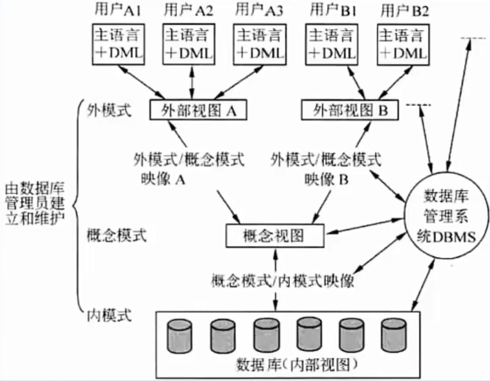

### 数据库设计
> 考点：设计步骤要记住；每个步骤的产出物；每个步骤的内容和值得注意的地方。

- (1)**需求分析**:即分析数据存储的要求,产出物有数据流图、数据字典、需求说明书。获得用户对系统的三个要求:信息要求、处理要求、系统要求。
- (2)**概念结构设计**:就是设计E-R图,也即实体-联系图。工作步骤包括:选择局部应用、逐一设计分E-R图、E-R图合并。**分E-R图进行合并时,它们之间存在的冲突主要有以下3类:**
  - 属性冲突。同一属性可能会存在于不同的分E-R图中。
  - 命名冲突。相同意义的属性,在不同的分E-R图上有着不同的命名,或是名称相同的属性在不同的分E-R图中代表着不同的意义。
  - 结构冲突。同一实体在不同的分E-R图中有不同的属性,同一对象在某一分E-R图中被抽象为实体而在另一分E-R图中又被:抽象为属性。
- (3)**逻辑结构设计**:将E-R图,转换成关系模式。工作步骤包括活:确定数据模型、将E-R图转换成为指定的数据模型、确定完整性约束和确定用户视图。
- (4)**物理设计**:步骤包括确定数据分布、存储结构和访问方式。
- (5)**数据库实施阶段**:根据逻辑设计和物理设计阶段的结果建立数据库,编制与调试应用程序,组织数据入库,并进行试运行。
- (6)**数据库运行和维护阶段**:数据库应用系统经过试运行即可投入运行,但该阶段需要不断地对系统进行评价、调整与修改。
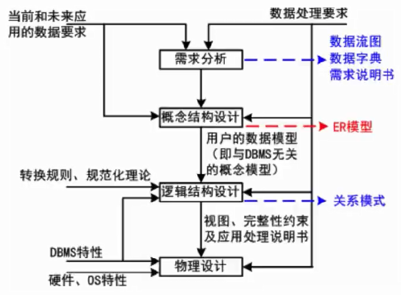

### 数据模型
数据模型大体分为以下四种：
- **关系模型**是**二维表的形式表示的实体-联系模型**,是将实体-联系模型转换而来的,经过开发人员设计的;（是一张表格。）
- **概念模型**是从用户的角度进行建模的,是现实世界到信息世界的第一抽象,是真正的实体-联系模型；（是E-R图形。）
- 网状模型表示实体类型及其实体之间的联系,一个事物和另外几个都有联系,形成一张网。
- 面向对象模型是采用面向对象的方法设计数据库,以对象为单位,每个对象
包括属性和方法,具有类和继承等特点。

数据模型三要素:**数据结构**(所研究的对象类型的集合)、**数据操作**(对数
据库中各种对象的实例允许执行的操作的集合)、**数据的约束条件**(一组完整
性规则的集合)。

#### E-R模型
用E-R图来描述概念数据模型,世界是由一组称作实体的基本对象和这些对象之间的联系构成的。

在E-R模型中,使用**椭圆表示属性(一般没有)、长方形表示实体、菱形表示联系,联系的两端要填写联系类型**,示例如下图:
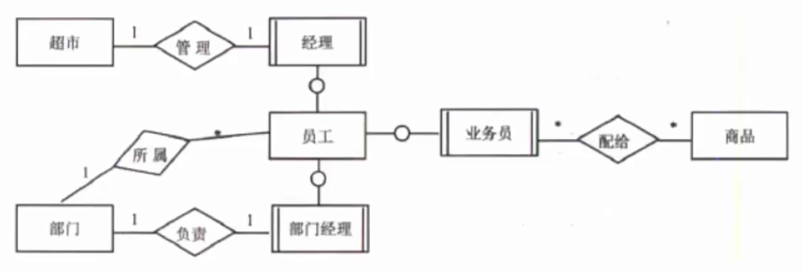
> 联系类型：1对1(1:1)、1对多(1:\*)，多对多(\*:\*)，要通过题目描述来判断联系类型。*、M、N都可以表示多的含义，考试时根据可根据题目内容进行表示，若题目没有多的表示，则选任意一种，不要混合使用，保持一个标准。

一些概念：
- 实体:**客观存在并可相互区别的事物**。可以是具体的人、事、物或抽象概念。如人、汽车、图书、账户、贷款。
- 弱实体和强实体:弱实体依赖于强实体的存在而存在。（长方形加两道杠叫弱实体）
- 实体集:具有相同类型和共享相同属性的实体的集合,如学生、课程。
- 属性:**实体所具有的特性**。
- 属性分类:简单属性（如年龄）和复合属性（如家庭住址，包含国家、省市县街道等属性）;单值属性（取值唯一的属性，年龄只有一个）和多值属性（可取多个值的属性，电话号码可以有多个）;NULL属性（暂时没有值）;派生属性（其他属性计算得出的，比如表中有出生年月和当前时间，可计算出年龄，则年龄就是派生属性）。
- 域:属性的取值范围称为该属性的域。
- 码(key)，又叫键:唯一标识实体的属性集。
- 联系:现实世界中**事物内部以及事物之间的联系**,在E-R图中反映为**实体内部的联系和实体之间的联系**。
- 联系类型:**一对一1:1、一对多1:N、多对多M:N**。
- 两个以上实体型的联系:

#### 关系模型
关系模型中数据的逻辑结构是一张**二维表**,由行列组成。用表格结构表达实体集,用外键标识实体间的联系。如下图:
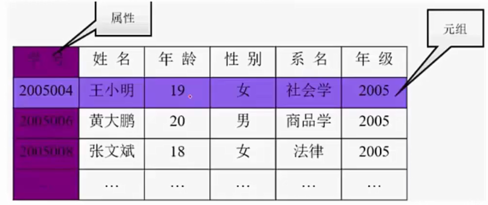
优点:建立在严格的数学概念基础上;概念单一、结构简单、清晰用户易懂易用;存取路径对用户透明,从而数据独立性、安全性好,简化数据库开发工作。

缺点:由于存取路径透明,查询效率往往不如非关系数据模型。

#### E-R模型转换关系模型
E-R模型转换为关系模型:**每个实体（强实体）都对应一个关系模式**;联系分为三种:
- 1:1联系中,联系可以**放到任意的两端实体中,作为一个属性**(要保证1:1的两端关联),也可以转换为一个单独的关系模式;
- 1:N的联系中,联系可以单独作为一个关系模式,也可以**在N端中加入1端实体的主键**;（比如员工、部门关系，在员工表中加入部门号主键属性。如果反过来在1端加入N端实体，则会造成数据冗余。）
- M:N的联系中,联系**必须作为一个单独的关系模式,其主键是M和N端的联合主键**。

### 关系代数
关系代数就是指表之间的逻辑运算。

- 并:结果是两张表中所有记录数合并,相同记录只显示一次。
- 交:结果是两张表中相同的记录。
- 差:S1-S2,结果是S1表中有而S2表中没有的那些记录。
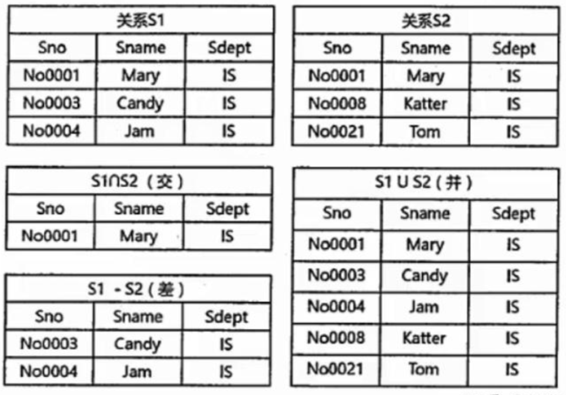

- 笛卡尔积（符号×）:S1×S2,产生的结果包括S1和S2的所有属性列,并且S1中每条记录依次和S2中所有记录组合成一条记录,最终属性列为S1+S2属性生列,记录数为S1×S2记录数。
- 投影（符号π）:实际是按条件选择某关系模式中的**某列**,列也可以用数字表示。
- 选择（符号σ）:实际是按条件选择某关系模式中的**某条记录**。

- 自然连接的结果**显示全部的属性列,但是相同属性列只显示一次,显示两个关系模式中属性相同且值相同的记录**。设有关系R、S如下左图所示,自然连接结果如下右图所示:
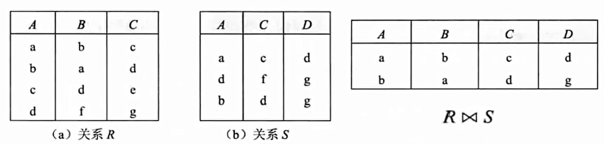

## 规范化和并发
### 函数依赖
给定一个X,能唯一确定一个Y,就称X确定Y,或者说Y依赖于X(X→Y),例如Y=X*X函
数。

函数依赖又可扩展以下两种规则:
- 部分函数依赖:A可确定C,(A,B)也可确定C,**(A,B)中的一部分(即A)可以确定C**,表示为AB→C（内部包含了A→C）,称为部分函数依赖。只存在于联合主键中。
- 传递函数依赖:当A和B不等价时,**A可确定B,B可确定C,则A可确定C**,是传递函数依赖;若A和B等价,则不存在传递,直接就可确定C。

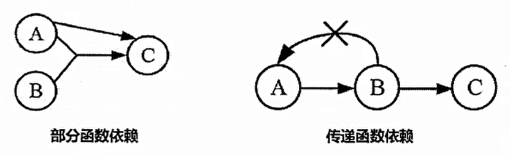

**函数依赖的公理系统(Armstrong)**

设关系模式R<U,F>,U是关系模式R的属性全集,F是关系模式R的一个函数依赖集。对于R<U,F>来说有以下的:
- 自反律:若Y⊆X⊆U,则X→Y为F所逻辑蕴含
- 增广律:若X→Y为F所逻辑蕴含,且Z⊆U,则XZ→YZ为F所逻辑蕴含
- 传递律:若X→Y和Y→Z为F所逻辑蕴含,则X→Z为F所逻辑蕴含
- 合并规则:若X→Y,X→Z,则X→YZ为F所蕴涵
- 伪传递率:若X→Y,WY→Z,则XW→Z为F所蕴涵
- 分解规则:若X→Y,Z⊆Y,则X→Z为F所蕴涵

### 键与约束
键有时候也叫码，一下概念中的键也可以用码替换。
- 超键:能**唯一标识**此表的属性的组合。
- 候选键:超键中**去掉冗余的属性**,剩余的属性就是候选键。
- 主键:**任选一个候选键**,即可作为主键。
- 外键:**其他表中的主键**。
- 主属性:**候选键内的属性为主属性**,其他属性为非主属性。
- 实体完整性约束:即**主键约束,主键值不能为空,也不能重复**。
- 参照完整性约束:即外键约束,**外键必须是其他表中已经存在的主键的值,或者为空**。
- 用户自定义完整性约束:**自定义表达式约束**,如设定年龄属性的值必须在0到150之间。

候选关键字的求法:根据依赖集,**找出从未在右边出现过的属性**,必然是候选键之一，以该属性为基础,根据依赖集依次扩展,**看能否遍历所有属性**,将无法遍历的加入候选键中。

### 范式
讲第一、第二、第三、BC范式，之后的第四、第五不讲，不太重要。考试比较多是第三范式。

#### 第一范式1NF

关系中的**每一个分量必须是一个不可分的数据项**（要求每个属性必须是简单属性，不能是复合属性。）。通俗地说,第一范式就是表中不允许有小表的存在。比如,对于如下的员工表,就不属于第一范式（薪资是复合属性）:
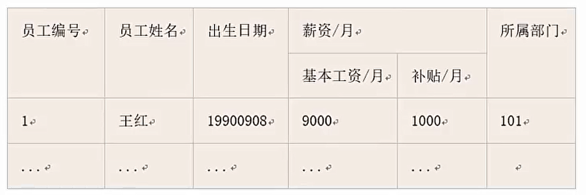

用以下有问题的实例来讲解后面的范式：
- 实例:用一个单一的关系模式学生来描述学校的教务系统:学生(学号,学生姓名,系号,系主任姓名,课程号,成绩)
- **依赖关系**(学号->学生姓名,学号->系号,系号,系号->系主任姓名,学号->课程号,(学号,课程号)->成绩)

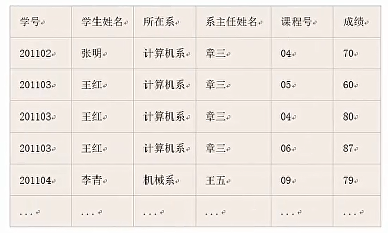
目前的联合

#### 第二范式2NF
如果**关系R属于1NF**,且**每一个非主属性完全函数依赖于任何一个候选码**,则R属于2NF。通俗地说,2NF就是在1NF的基础上,表中的**每一个非主属性不会依赖复合主键中的某一个列**。
> 单属性的主键必然是2NF，第二范式就是消除非主属性对主键的部分函数依赖。

按照定义,上面的学生表就不满足2NF,因为学号不能完全确定果程号和成绩(每个学生可以选多门课)。

将学生表**分解为**:
- 学生(学号,学生姓名,系编号,系名,系主任)，主键就是学号，单属性的主键。
- 选课(学号,课程号,成绩)，主键是(学号，课程号)，没有部分函数依赖。
每张表均属于2NF。

#### 第三范式3NF
> 第三范式消除非主属性对主键的传递依赖。
在**满足1NF的基础上,表中不存在非主属性对主键的传递依赖**。

继续上面的实例,学生关系模式就不属于3NF,因为学生无法直接决定系主任和系名,是由学号->系编号,再由系编号->系主任,系编号>系名,因此存在非主属性对主属性的传递依赖,

**将学生表进一步分解为**:
- 学生(学号,学生姓名,系编号)
- 系(系编号,系名,系主任)
- 选课(学号,课程号,成绩)
每张表都属于3NF。

#### BC范式BCNF
> 考的少一点。要依赖多个候选关键字。
BC范式BCNF,是指**在第三范式的基础上进一步消除主属性对于码（主键）的部分函数依赖和传递依赖**。通俗的来说,就是**在每一种情况下,每一个依赖的左边决定因素都必然包含候选键**,如下:
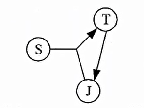

上图中,候选键有两种情况:组合键(S,T)或者(S,J),依赖集为{SJ→T,T→J},可知,STJ三个属性都是主属性,因此其达到了3NF(无非主属性),然而,第二种情况,即(S,J)为候选键的时候,对于依赖T→J,T在这种情请况不是候选键,即T→J的决定因素不包含任意候选码,因此上图不是BCNF。

要使上图关系模式转换为BCNF也很简单,只需要将依赖T→J变为TS→J即可,这样其左边决定因素就包含了候选键之一S。

### 模式分解
范式之间的转换一般都是通过拆分属性,即模式分解,将具有部部分函数依赖和传递依赖的属性分离出来,来达到一步步优化,一般分为以下两种:

**保持函数依赖分解**

对于关系模式R,有依赖集F,若对R进行分解,**分解出来的多个关系系模式,保持原来的依赖集不变**,则为保持函数依赖的分解。另外,注意要消除掉冗余依赖(如传递依赖)。
  - 实例:设原关系模式R(A,B,C),依赖集F(A->B, B->C,A->C),将其分解为两个关系模式R1(A,B)和R2(B,C),此时R1中保持依赖A->B,R2保持依赖B->C说明分解后的R1和R2是保持函数依赖的分解,因为A->C这个函数依赖实你是一个冗余依赖,可以由前两个依赖传递得到,因此不需要管。
  - **保持函数依赖的判断**(补充,第2点不强求):
    - 1、如果F上的每一个函数依赖都在其分解后的某一个关系上成立,则这个分解是保持依赖的(这是一个充分条件)。也即我们课堂上说的简单方法,看函数每个依赖的左右两边属性是否都在同一个分解的模式中。
    - 2、如果上述判断失败,并不能断言分解不是保持依赖的,还要使用下面的通用方法来做进一步判断。方法的表述如下（其中+的意思是代表由属性能够推导出的其他所有属性的集合，如B+就是B能够推导出的其他所有属性的集合）：
    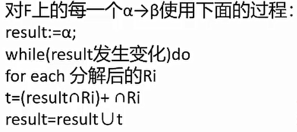

**无损分解**
分解后的关系模式能够还原出原关系模式（原属性）,就是无损分解,不能还原就是有损。

当分解为**两个关系模式**,可以通过以下定理判断是否无损分解:
- 定理:如果R的分解为p={R1,R2},F为R所满足的函数依赖集合,分解p具有无损
连接性的**充分必要条件是R1∩R2->(R1-R2)或者R1∩R2->(R2-R1)**。

当分解为**三个及以上关系模式时,可以通过表格法求解**,如下:
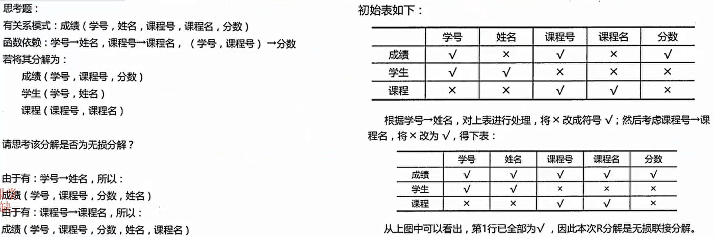

### 并发控制

事务:由一系列操作组成,这些操作,要么全做,要么全不做,拥有四种特性,详解如下:
- (操作)**原子性**:要么全做,要么全不做。
- (数据)**一致性**:事务发生后数据是一致的,例如银行转账,不会会存在A账户转出,但是B账户没收到的情况。
- (执行)**隔离性**:任一事务的更新操作直到其成功提交的整个过程对其他事务都是不可见的,不同事务之间是隔离的,互不干涉。
- (改变)**持续性**:事务操作的结果是持续性的。

事务是并发控制的前提条件,并发控制就是**控制不同的事务并发执行**,提高系统效率,但是**并发控制中存在下面三个问题**:
- **丢失更新**:事务1对数据A进行了修改并写回,事务2也对A进行了修改并写回,此时事务2写回的数据会覆盖事务1写回的数据,就丢失了事务1对A的更新。即对数据A的更新会被覆盖。
- **不可重复读**:事务2读A,而后事务1对数据A进行了修改并写回,此时若事务2再读A,发现数据不对。即一个事务重复读A两次,会发现数据A有误。
- **读脏数据**:事务1对数据A进行了修改后,事务2读数据A,而后事事务1回滚,数据A恢复了原来的值,那么事务2对数据A做的事是无效的,读到了脏数据。
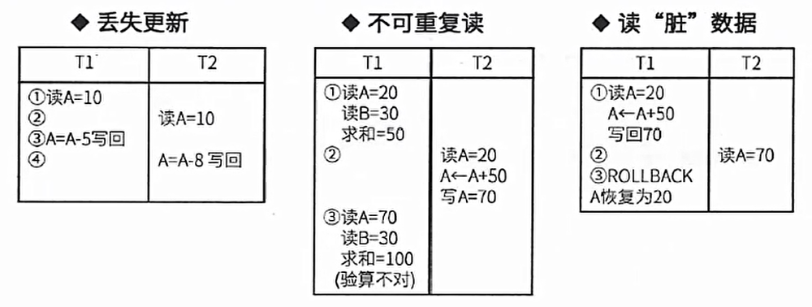

### 封锁协议
- **X锁是排它锁(写锁)**。若事务T对数据对象A加上X锁,则只允许T读取和修改A,**其他事务都不能再对A加任何类型的锁**,直到T释放A上的锁。
- **S锁是共享锁(读锁)**。若事务T对数据对象A加上S锁,则只允许T读取A,但不能修改A,**其他事务只能再对A加S锁**(也即能读不能修改),直至到T释放A上的S锁。

共分为三级封锁协议,如下:

- 一级封锁协议:**事务在修改数据R之前必须先对其加X锁**,直到事务结束才释放。**可解决丢失更新问题。**
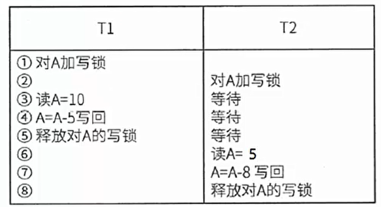

- 二级封锁协议:一级封锁协议的基础上加上事务T在**读数据R之前必须先对其加S锁,读完后即可释放S锁。可解决丢失更新、读脏数据问题**。
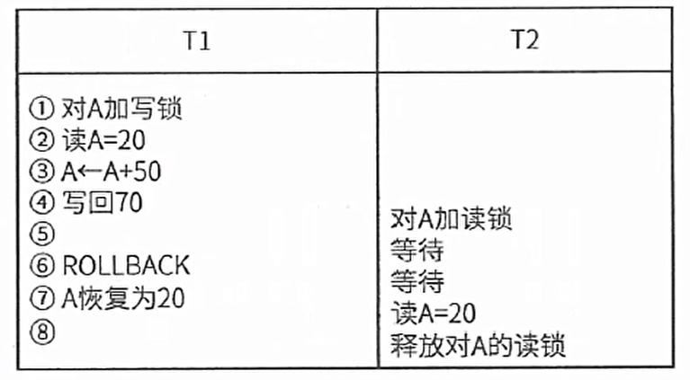

- 三级封锁协议:一级封锁协议加上事务T在读取数据R之前先对其加s锁,**直到事务结束才释放**。**可解决丢失更新、读脏数据、数据重复读问题**。
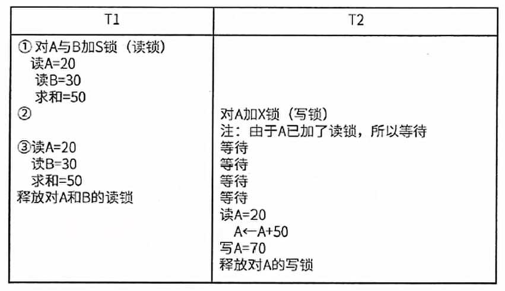

## 数据库新技术
### 数据库安全
数据库安全措施和常见故障：
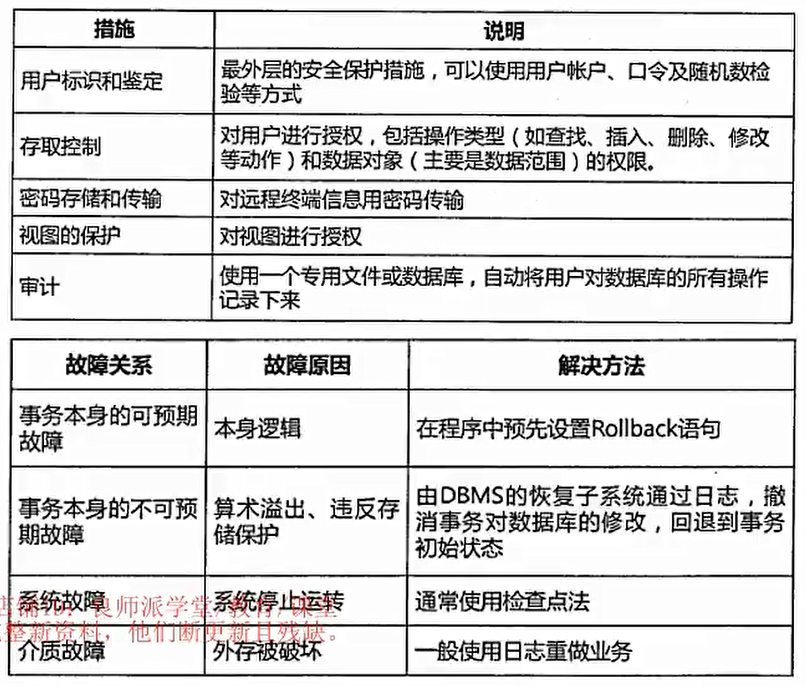

数据库备份：
- 静态转储:即**冷备份**,指在转储期间不允许对数据库进行任何存取又、修改操作;
  - 优点是非常快速的备份方法、容易归档(直接物理复制操作);
  - 缺点是只能提供到某一时间点上的恢复,不能做其他工作,不能按表或按用户恢复。
- 动态转储:即**热备份**,在转储期间允许对数据库进行存取、修改操作因此,转储和用户事务可并发执行;
  - 优点是可在表空间或数据库文件级备份,数据库扔可使用,可达到秒级恢复;
  - 缺点是不能出错,否则后果严重,若热备份不成功,所得结果几乎全部无效。

备份方式：
- 完全备份:备份所有数据。
- 差量备份:仅备份上一次完全备份之后变化的数据。
- 增量备份:备份上一次备份之后变化的数据。

**日志文件**:在事务处理过程中,DBMS把事务开始、事务结束以及对数据库的插入、删除和修改的每一次操作写入日志文件。一旦发生故障,DBMS的恢复子系统利用日志文件撤销事务对数据库的改变,回退到事务的初始状态。

### 分布式数据库
局部数据库位于不同的物理位置,使用一个全局DBMS将所有局部数据库联网管理,这就是分布式数据库。

**分片模式**
- 水平分片:将表中**水平的记录**分别存放在不同的地方。
- 垂直分片:将表中的**垂直的列值**分别存放在不同的地方。

**分布透明性**
- 分片透明性:用户或应用程序**不需要知道逻辑上访问的表具体是如何分块存储的**。
- 位置透明性:应用程序**不关心数据存储物理位置的改变**。
- 逻辑透明性:用户或应用程序**无需知道局部使用的是哪种数据模型**。
- 复制透明性:用户或应用程序**不关心复制的数据从何而来**。

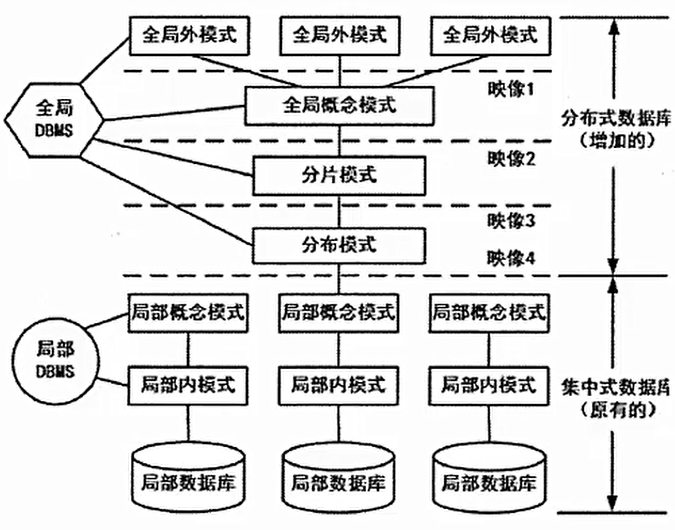
### 数据仓库
> 数据库存的数据是同源的，数据仓库存的是异构复合数据。

数据仓库是一个**面向主题的、集成的、非易失的、且随时间变化**的数据集合,用于支持管理决策。

- **面向主题的**:按照一定的主题域进行组织的。
- **集成的**:数据仓库中的数据是在对原有分散的数据库数据抽取、清理的的基础上经过系统加工、汇总和整理得到的,必须消除源数据中的不一致性,以保证数据仓念库内的信息是关于整个企业的一致的全局信息。
- **相对稳定的**:数据仓库的数据主要供企业决策分析之用,所涉及的数据操作主要是数据查询,一旦某个数据进入数据仓库以后,一般情况下将被长期保留,也就是数据仓库中一般有大量的查询操作,但修改和删除操作很少,通常只需要定期的加载、刷新。
- **反映历史变化**:数据仓库中的数据通常包含历史信息,系统记录了企业从过去某一时点(如开始应用数据仓库的时点)到目前的各个阶段的信息,通过这些信息,可以对企业的发展历程和未来趋势做出定量分析和预测。

数据仓库的结构通常包含四个层次,如下图所示:
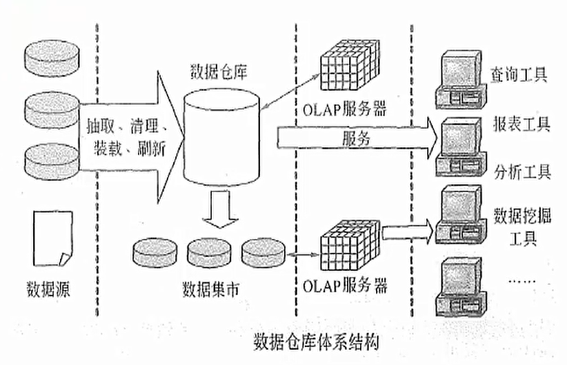
- 1.**数据源**:是数据仓库系统的基础,是整个系统的数据源泉。
- 2.**数据的存储与管理**:是整个数据仓库系统的核心。
- 3.**OLAP(联机分析处理)服务器**:对分析需要的数据进行有效集成,按多维模型组织,以便进行多角度、多层次的分析,并发现趋势。
- 4.**前端工具**:主要包括各种报表工具、查询工具、数据分析工具、数据挖掘工具以及各种基于数据仓库或数据集市的应用开发工具。

**商业智能**

BI（商业智能）系统主要包括**数据预处理、建立数据仓库、数据分析和数据展现**四个主要阶段。
- 数据预处理是整合企业原始数据的第一步,它包括数据的抽取
(Extraction)、转换(Transformation)和加载(Load)三个过程(**ETL过程**);
- 建立数据仓库则是处理海量数据的基础;
- 数据分析是体现系统智能的关键,一般采用联机分析处理(OLAP)和数据挖掘两大技术。联机分析处理不仅进行数据汇总/聚集,同时还提供切片切块、下钻、上卷和旋转等数据分析功能,用户可以方便地对海量数据进行多维分析。数据挖掘的目标则是挖掘数据背后隐藏的知识,通过关联分析、聚类和分类等方法建立分析模型,预测企业未来发展趋势和将要面临的问题;
- 在海量数据和分析手段增多的情况下,数据展现则主要保保障系统分析结果的可视化。

### 反规范化技术
反规范化技术:规范化设计后,数据库设计者希望**牺牲部分规范化来提高性能**。
- 采用反规范化技术的益处:**降低连接操作的需求、降低外码和索引的数姐,还可能减少表的数目,能够提高查询效率**。
- 可能带来的问题:数据的**重复存储**,浪费了磁盘空间;可能出现数据的**完整性问题**,为了保障数据的一致性,增加了数据维护的复杂性,会**降低修改速度**。

具体方法:
- (1)增加冗余列:在**多个表中保留相同的列**,通过增加数据冗余减少可我避免查询时的连接操作。
- (2)增加派生列:在表中增加可以**由本表或其它表中数据计算生成的列**,减少查询时的连接操作并避免计算或使用集合函数。
- (3)重新组表:如果许多用户需要查看两个表连接出来的结果数据,则把**这两个表重新组成一个表来减少连接而提高性能**。
- (4)水平分割表:根据一列或多列数据的值,把**数据放到多个独立的表中**,主要用于表数据规模很大、表中数据相对独立或数据需要存放到多个介质上时使用。
- (5)垂直分割表:对表进行分割,**将主键与部分列放到一个表中**,主键与其它列放到另一个表中,在查询时减少I/O次数。

### 大数据
特点:大量化、多样化、价值密度低、快速化。

大数据和传统数据的比较如下:
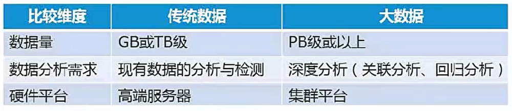

要处理大数据,一般使用集成平台,称为大数据处理系统,其特征为：

高度可扩展性、高性能、高度容错、支持异构环境、较短的分析行延迟、易用且开放的接口、较低成本、向下兼容性。

### SQL语言
SQL语言中的语法关键字,不区分大小写:
- 创建表create table;
- 指定主键primary key();
- 指定外键foreign key();
- 修改表alter table;
- 删除表drop table;
- 索引index,视图view;
- 数据库查询select...from...where;
- 分组查询group by,分组时要注意select后的列名要适应分组,having为分组查询附加条件:select sno,avg(score) from student group by sno having(avg(score)>60)
- 更名运算as:select sno as "学号" from t1
- 字符串匹配like,%匹配多个字符串,\_匹配任意一个字符串:select * from t1 where sname like 'a_'
- 数据库插入insert into...values(): insert into t1 values('a',66)
- 数据库删除delete from...where: delete t1 where sno=4
- 数据库修改update...set...where: update t1 set sname='aa' where sno=3
- 排序order by,默认为升序,降序要加关键字DESC: select * from t1 order by
- DISTINCT:过滤重复的选项,只保留一条记录。
- UNION:出现在两个SQL语句之间,将两个SQL语句的查询结果取或运算,即值存在于第一句或第二句都会被选出。
- INTERSECT:对两个SQL语句的查询结果做与运算,即值同时存在于两个语句才被选出。
- MIN、AVG、MAX:分组查询时的聚合函数

