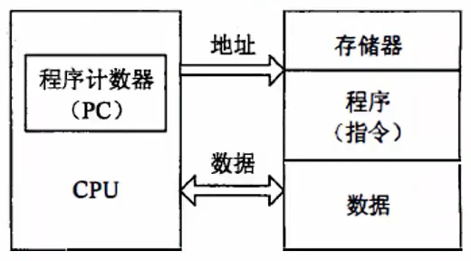
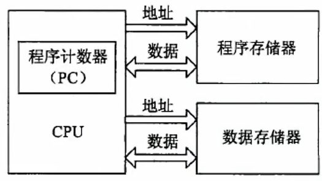
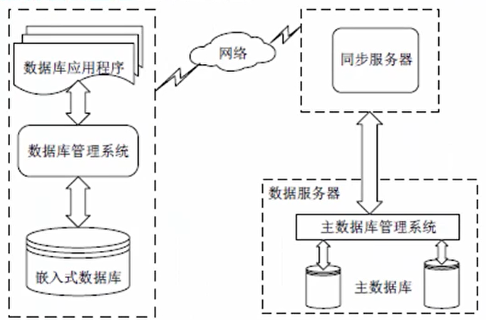
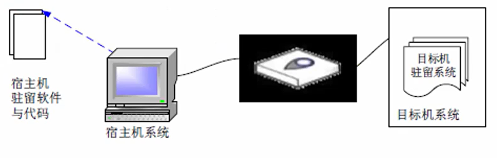

# 嵌入式技术

- [嵌入式技术](#嵌入式技术)
  - [整体情况](#整体情况)
  - [嵌入式微处理器](#嵌入式微处理器)
    - [体系结构](#体系结构)
      - [冯诺依曼结构](#冯诺依曼结构)
      - [哈佛结构](#哈佛结构)
    - [微处理器分类](#微处理器分类)
    - [多核处理器](#多核处理器)
  - [嵌入式软件](#嵌入式软件)
    - [嵌入式系统](#嵌入式系统)
    - [嵌入式操作系统EOS](#嵌入式操作系统eos)
    - [嵌入式实时操作系统](#嵌入式实时操作系统)
    - [嵌入式软件设计](#嵌入式软件设计)
    - [软件开发工具](#软件开发工具)

## 整体情况
本章节偶尔会考到，比计算机硬件的概率要大。一般是3-5分。不管是选择题还是案例题，考的时候一般都会超纲，基本上50%都会超纲。

## 嵌入式微处理器
### 体系结构
#### 冯诺依曼结构

传统计算机采用冯·诺依曼(Von Neumann)结构,也称**普林斯顿结构**,是一种将**程序指令存储器和数据存储器合并在一起的存储器结构**。

- 冯·诺依曼结构的计算机程序和数据共用一个存储空间,程序指令存储地址和数据存储地址指向**同一个存储器的不同物理位置**。
- 采用**单一的地址及数据总线**,程序指令和数据的宽度相同。
- 处理器执行指令时,**先从储存器中取出指令解码,再取操作数执行运算**,即使单条指令也要耗费几个甚至几十个周期,在高速运算真时,在传输通道上会出现瓶颈效应。

#### 哈佛结构
哈佛结构是一种**并行体系结构**,它的主要特点是将**程序和数据存储在不同的存储空间中**,即程序存储器和数据存储器是**两个相互独立的存储器,每个存储器独立编址、独立访问**。

- 与两个存储器相对应的是系统中的**两套独立的地址总线和数据总线**。
这种分离的程序总线和数据总线可允许在**一个机器周期内同时获取指令字(来自程序存储器)和操作数(来自数据存储器)**,从而提高了执行速度,使数据的吞吐率提高了1倍。

### 微处理器分类
**根据嵌入式微处理器的字长宽度**,可分为4位、8位、16位、32位和64位。一般把16位及以下的称为嵌入式微控制器(Embedded Micro Controller),32位及以上的称为嵌入式微处理器。

如果按**系统集成度划分**,可分为两类:一种是微处理器内部仅包含单纯的中央处理器单元,称为一般用途型微处理器:另一种则是将CPU、ROM、RAM及I/O等部件集成到同一个芯片上,称为单芯片微控制器(Single Chip Microcontroller)

如果**根据用途分类**,一般分为嵌入式微控制器MCU、嵌入式微处理器MPU、嵌入式数字信号处理器DSP、嵌入式片上系统SOC等。

- **嵌入式微控制器MCU的典型代表是单片机**,其片上外设资源比较丰富,适合于控制。MCU芯片内部集成ROM/EPROM、RAM、总线、总线逻辑、定时/计数器、看门狗、I/O、串行口、脉宽调制输出、A/D、D/A、Flash RAM、EEPROM等各种必要功能和外设。和嵌入式微处理器相比,微控制器的最大特点是单片化体积大大减小,从而使功耗和成本下降、可靠性提高,其片上外议资源一般较丰富,适合于控制,是嵌入式系统工业的主流。（**一般用在工业控制中，性能比不上MPU**）
- **嵌入式微处理器MPU由通用计算机中的CPU演变**而来。它的特征是具有**32位以上的处理器**,具有较高的性能,当然其价格也相应较高。但与计算机处理器不同的是,在实际嵌入式应用中,**只保留和嵌入式应用紧密相关的功能硬件去除其他的冗余功能部分,这样就以最低的功耗和资源实现嵌入式应用的特殊要求**。与工业控制计算机相比,嵌入式微处理器具有体积小、重量轻、成本低、可靠性高的优点。目前常见的有ARM、MIPS、POWER PC等。
- **嵌入式数字信号处理器DSP是专门用于信号处理方面的处理器**,其**在系统结构和指令算法方面进行了特殊设计,具有很高的编译效率和指令的的执行速度。采用哈佛结构,流水线处理,其处理速度比最快的CPU还快10-50倍**。在数字滤波、FFT、谱分析等各种仪器上DSP获得了大规模的应用。
- **嵌入式片上系统SOC,是追求产品系统最大包容的集成器件**。SoC最大的特点是成功实现了软硬件无缝结合,直接在处理器片内嵌入操作系统的代码模块。是一个有专用目标的集成电路,其中包含完整系统并有嵌入转你件的全部内容。

### 多核处理器
**多核指多个微处理器内核**,是将两个或更多的微处理器封装在一起,**集成在一个电路中**。多核处理器是**单枚芯片**,能够直接插入单一的处理器插槽中。多核与多CPU相比,**很好的降低了计算机系统的功耗和体积**。在多核技术中,**由操作系统软件进行调度,多进程,多线程并发都可以。**

2个或多个内核工作协调实现方式:
- **对称多处理技术SMP**:将2颗完全一样的处理器封装在一个芯片内,达到双倍或接近双倍的处理性能,节省运算资源。
- **非对称处理技术AMP**:2个处理内核彼此不同,各自处理和执行特定的功能,在软件的协调下分担不同的计算任务。

多核CPU的调度，多核CPU环境下进程的调度算法一般有**全局队列调度和局部队列调度**两种：
- 全局队列调度是指操作系统维护一个**全局的任务等待队列**,当系统中有一个CPU空闲时,操作系统就从全局任务等待队列中选取就绪任务开始执行,CPU核心利用率高。
- 局部队列调度是**操作系统为每个CPU内核维护一个局部的任务等待队列**,当系统中有一个CPU内核空闲时,就从该核心的任务等待队列中选取适当的任务执行行,优点是无需在多个CPU之间切换。

## 嵌入式软件
嵌入式软件是指**应用在嵌入式计算机系统当中的各种软件**,除了具有通用软件的一般特性,还具有一些与嵌入式系统相关的特点,包括:**规模较小、开发难度大、实时性和可靠性要求高、要求固化存储**。

嵌入式软件分类
- 系统软件:**控制和管理嵌入式系统资源**,为嵌入式应用提供支持的各种软件,如设备驱动程序、嵌入式操作系统、嵌入式中间件等。
- 应用软件:嵌入式系统中的**上层软件**,定义了嵌入式设备的主要功能和用途,并负责与用户交互,一般面向特定的应用领域,如飞行控制软件手机软件、地图等。
- 支撑软件:**辅助软件开发的工具软件**,如系统分析设计工具、在在线仿真工具、交叉编译器等。

板级支持包(BSP)是**介于主板硬件和操作系统中驱动层程序之间的一层**,一般认为它属于操作系统一部分,主要是实现对操作系统的支持,为上层的驱动程序提供访问硬件设备寄存器的函数包,使之能够更好的运行于硬件主板。

具体功能包括:
1. 单板硬件初始化,主要是CPU的初始化,为整个软件系统提供底层硬件支持
2. 为操作系统提供设备驱动程序和系统中断服务程序
3. 定制操作系统的功能,为软件系统提供一个实时多任务的运行环境
4. 初始化操作系统,为操作系统的正常运行做好准备

主要具有以下两个特点：
1. 硬件相关性,因为嵌入式实时系统的硬件环境具有应用相关性而作为上层
软件与硬件平台之间的接口,BSP需为操作系统提供操作和控制具体硬件的方法。
2. 操作系统相关性,不同的操作系统具有各自的软件层次结构,因此不同操作
系统具有特定的硬件接口形式。

一般来说,**BSP主要包括两个方面的内容;引导加载程序BootLoader和设备驱动程序**。

BootLoader是嵌入式系统**加电后运行的第一段软件代码**,是在操作系统内核运行之前运行的一小段程序,通过这段程序,可以**初始化硬件设备、建立内存空间的映射图,从而将系统的软硬件环境设置到一个合适的状态,以便为最终调用操作系统内核做好准备**。一般包括以下功能:
- **片级初始化**:主要完成**微处理器的初始化**,包括设置微处理器的核核心寄存器和控制寄存器、微处理器的核心工作模式及其局部总线模式等。片级初始化把微处理器从上电时的默认状态逐步设置成系统所要求的工作状态。这是一个纯硬件的初始化过程。
- **板级初始化**:通过正确地设置各种寄存器的内容来完成微处理器以外的其他硬件设备的初始化。例如,初始化LED显示设备、初始化定时器、设置中断控制寄存器、初始化串口通信、初始化内存控制器、建立内存空间的地址映射等。在此过程中,除了要设置各种硬件寄存器以外,还要设置某些软件的收据结构和参数。因此,这是一个同时包含有软件和硬件在内的初始化过程。
- **加载内核(系统级初始化)**:将操作系统和应用程序的映像从Flash存储器复制到系统的内存当中,然后跳转到系统内核的第一条指令处继续执行。

在一个嵌入式系统当中,操作系统是可能有也可能无的。但无论如何,**设备驱动程序是必不可少的**。所谓的设备驱动程序,**就是一组库函数,用来对硬件进行初始化和管理,并向上层软件提供良好的访问接口**。

对于不同的硬件设备来说,它们的功能是不一样的,所以它们的设备驱动程序也是不一样的。但是一般来说,大多数的设备驱动程序都会具备以下的一些基本功能：
- 硬件启动:在开机上电或系统重启的时候,对硬件进行初始化。
- 硬件关闭:将硬件设置为关机状态。
- 硬件停用:暂停使用这个硬件。
- 硬件启用:重新启用这个硬件。
- 读操作:从硬件中读取数据。
- 写操作:往硬件中写入数据。

### 嵌入式系统
嵌入式系统的组成:一般嵌入式系统由**嵌入式处理器、相关支撑硬件、嵌入式操作系统、支撑软件以及应用软件**组成。
- (1)嵌入式处理器。由于嵌入式系统一般是在恶劣的环境条件下工作,与一般处理器相比,嵌入式处理器应可抵抗恶劣环境的影响,比如高温、寒冷、电磁、加速度等环境因素。为适应恶劣环境,嵌入式处理器芯片除满足低功耗、体积小等需求外,根据不同环境需求,其工艺可分为民用、工业和军用等三个档次。
- (2)相关支撑硬件。相关支撑硬件是指除嵌入式处理器以外的构成系统的其他硬件,包括存储器、定时器、总线、10接口以及相关专用硬件。
- (3)嵌入式操作系统。嵌入式操作系统是指运行在嵌入式系统中的基础软件,主要用于管理计算机资源和应用软件。与通用操作系统不同,嵌入式操作系统应具备实时性、可剪裁性和安全性等特征。
- (4)支撑软件。支撑软件是指为应用软件开发与运行提供公共服务、软件开发、调试能力的软件,支撑软件的公共服务通常运行在操作系统之上,以库的方式被应用软件所引用。
- (5)应用软件。应用软件是指为完成嵌入式系统的某一特定目标所开发的软件。

嵌入式系统应具备以下特性:
- (1)**专用性强**。嵌入式系统面向特定应用需求,能够把通用CPU中许多由板卡完成的任务集成在芯片内部,从而有利于嵌入式系统的小型化。
- (2)**技术融合**。嵌入式系统将先进的计算机技术、通信技术、半导体技术0电子技术与各个行业的具体应用相结合,是一个技术密集、资金密集、高度分散、不断创新的知识集成系统。
- (3)**软硬一体软件为主**。软件是嵌入式系统的主体,有IP核。嵌入式系统的硬件和软件都可以高效地设计,量体裁衣,去除冗余,可以在同样的硅片面积上实现更高的性能。
- (4)**比通用计算机资源少**。由于嵌入式系统通常只完成少数几个任务。设计时考虑到其经济性,不能使用通用CPU,这就意味着管理的资源少,成本低,结构更简单。
- (5)**程序代码固化在非易失存储器中**。为了提高执行速度和系统可靠性,嵌入式系统中的软件一般都固化在存储器芯片或单片机本身中,而不是存在磁盘中。
- (6)**需专门开发工具和环境**。嵌入式系统本身不具备开发能力,即使设计完成以后,用户通常也不能对其中的程序功能进行修改,必须有一套开发工具和环境才能进行开发。
- (7)**体积小、价格低、工艺先进、性能价格比高、系统配置要求低、实时性强。**
- (8)对**安全性和可靠性**的要求高。

嵌入式系统分类

根据不同用途可将嵌入式系统划分为**嵌入式实时系统和嵌入式非实时系统两种**,而实时系统又可分为**强实时系统和弱实时系统**。如果从安全性要求看,嵌入式系统还可分为**安全攸关系统和非安全攸关系统**。

嵌入式系统分为**硬件层、抽象层、操作系统层、中间件层和应用层**等5层。
- (1)硬件层。硬件层主要是为嵌入式系统提供运行支撑的硬件环境,其核心是微处理器、存储器(ROM、SDRAM、Flash等)、I/O接口(A/D、D/A、I/O等)和通用设备以及总线、电源、时钟等。
- (2)抽象层。在硬件层和软件层之间为抽象层,主要实现对硬件层的硬件进行抽象,为上层应用(操作系统)提供虚拟的硬件资源:板级支持包(BSP)是一种硬件驱动软件,它是面向硬件层的硬件芯片或电路进行驱动,为上层操作系统提供对硬件进行管理的支持。
- (3)操作系统层。操作系统层主要由嵌入式操作系统、文件系统、图形用户接口、网络系统和通用组件等可配置模块组成。
- (4)中间件层。中间件层一般位于操作系统之上,管理计算机资源和网络通信,中间件层是连接两个独立应用的桥梁。
- (5)应用层。应用层是指嵌入式系统的具体应用,主要包括不同的应用软件。

**嵌入式数据库系统EDBMS**
1. 使用环境的特点:
- (1)**设备随时移动性**。嵌入式数据库主要用在移动信息设备上,设备的位置经常随使用者一起移动。
- (2)**网络频繁断接**。移动设备或移动终端在使用的过程中,位置经常发生变变化,同时也受到使用方式、电源、无线通信和网络条件等因素的影响。所以,一般并不持续保持网络连接,而是经常主动或被动地间歇性断接和连接。
- (3)**网络条件多样化**。由于移动信息设备位置的经常变化,导致它们与数据库服务器在不同的时间可能通过不同的网络系统连接,这些网络在带宽、通信代价、网络延迟和QoS等方面可能有所差异。
- (4)**通信能力不对称**。由于受到移动设备资的源限制,移动设备与服务器之间的网络通信能力是非对称的。移动设备的发送能力都非常有限,使得数据库车服务器到移动设备的下行通信带宽和移动设备到数据库服务器之间的上行带宽相差很大。

2. 系统组成:

一个完整的EDBMS由若干子系统组成,包括**主数据库、同步服务器、嵌入式数据库和连接网络**等几个子系统:

**嵌入式移动数据库在实际应用中必须解决好数据的一致性(复制性)、高效的
事务处理和数据的安全性等关键问题**。

### 嵌入式操作系统EOS
与通用操作系统相比,EOS主要有以下特点:
- (1)**微型化**。EOS的运行平台不是通用计算机,而是嵌入式系统。这类系统一般没有大容量的内存,几乎没有外存,因此,EOS必须做得小巧,以占用尽量少的系统资源。
- (2)**代码质量高**。在大多数嵌入式应用中,存储空间依然是宝贵的资源,这就要求程序代码的质量要高,代码要尽量精简。
- (3)**专业化**。嵌入式系统的硬件平台多种多样,处理器的更新速度快,每种处理器都是针对不同的应用领域而专门设计的。因此,EOS要有很好适应性和移植性,还要支持多种开发平台。
- (4)**实时性强**。嵌入式系统广泛应用于过程控制、数据采集、通信、多媒体信息处理等要求实时响应的场合,因此,实时性成为EOS的又一特点。
- (5)**可裁减和可配置**。应用的多样性要求EOS具有较强的适应能力,能够根据应用的特点和具体要求进行灵活配置和合理裁减,以适应微型化和专业化的要求。

### 嵌入式实时操作系统
嵌入式实时系统是一种完全嵌入受控器件内部,为特定应用而设计的专用计算机系统。在嵌入式实时系统中,要求**系统在投入运行前即具有确定性和可预测性**：
- 可预测性是指系统在运行之前,其功能、响应特性和执行结果是是可预测的;
- 确定性是指系统在给定的初始状态和输入条件下,在确定的时间内给出确定的结果。

实时操作系统**(RTOS)**的特点

当外界事件或数据产生时,**能够接受并以足够快的速度予以处理**,其处理的结果又能在规定的时间之内来控制生产过程或对处理系统做出快速响应,并控制所有实时任务协调一致运行。因而,提供**及时响应和高可靠性**是其主要特点。

实时操作系统有**硬实时和软实时**之分,硬实时要求在规定的时间内必须完成操作,这是在操作系统设计时保证的;软实时则只要按照任务的的优先级,尽可能快地完成操作即可。

**实时操作系统的特征**
1. **高精度计时系统**

计时精度是影响实时性的一个重要因素。在实时应用系统中,经常需要精确确定实时地操作某个设备或执行某个任务,或精确的计算一个时间函数教。这些不仅依赖于一些硬件提供的时钟精度,也依赖于实时操作系统实现的高高精度计时功能。

2. **多级中断机制**

一个实时应用系统通常需要处理多种外部信息或事件,但处理的紧迫程度有轻
重缓急之分。有的必须立即作出反应,有的则可以延后处理。因此,需要建立
多级中断嵌套处理机制,以确保对紧迫程度较高的实时事件进行及时响应和处
理。

3. **实时调度机制**

实时操作系统不仅要及时响应实时事件中断,同时也要及时调度运行实时任务。
但是,处理机调度并不能随心所欲的进行,因为涉及到两个进程之间的切换
只能在确保"安全切换"的时间点上进行,实时调度机制包括两个方面,一是
在调度策略和算法上保证优先调度实时任务;二是建立更多"安全切换"时间
点,保证及时调度实时任务。

### 嵌入式软件设计
一个典型的交叉平台开发环境,包含三个高度集成的部分:
- (1)运行在宿主机和目标机上的**强有力的交叉开发工具和实用程序**。
- (2)运行在目标机上的**高性能、可裁剪的实时操作系统**。
- (3)**连接宿主机和目标机的多种通信方式**,例如,以太网、USE3、串口等。

**交叉编译**:**嵌入式软件开发所采用的编译为交叉编译**。所谓交叉编译就是**在一个平台上生成可以在另一个平台上执行的代码**。编译的最主要的工作就在将程序转化成运行该程序的CPU所能识别的机器代码,由于不同的体系结构有不同的指令系统。因此,不同的CPU需要有相应的编译器,而交叉编译就如同翻译样,把相同的程序代码翻译成不同CPU的对应可执行二进制文件。**嵌入式系统的开发需要借助宿主机(通用计算机)来编译出目标机的可执行代码**。

**交叉调试**:嵌入式软件经过编译和链接后即进入调试阶段,调试是是软件开发过程中必不可少的一个环节,嵌入式软件开发过程中的交叉调试与通用软件开发过程中的调试方式有很大的差别。

在嵌入式软件开发中,调试时**采用的是在宿主机和目标机之间进行的交叉调试调试器仍然运行在宿主机的通用操作系统之上,但被调试的进程劫却是运行在基于特定硬件平台的嵌入式操作系统中**,调试器和被调试进程通过串口或者网络进行通信,调试器可以控制、访问被调试进程,读取被调试进程的当前状态并能够改变被调试进程的运行状态。

### 软件开发工具
嵌入式软件的开发可以分为几个阶段:编码、交叉编译、交叉调试。

编辑器:用于编写嵌入式源代码程序,从理论上来说,任何一个文本编辑器都可以用来编写源代码。各种集成开发环境会提供功能强大的编辑器,如VS系列、eclipse、keil、CSS等。常见的独立编辑器:UE、Source Insight、vim等。

编译器gcc:编译阶段的工作是用交叉编译工具处理源代码,生成可执行的目标文件,在嵌入式系统中,由于宿主机和目标机系统不一样,需需要使用交叉编译,GNUC/C++(gcc)是目前常用的一种交叉编译器,支持非常多的宿主机/目标机组合。

调试器gdb

在开发嵌入式软件时,交叉调试是必不可少的一步。嵌入式软件调试特点:调试器运行在宿主机上,被调试程序运行在目标机上。
调试器通过某种通信方式与目标机建立联系,如串口、并口、网络、JTAG等。在目标机上一般有调试器的某种代理,能配合调试器一起完成对自标机上运行程序的调试,可以是软件或支持调试的硬件。gdb是GNU开源组织发布的一个强大的程序调试工具。