# 计算机网络

- [计算机网络](#计算机网络)
  - [整体情况](#整体情况)
  - [网络功能和分类](#网络功能和分类)
  - [通信技术](#通信技术)
  - [OSI七层模型](#osi七层模型)
  - [局域网和广域网协议](#局域网和广域网协议)
  - [TCP/IP协议](#tcpip协议)
  - [交换技术](#交换技术)
  - [路由技术](#路由技术)
  - [传输介质](#传输介质)
  - [通信方式和交换方式](#通信方式和交换方式)
  - [IP地址](#ip地址)
  - [IPv6](#ipv6)
  - [网络规划和设计](#网络规划和设计)
  - [磁盘冗余阵列](#磁盘冗余阵列)
  - [网络存储技术](#网络存储技术)
  - [其他考点补充](#其他考点补充)

## 整体情况
每年考3-5分。本章节超纲率也有50%。

## 网络功能和分类
计算机网络是计算机技术与通信技术相结合的产物,它实现了远程通信、远程信息处理和资源共享。

计算机网络的功能:**数据通信、资源共享、管理集中化、实现分布式处理、负载均衡**。

网络**性能**指标:速率、带宽(频带宽度或传送线路速率)、吞吐量、时延、往返时间、利用率。

网络**非性能**指标:费用、质量、标准化、可靠性、可扩展性、可升级性、易管理性和可维护性。

计算机网络按分布范围和拓扑结构划分如下图所示:
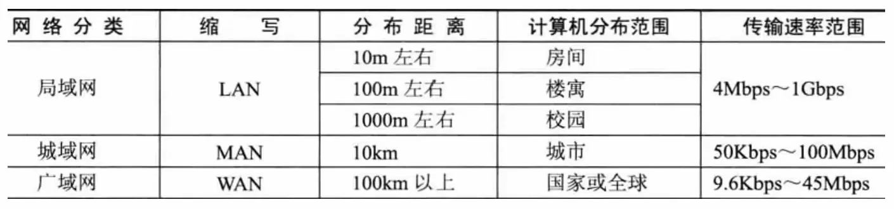

总线型(利用率低、干扰大、价格低)、星型(交换机形成的局域网、中央单元负荷大)、环型(流动方向固定、效率低扩充难)、树型(总线型的扩充、分级结构)、分布式(任意节点连接、管理难成本高)。
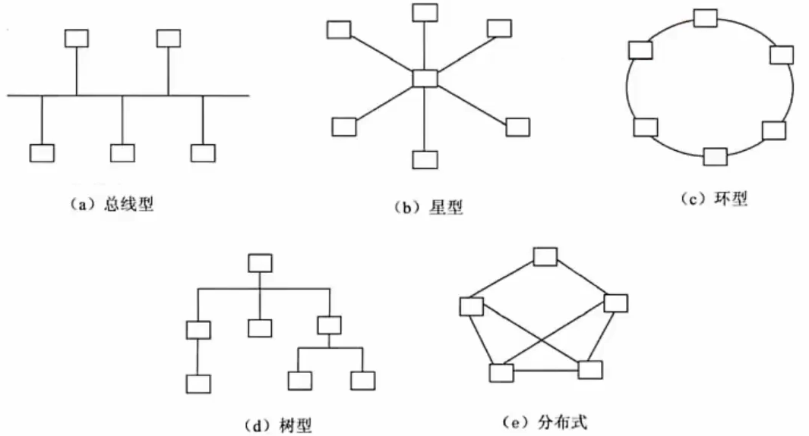

## 通信技术
计算机网络是**利用通信技术将数据从一个结点传送到另一结点的过程**。通信技术是计算机网络的基础。

信道可分为**物理信道和逻辑信道**。物理信道由传输介质和设备组成,根据传输介质的不同,分为无线信道和有线信道。逻辑信道是指在数据发送端和接收端之间存在的一条虚拟线路,可以是有连接的或无连接的。逻辑信道以物理信道为载体。

**发信机进行的信号处理**包括信源编码、信道编码、交织、脉冲成形和调制。相反地,收信机进行的信号处理包括解调、采样判决、去交织、信道译码和信源记择码。

如果**同时传递多路数据就需要复用技术和多址技术**。复用技术是指在一条信道上同时传输多路数据的技术,如TDM时分复用、FDM频分复用和CDM码分复用等等。多址技术是指在一条线上同时传输多个用户数据的技术,在接收端把多个用户的数据分离(TDMA时分多多址、FDMA频分多址和CDMA码分多址)。

作为**新一代的移动通信技术**,5G特征体现在以下方面。
1. 基于OFDM优化的波形和多址接入
2. 实现可扩展的OFDM间隔参数配直
3. FDM加窗提高多路传输效率
4. 灵活框架设计
5. 大规模MIMO:最多256根天线
6. 毫米波:频率大于24GHz以上的频段
7. 频谱共享
8. 先进的信道编码设计

5G网络的主要特征:服务化架构、网络切片。

## OSI七层模型
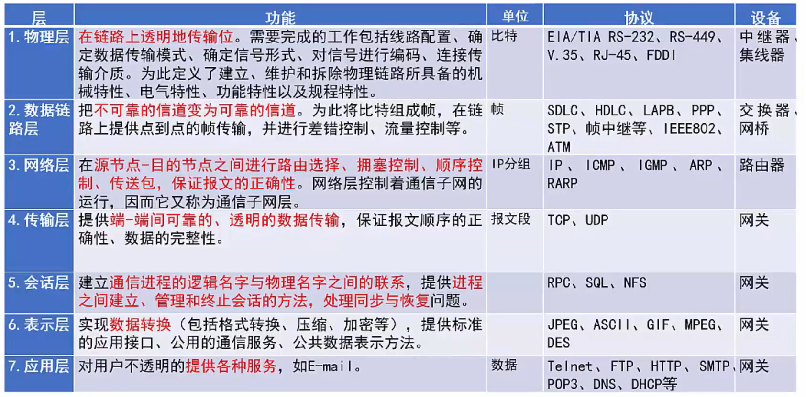

## 局域网和广域网协议
以太网是一种计算机局域网组网技术。
以太网规范**IEEE 802.3**是重要的局域网协议,包括:
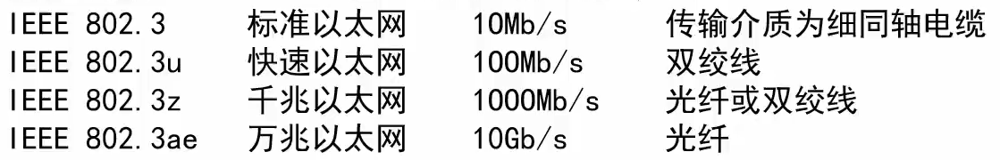

上图依次为:目的MAC地址、源MAC地址、长度/类型、数据填充、校验。

最小帧长:64字节，最大是1518帧长。

无线局域网WLAN技术标准:**IEEE 802.11**

在WLAN中,通常使用的拓扑结构主要有3种形式:点对点型型、HUB型和全分布型。

广域网相关技术:同步光网络(SONET,利用光纤进行数字化化信息通信)、数字数据网(DDN,利用数字信道提供半永久性连接电路以传输数据)、帧中继(IFR,数据包交换技术)、异步传输技术(ATM,以信元为基础的面向连接的一种分组交换和复用技术)。

## TCP/IP协议
网络协议三要素:**语法、语义、时序**。其中语法部分规定传输数据的格式,语义部分规定所要完成的功能,时序部分规定执行各种操作的条件、顺序关系等。
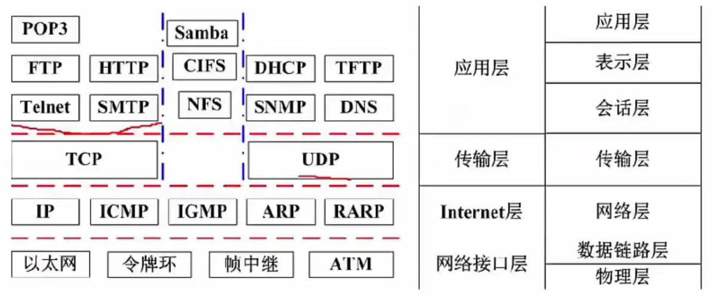
**网络层协议:**
- IP:网络层最重要的核心协议,在源地址和目的地址之间传送数据报,无连接、不可靠。
- ICMP:因特网控制报文协议,用于在IP主机、路由器之间传递控制消息。控制消息是指网络通不通、主机是否可达、路由是否可用等网络本身的消息。
- IGMP:网络组管理协议,允许因特网中的计算机参加多播,是计算机用做向相邻多目路由器
报告多目组成员的协议,支持组播。

**传输层协议:**
- TCP:整个TCP/IP协议族中最重要的协议之一,在IP协议提供的不不可靠数据数据基础上,采用了重发技术,为应用程序提供了一个可靠的、面向连接的、全双工的数据传输服务。一般用于传输数据量比较少,且对可靠性要求高的场合。
- UDP:是一种不可靠、无连接的协议,有助于提高传输速率,一般用于传输数据量大,对可靠性要求不高,但要求速度快的场合。

**应用层协议:** 基于TCP的FTP、HTTP等都是可靠传输。基于UDP的DHCP、DNS等都是不可靠传输。
- FTP:可靠的文件传输协议,用于因特网上的控制文件的双向传输。
- HTTP:超文本传输协议,用于从WWW服务器传输超文本到本地浏览器的传输协议。使用SSL加密后的安全网页协议为HTTPS。
- SMTP和POP3:简单邮件传输协议,是一组用于由源地址到目的地址传送邮件的规则,邮件报文采用ASCII格式表示。
- Telnet:远程连接协议,是因特网远程登录服务的标准协议和主要方式、
- TFTP:不可靠的、开销不大的小文件传输协议。
- SNMP:简单网络管理协议,由一组网络管理的标准协议,包含一个应用层协议、数据库模型和一组资源对象。该协议能够支持网络管理系统,泳衣监测连接到网络上的设备是否有任何引起管理师行关注的情况。
- DHCP:动态主机配置协议,基于UDP,基于C/S模型,为主机动态分配IP地址,有三种方式:固定分配、动态分配、自动分配。
- DNS:域名解析协议,通过域名解析出IP地址。

**协议端口号对照表**
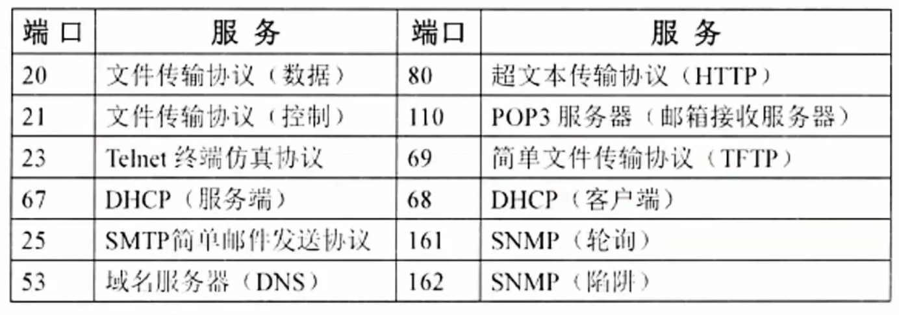

## 交换技术
数据在网络中转发通常离不开**交换机**。人们日常使用的计算机通常就是通过交换机接入网络的。

交换机功能包括:
- 集线功能。提供大量可供线缆连接的端口达到部署星状拓扑网络的目的。
- 中继功能。在转发帧时重新产生不失真的电信号。
- 桥接功能。在内置的端口上使用相同的转发和过滤逻辑。
- 隔离冲突域功能。将部署好的局域网分为多个冲突域,而每个冲突域都有自己独立的带宽,以提高交换机整体宽带利用效率。

交换机需要实现的功能如下所述。
1. 转发路径学习。根据收到数据帧中的源MAC地址建立该:地址同交换机端口的映射,写入MAC地址表中。
2. 数据转发。如果交换机根据数据帧中的目的MAC地址在建立好的MAC地址表中查询到了,就向对应端口进行转发。
3. 数据泛洪。如果数据帧中的目的MAC地址不在MAC地址表中,则向所有端口转发,也就是泛洪。广播帧和组播帧向所有端口(不包括源端口)进行转发。
4. 链路地址更新。MAC地址表会每隔一定时间(如300s)更新一次。

## 路由技术
路由功能由路由器来提供,具体包括:
1. 异种网络互连,比如具有异种子网协议的网络互连。
2. 子网协议转换,不同子网间包括局域网和广域网之间的协议转换。
3. 数据路由,即将数据从一个网络依据路由规则转发到另一个网络。
4. 速率适配,利用缓存和流控协议进行适配。
5. 隔离网络,防止广播风暴,实现防火墙。
6. 报文分片和重组,超过接口的MTU报文被分片,到达目的地之后的报文被重组。
7. 备份、流量控制,如主备线路的切换和复杂流量控制等。

路由器工作在OSI七层协议中的第3层,即网络层。其主要任务是接收来源于一个网络接口的
数据包,通常根据此数据包的目地址决定待转发的下一个地址(即下一跳地址)。路由器中维持着数据转发所需的路由表,所有数据包的发送或转发都通过查找路由表来实现。这个路由表可以静态配置,也可以通过动态路由协议自动生成。

一般来说,路由协议可分为内部网关协议(IGP)和外部网关协议(EGP)两类。

网络建设工程可分为网络规划、网络设计和网络实施三个环节。

## 传输介质
双绞线:将多根铜线按规则缠绕在一起,能够减少干扰;分为**无屏蔽双绞线UTP**和**屏蔽双绞线STP**,都是由一对铜线簇组成。也即我们常说的**网线**;双绞线的**传输距离在100m以内**。
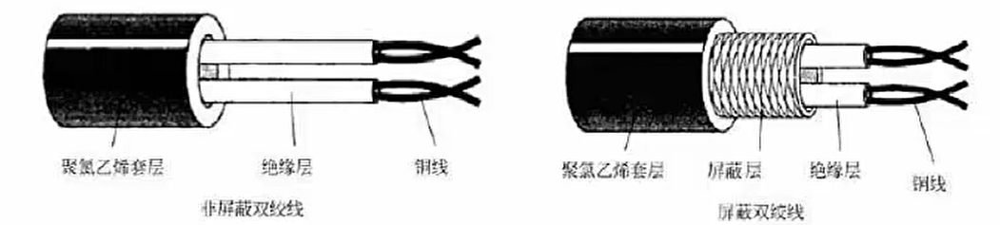

无屏蔽双绞线UTP:价格低,安装简单,但可靠性相对较低,分为CAT3(3类UTP,速率为10Mbps)、CAT4(4类UTP,与3类差不多,无应用)、CAT5(5参类UTP,速率为100Mbps,用于快速以太网)、CAT5E(超5类UTP,速率为1000Mbps)、CAT6(6类UTP,用来替代CAT5E,速率也是1000Mbps)。

屏蔽双绞线STP:比之UTP增加了一层屏蔽层,可以有效的提高可靠性,但对应的价格高,安装麻烦,一般用于对传输可靠性要求很高的场合。

网线有如下两种安装标准:都是八根不同颜色的网线,按照不同的顺序排序,插入水晶头中,**区分在第1236四根网线的位置不同**。
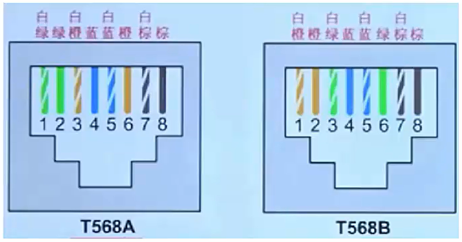

光纤:由纤芯和包层组成,传输的光信号在纤芯中传输,然而从PC端出来的信号都是电信号,要经过光纤传输的话,就必须将电信号转换为光信号。

**多模光纤MMF**:纤芯半径较大,因此可以**同时传输多种不同的信号**,光信号在光纤中以全反射的形式传输,采用**发光二极管LED为光源,成本低,但是传输的效率和可靠性都较低,适合于短距离传输**,其传输距离与传输速率相关,速率为100Mbps时为2KM,速率为为1000Mbps时为550m。
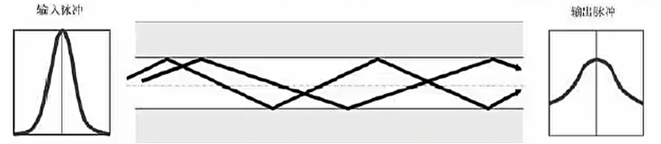
**单模光纤SMF**:纤芯半径很小,**一般只能传输一种信号,采用激光二极管LD作为光源,并且只支持激光信号的传播**,同样是以全反射形式传播,只不过反射角很大,看起来像一条直线,**成本高,但是传输距离远,可靠性高**。传输距离可达5KM。
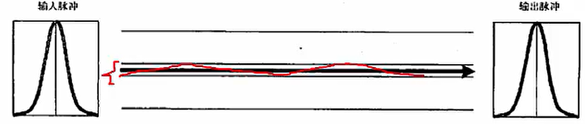

无线信道:分为无线电波和红外光波
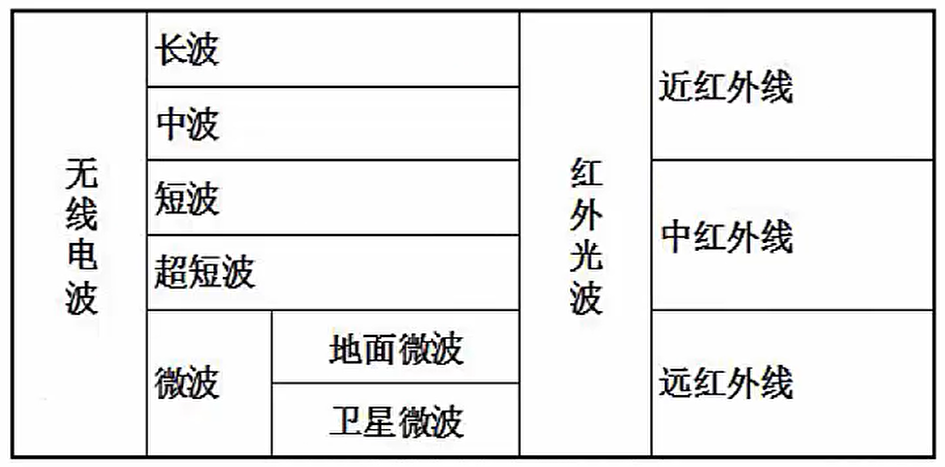

## 通信方式和交换方式
通信方向:数据通信是指发送方发送数据到接收方,这个传输过程可以分类如下:
- **单工**:只能由设备A发给设备B,即数据流只能单向流动。
- **半双工**:设备A和设备B可以互相通信,但是同一时刻数据流只能单向流动。
- **全双工**:设备A和设备B在任意时刻都能互相通信。

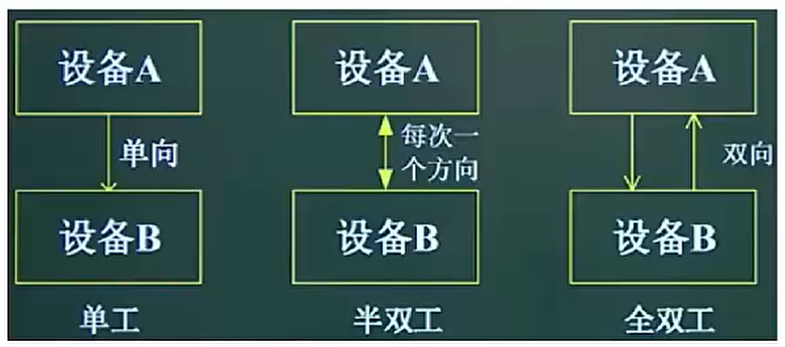

**同步方式**
- 异步传输:发送方每发送一个字符,需要约定一个起始位和停止位插入到字符的起始和结尾处,这样当接收方接收到该字符时能够识别,但是这样会造成资源浪费,传输效率降低。
- 同步传输:以数据块为单位进行传输,当发送方要发送数据时,**先发送一个同步帧**,接收方收到后做好接收准备,开始接收数据块,**结束后又会有结束帧确认**,这样一次传输一个数据块,效率高。

- 串行传输:只有**一根数据线**,数据只能1bit挨个排队传送,适合低速设备、远距离的传送,一般用于广域网中。
- 并行传输:有**多根数据线**,可以同时传输多个bit数据,适合合高速设备的传送,常用语计算机内部各硬件模块之间。

**交换方式⭐**
- 电路交换:通信一方进行呼叫,另一方接收后,在二者之间会**建立一个专用电路**,特点为**面向连接、实时性高、链路利用率低**,一般用于语音视频通信。
- 报文交换:**以报文为单位,存储转发模式**,接收到数据后先存储,进行差错校验,没有错误则转发,有错误则丢弃,因此**会有延时,但可靠性高,是面向无连接的**。
- 分组交换:以**分组为单位,也是存储转发模式**,因为分组的长度比报文小,所以时延小于报文交换,又可分为三种方式:
  - **数据报**:是现在主流的交换方式,**各个分组携带地址信息,自由的选择不同的路由路径**传送到接收方,接收方接收到分组后再根据地址信息重新组装成原数据,是面向无连接的,但是不可靠的。
  - **虚电路**:发送方发送一个分组,接收方收到后**二者之间就建立了一个虚拟的通信线路**,二者之间的分组数据交互都通过这条线路传送,在空闲的时候这条线路也可以传输其他数据,是面向连接
的,可靠的。
  - **信元交换**:**异步传输模式ATM采用的交换方式**,本质是按照虚电路方式进行转发,只不过**信元是固定长度的分组**,共53B,其中5B为头部,48B为数据域,也是面向连接的,可靠的。

## IP地址
机器中存放的**IP地址是32位的二进制代码**,**每隔8位**插入一个空格,可提高可读性,为了便于理解和设置,一般会采用**点分十进制**方法来表示:将32位二进制代码**每8位二进制转换成十进制,就变成了4个十进制数**,而后在每个十进制数间隔中插入.,如下所示,最终为128.11.3.31:

因为每个十进制数都是由8个二进制数转换而来,因此**每个十进制数的取值范围为0-255**(掌握二进制转十进制的快速计算方法,牢记2的的幂指数值,实现快速转换)。

**分类IP地址**:IP地址分四段,每段八位,共32位二进制数组成。

在逻辑上,这32位IP地址分为**网络号和主机号**,依据网络号号位数的不同,可以将
IP地址分为以下几类:
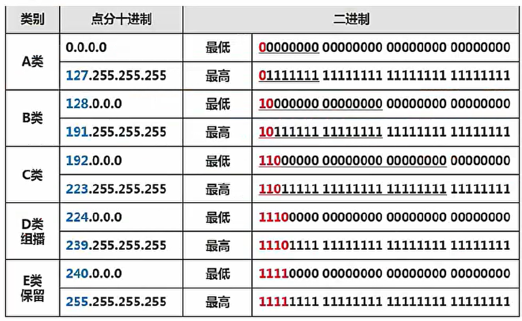

**无分类编址**:即不按照ABC类规则,自动规定网络号,无分类编址格式为:IP地址/网络号,示例:128.168.0.11/20表示的IP地址为128.168.0.11,其网络号占20位,因此主机号占32-20=12位,也可以划分子网。

特殊IP地址
- **公有地址**:通过它直接访问因特网。是全网唯一的IP地址。
- **私有地址**:属于非注册地址,专门为组织机构内部使用,不下能直接访问因特网,下表所示为私有址范围：
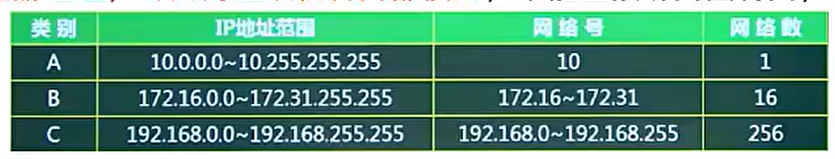
其他特殊地址如下表所示：
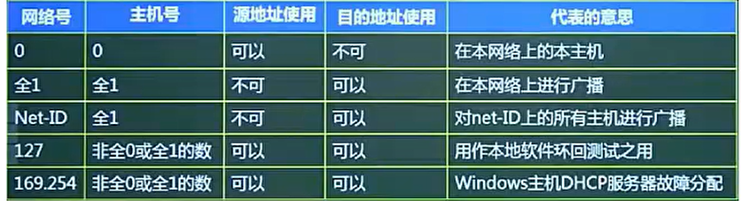

**子网划分**

- 子网划分:一般公司在申请网络时,会直接获得一个范围很大的的网络,如一个B类地址,因为主机数之间相差的太大了,不利于分配,我们一般采用子网划分的方法来划分网络,即**自定义网络号位数**,就能自定义主机号位数,就能**根据主机个数来划分出最适合的方案,不会造成资源的浪费**。
- 因此就有子网的概念,一般的IP地址按标准划分为ABC类后,可可以进行再一步的划分,**将主机号拿出几位作为子网号**,就可以划分出多个子网风,此时IP地址组成为:**网络号+子网号+主机号**。
- **网络号和子网号都为1,主机号都为0,这样的地址为子网掩码。**
- 要注意的是:**子网号可以为全0和全1,主机号不能为全0或全1**,因此,主机数需要-2,而子网数不用。
- 还可以聚合网络为超网,就是划分子网的逆过程,将**网络号取出几位作为主机号**,此时,这个网络内的主机数量就变多了,成为一个更大的网络。

## IPv6
主要是为了解决IPv4地址数不够用的情况而提出的设计方案,IPv6具有以下特性:
- IPv6地址长度为128位,地址空间增大了2^96倍;
- 灵活的IP报文头部格式,使用一系列固定格式的扩展头部取代了IPVv4中可变长度的选项字段。IPv6中选项部分的出现方式也有所变化,使路由器可以简单撸过选项而不做任何处理,加快了报文处理速度;
- IPv6简化了报文头部格式,加快报文转发,提高了吞吐量;
- 提高安全性,身份认证和隐私权是IPv6的关键特性;
- 支持更多的服务类型;
- 允许协议继续演变,增加新的功能,使之适应未来技术的发展。

IPv4和IPv6的过渡期间,主要采用三种基本技术:
1. 双协议栈:主机同时运行IPv4和IPv6两套协议栈,同时支持两套协议,一般来说IPv4和IPv6地址之间存在某种转换关系,如IPv6的低32位可以直接转换为IPv4地址,实现互相通信。
2. 隧道技术:这种机制用来在IPV4网络之上建立一条能够传输IPv6数据报的隧道,例如可以将IPv6数据报当做IPv4数据报的数据部分加以封装,只需要加一个IPV4的首部,就能在IPV4网络中传输IPv6报文。
3. 翻译技术:利用一台专门的翻译设备(如转换网关),在纯IPV4和纯IPv6网络之间转换IP报头的地址,同时根据协议不同对分组做相应的语义翻译,从而使纯JPV4和纯IPv6站点之间能够透明通信。

## 网络规划和设计
三层模型将网络划分为核心层、汇聚层和接入层,每一层都有着特定的作用：
- 核心层提供不同区域之间的最佳路由和高速数据传送;
- 汇聚层将网络业务连接到接入层,并且实施与安全、流量、负载和路由相关的策略;
- 接入层为用户提供了在本地网段访问应用系统的能力,还要解决决相邻用户之间的互访需要,接入层要负责一些用户信息(例如用户|P地址、MAC地址和访问 日志等)的收集工作和用户管理功能(包括认证和计费等)。
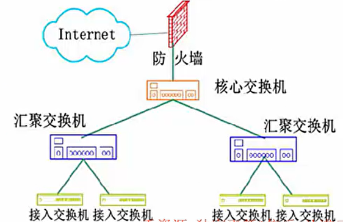

建筑物综合布线系统PDS:
1. 工作区子系统:实现工作区终端设备到水平子系统的信息插座之间的互联。
2. 水平布线子系统:实现信息插座和管理子系统之间的连接。
3. 设备间子系统:实现中央主配线架与各种不同设备之间的连接。
4. 垂直干线子系统:实现各楼层设备间子系统之间的互连。
5. 管理子系统:连接各楼层水平布线子系统和垂直干缆线,负责连接控制其他子系统为连接其他子系统提供连接手段。
6. 建筑群子系统:各个建筑物通信系统之间的互联。
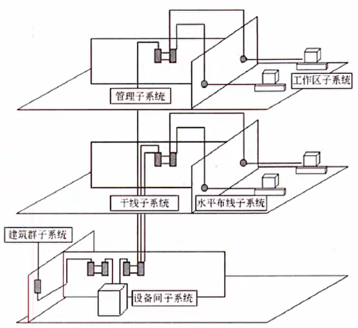

## 磁盘冗余阵列
RAID即磁盘冗余阵列技术,将数据分散存储在不同磁盘中,可关行读取,可冗余存储,提高磁盘访问
速度,保障数据安全性。

- RAID0将数据分散的存储在不同磁盘中,磁盘利用率100%,访问速度最快,但是没有提供冗余和错误修复技术;
- RAID1在成对的独立磁盘上产生互为备份的数据,增加存储可靠性,可以纠错,但磁盘利用率只有50%;
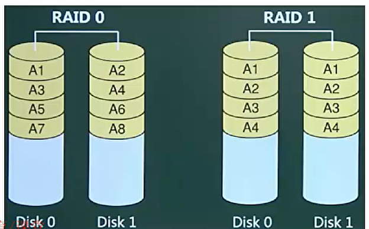
- RAID2将数据条块化的分布于不同硬盘上,并使用海明码校验;
- RAID3使用奇偶校验,并用单块磁盘存储奇偶校验信息(可靠性低于RAID5);
- RAID5在所有磁盘上交叉的存储数据及奇偶校验信息(所有校验信息存储总量为一个磁盘容量,但分布式存储在不同的磁盘上),读/写指针可同时操作;
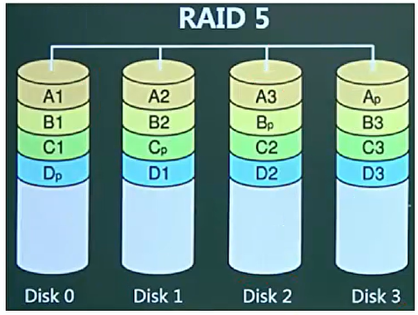
- RAID0+1(是两个RAID0,若一个磁盘损坏,则当前RAID0无法工作,即:有一半的磁盘无法工作);
- RAID1+0(是两个RAID1,不允许同一组中的两个磁盘同时损坏)与RAID1原理类似,磁盘利用率都
只有50%,但安全性更高。
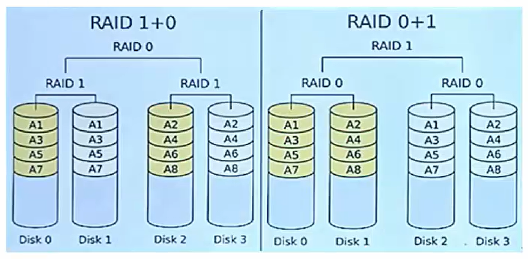

## 网络存储技术
1. 直接附加存储(DAS):是指将存储设备通过SCSI接口直接连接到一台服务器上使用,其本身是硬件的堆叠,存储操作依赖于服务器,不带有任何存储操作系统。
   - 存在问题:在传递距离、连接数量、传输速率等方面都受到阳限制。容量难以扩展升级;数据处理
和传输能力降低;服务器异常会波及存储器。
2. 网络附加存储(NAS):通过网络接口与网络直接相连,由用户通过网络访问,有独立的存储系统。如下图所示。NAS存储设备类似于一个专用的文件服务器,去掉了通用服务器大多数计算功能,而仅仅提供文件系统功能。以数据为中心,将存储设备与服务器分离,其存储设备在功能上完全独立于网络中的主服务器。客户机与存储设备之间的数据访问不再需要文件服务器的干预,同时它允许客户机与存储设备之间进行直接的数据访问,所以不仅响应速度快,而且数据传输速率也很高。
   - NAS的性能特点是进行小文件级的共享存取;支持即插即用;可以很经济的解决存储容量不足的
问题,但难以获得满意的性能。

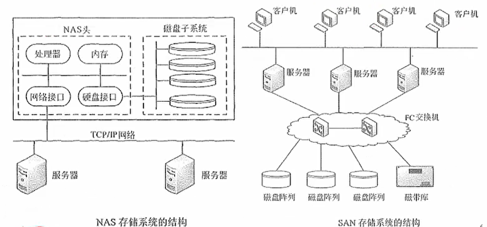

3. 存储区域网(SAN):SAN是通过专用交换机将磁盘阵列与服务器连接起来的高速专用子网。它没有
采用文件共享存取方式,而是采用块(block)级别存储。SAN是通过专用高速网将一个或多个网络
存储设备和服务器连接起来的专用存储系统,其最大特点是将存储设备从传统的以太网中分离了出
来,成为独立的存储区域网络SAN的系统结构。根据数据传输过程采用的协议,其技术划分为FC
SAN(光纤通道)、IP SAN (IP网络)和IB SAN (无线带宽)技术。

## 其他考点补充
- 网络地址翻译NAT:公司内有很多电脑,在公司局域网内可以互联通信,但是要访问外部因特网时,只提供固定的少量IP地址能够访问因特网,将公司所有电脑这个大的地址集合映射到能够访问因特网的少量IP地址集合的过程就称为NAT。
  - 很明显,使用了NAT后,一个公司只有少量固定IP地址可以上网,大大减少了IP地址的使用量。
- 默认网关:一台主机可以有多个网关。默认网关的意思是一台主机如果找不到可用的网关,就把数据包发给默认指定的网关,由这个网关来处理数据包。现在主机使用的网关,一般指的是默认网关。默认网关的IP地址必须与本机IP地址在同一个网段内,即同网络号。
- 虚拟局域网VLAN:是一组逻辑上的设备和用户,这些设备和用户并不受物理位置的限制,可以根据功能、部门及应用等因素将它们组织起来,相互之间的通信就好子像它们在同一个网段中一样。
- VLAN工作在OSI参考模型的第2层和第3层,一个VLAN就是一个广播域,VLAN之间的通信是通过第3层的路由器来完成的。
  - 与传统的局域网技术相比较,VLAN技术更加灵活,它具有以下下优点:网络设备的移动、添加和修改的管理开销减少;可以控制广播活动;可提高网络的安全性。
- 虚拟专用网VPN:是在公用网络上建立专用网络的技术。其之所以称为虚拟网,主要是因为整个VPN网络的任意两个节点之间的连接并没有传统专网所需的端到端的物理链路,而是架构在公用网络服务商所提供的网络平台,如Internet、ATM(异步传输模式)、Frame Relay(帧中继)等之上的逻辑网络,用户数据在逻辑链路中传输。
- PPP:安全认证介绍:PPP的NCP可以承载多种协议的三层数据包。PP使用LCP控制多种链路的参数(建立、认证、压缩、回拨)。
  - PPP的认证类型:pap认证是通过二次握手建立认证(明文不加密),chap挑战握手认证协议,通过三次握手建立认证(密文采用MD5加密)。PPP的双向验证,采用的是chap的主验证风格。PPP的加固验证,采用的是两种(pap,chap)验证同时使用
- 冲突域和广播域:路由器可以阻断广播域和冲突域,交换机只能阻断冲突域,因此一个路由器下可以划分多个广播域和多个冲突域;一个交换机下整体是一个广播域,但可以划分多个冲突域;而物理层设备集线器下整体作为一个冲突域和一个广播域。
