# 软件工程

- [软件工程](#软件工程)
  - [整体情况](#整体情况)
  - [软件工程概述](#软件工程概述)
  - [能力成熟度模型](#能力成熟度模型)
    - [能力成熟度模型CMM](#能力成熟度模型cmm)
    - [能力成熟度模型集成CMMI](#能力成熟度模型集成cmmi)
  - [软件过程/工程模型/信息系统生命周期典型模型](#软件过程工程模型信息系统生命周期典型模型)
    - [瀑布模型SDLC](#瀑布模型sdlc)
    - [原型化模型](#原型化模型)
    - [螺旋模型](#螺旋模型)
    - [V模型](#v模型)
    - [增量模型](#增量模型)
    - [其他模型](#其他模型)
    - [敏捷模型](#敏捷模型)
    - [统一过程模型RUP](#统一过程模型rup)
  - [逆向工程](#逆向工程)
  - [需求工程](#需求工程)
    - [软件需求](#软件需求)
    - [需求获取](#需求获取)
    - [需求分析](#需求分析)
    - [需求定义](#需求定义)
    - [需求验证](#需求验证)
    - [需求管理](#需求管理)
  - [系统设计](#系统设计)
    - [处理流程设计](#处理流程设计)
    - [系统设计](#系统设计-1)
    - [人机界面设计](#人机界面设计)
  - [测试基础知识](#测试基础知识)
    - [测试原则和方法](#测试原则和方法)
    - [测试阶段](#测试阶段)
    - [测试用例设计](#测试用例设计)
    - [调试](#调试)
    - [软件度量](#软件度量)
  - [系统运行与维护](#系统运行与维护)
    - [系统转换](#系统转换)
    - [系统维护](#系统维护)
  - [净室软件工程](#净室软件工程)
  - [基于构件的软件工程](#基于构件的软件工程)

## 整体情况
重点章节，选择题、案例、论文都会考到。选择题每年考12-15分左右。案例和论文会考到结构化、面向对象的分析与设计内容。论文也会考到软件开发模型、开发方法、基于构件的软件开发等内容。

## 软件工程概述
**软件开发生命周期**:
- **软件定义时期**:包括**可行性研究和详细需求分析过程,**任务是确定软件开发工程必须完成的总目标,具体可分成问题定义、可行性研究、需求分析等。
- **软件开发时期**:就是软件的**设计与实现**,可分成概要设计、详细设计、编码、测试等。
- **软件运行和维护**:就是把**软件产品移交给用户使用**。

**软件系统的文档**可以分为**用户文档和系统文档**两类,用户文档主要描述**系统功能和使用方法**,并不关系这些功能是怎样实现的;系统文档描述**系统设计、实现和测试等各方面的内容**。

**软件工程过程**是指为获得软件产品包括以下4个方面活动:
1. P(Plan)--**软件规格说明**。规定软件的功能及其运行时的限制。
2. D(Do)--**软件开发**。开发出满足规格说明的软件。
3. C(Check)--**软件确认**。确认开发的软件能够满足用户的需求。
4. A(Action)--**软件演进**。软件在运行过程中不断改进以满足客户所的需求。

**软件系统工具**通常可以按软件过程活动将软件工具分为:
- **软件开发工具**:需求分析工具、设计工具、编码与排错工具、测试工具等。
- **软件维护工具**:版本控制工具、文档分析工具、开发信息库工具、逆向工程工具、再工程工具。
- **软件管理和软件支持工具**:项目管理工具、配置管理工具、软件详评价工具、软件开发工具的评价和选择。

软件设计四个活动:**数据设计、架构(体系结构)设计、人机界面(接口)设计和过程设计**。

## 能力成熟度模型
衡量组织（公司）的能力成熟度。

### 能力成熟度模型CMM
一般来说适用于软件过程的能力评估。

### 能力成熟度模型集成CMMI
是**若干过程模型的综合和改进**,不仅仅软件,而是**支持多个工程学科和领域的、系统的、一致的过程改进框架**,能适应现代工程的特点和需要,能提高过程的质量和工作效率。

CMMI两种表示方法:
1. **阶段式模型**:类似于CMM,它**关注组织的成熟度**,五个成熟度模型如下:

2. 连续式模型:关注每个过程域的能力,一个组织对不同的过程域可以达到不同的过程域能力等级。

## 软件过程/工程模型/信息系统生命周期典型模型
### 瀑布模型SDLC
> 适用于需求明确的情况。

瀑布模型(SDLC):瀑布模型是一个经典的软件生命周期模型,一般**将软件开发**分为:可行性分析(计划)、需求分析、软件设计(概要设计、详细设计)、编码(含单元测试)、测试、运行维护等几个阶段。
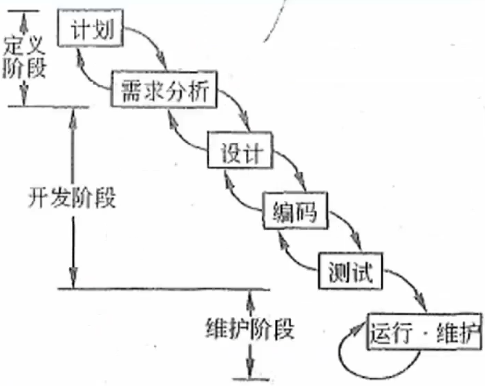

瀑布模型特点
1. 从**上一项开发活动接受该项活动的工作对象作为输入**。
2. 利用这一输入,**实施该项活动应完成的工作内容**。
3. 给出该项活动的**工作成果,作为输出**传给下一项开发活动。
4. 对**该项活动的实施工作成果进行评审**。若其工作成果得到确认,则继续进行下一项开发活动;否则返回前一项,甚至更前项的活动。尽量减少多个阶段间的反复。以相对来说较小的费用来开发软件。

### 原型化模型
> 适用于需求不明确的情况。

原型化模型**第一步就是创建一个快速原型**,能够满足项目干系人与未来的用户可以与原型进行交互,再通过与相关干系人进行充分的讨论和分析,**最终弄清楚当前系统的需求**,进行了充分的了解之后,在原型的基础上开发出用户满意的产品。

原型法认为在很难一下子全面准确地提出用户需求的情况下,原型应当具备的特点如下：
1. **实际可行**
2. 具有**最终系统的基本特征**
3. **构造方便、快速,造价低**。原型法的特点在于原型法**对用户的需求是动态响应、逐步纳入的**。

### 螺旋模型
> 结合瀑布模型和原型模型。

螺旋模型是一个**演化软件过程模型**,将**原型实现的迭代特征与线性顺序(瀑布)模型中控制的和系统化的方面结合起**来。在螺旋模型中,**软件开发是一系列的增量发布**。

开发过程具有**周期性重复的螺旋线状**。四个象限分别标志每个周期所划分的四阶段:**制订计划、风险分析、实施工程和客户评估**。螺旋模型**强调了风险分析**,特别**适用于庞大而复杂的、高风险的系统**。

### V模型
> 测试阶段对应词：单编、集详、系概、验需。

**V模型**从整体上看起来,就是一个V字型的结构,由左右两边组成。左边的下画线分别代表了需求分析、概要设计、详细设计、编码。右边的上画线代表了单元测试、集成测试、系统测试与验收测试。V模型的特点如下:
1. **单元测试**的主要目的是针对**编码过程中**可能存在的各种错误;
2. **集成测试**的主要目的是针对**详细设计中**可能存在的问题;
3. **系统测试**主要针**对概要设计**,检查系统作为一个整体是否有效地得到运行;
4. **验收测试**通常由业务专家或者用户进行,以确认产品能真正符合用户业务上的需要。
5. V模型**用于需求明确和需求变更不频繁**的情形。

### 增量模型
**首先开发核心模块功能**,而后与用户确认,之后再开发没核心模块的功能,即每次开发一部分功能,并与用户需求确认,最终完成项目开发，**优先级最高的服务最先交付**。

特点:但由于并不是从系统整体角度规划各个模块,**因此不利于模块划分**。难点在于**如何将客户需求划分为多个增量**。与原型不用的是**增量模型的每一次增量版本都可作为独立可操作的作品**,而原型的构造一般是为了演示。
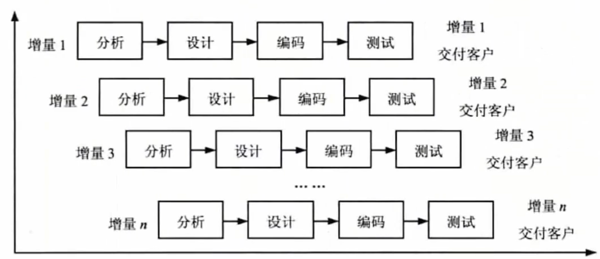

### 其他模型
喷泉模型:是一种**以用户需求为动力,以对象作为驱动的模型**,适合于**面向对象的开发方法**。使开发过程具有迭代性和无间隙性。

基于构件的开发模型CBSD:利用**预先包装的构件来构造应用系统**。构件可以是组织内部开发的构件,也可以是商品化成品软件构件。
- 特点是**增强了复用性**,在系统开发过程中,会构建一个构件库,供其他系统复
用,因此可以提高可靠性,节省时间和成本。

形式化方法模型:建立在**严格数学基础**上的一种软件开发方法,主要活动是
生成计算机软件形式化的数学规格说明。

### 敏捷模型
开发宣言:**个体和交互胜过过程和工具、可以工作的软件生过面面俱到的文档、客户合作胜过合同谈判、响应变化胜过遵循计划**。

敏捷方法区别于其他方法的两个特点:
1. 是"**适应性**"而非"预设性"。
2. 是"**面向人的**"而非"面向过程的"。

敏捷方法的核心思想:
1. 敏捷方法是**适应型**,而非可预测型。拥抱变化,适应变化。
2. 敏捷方法是**以人为本**,而非以过程为本。发挥人的特性。
3. **迭代增量式**的开发过程。以原型开发思想为基础,采用迭代增量式开发,发行版本小型化。

主要敏捷方法:
1. 极限编程(XP)。基础和价值观是**交流、朴素、反馈和勇气**,即任何一个软件项目都可以从4个方面入手进行改善:**加强交流;从简单做起;寻求反馈;勇于实事求是**。
   - XP是一种**近螺旋式**的开发方法,它**将复杂的开发过程分解为一个个相对比较简单的小周期**:通过积极的交流、反馈以及其他一系列的方法,开发人员和客户可以非常清楚老开发进度、变化、待解决的问题和潜在的困难等,并根据实际情况及时地调整开发过程。
   - XP提倡**测试先行**,为了将以后出现bug的几率降到最低。
2. 水晶系列方法。与XP方法一样,都有**以人为中心**的理念,但在实践上有所不同。其目的是发展一种提倡"机动性的"方法,包含具有共性的核心元素,**每个都含有独特的角色、过程模式、工作产品和实践**。
3. 并列争球法(Scrum)。是一种迭代的增量化过程,把**每段时间(如30天)一次的迭代称为"冲刺"(Sprint)**,并**按需求的优先级别**来实现产品,多个自组织和自治的人小组并行地递增实现产品。
4. 特性驱动开发方法(FDD)。是一个**迭代**的开发模型。认为有效的软你件开发需要3个要素:**人、过程和技术**。有5个核心过程:**开发整体对象模型、构造特征列表、计划特征开发、特征设计和特征构建**。

### 统一过程模型RUP
RUP描述了**如何有效地利用商业的、可靠的方法开发和部署软件**,是一种重量级过程。RUP类似个在线的指导者,它可以**为所有方面和层次的程序开发提供指导方针、模版以及事例支持**。

RUP软件开发生命周期是一个**二维的软件开发模型**,RUP中有**9个核心工作流**,如下:
1. **业务建模**:理解待开发系统所在的机构及其商业运作,确保所有参与与人员对待开发系统所在的机构有共同的认识,评估待开发系统对所在机构的影响。
2. **需求**:定义系统功能及用户界面,使客户知道系统的功能,使开发,人员理解系统的需求,为项目预算及计划提供基础。
3. **分析与设计**:把需求分析的结果转化为分析与设计模型。
4. **实现**:把设计模型转换为实现结果,对开发的代码做单元测试,将不同实现人员开发的模块集成为可执行系统。
5. **测试**:检查各子系统之间的交互、集成,验证所有需求是否均被皮正确实现,对发现的软件质量上的缺陷进行归档,对软件质量提出改进建议。
6. **部署**:打包、分发、安装软件,升级旧系统;培训用户及销售人员,并提供技术支持。
7. **配置与变更管理**:跟踪并维护系统开发过程中产生的所有制品的完整性和一致性。
8. **项目管理**:为软件开发项目提供计划、人员分配、执行、监控等方面的指导,为风险管理提供框架。
9. **环境**:为软件开发机构提供软件开发环境,即提供过程管理和二工具的支持。

RUP把软件开发生命周期划分为**多个循环**,每个循环生成产品的一个新的的版本,**每个循环依次由4个连续的阶段组成**,每个阶段完成确定的任务。这4个阶段如下：
- **初始阶段**:定义最终产品视图和业务模型,并**确定系统范围**。
- **细化阶段**:设计及确定**系统的体系结构**,制订工作计划及资源要求。
- **构造阶段**:**构造产品并继续演进需求**、体系结构、计划直至产品提交
- **移交阶段**:把产品**提交给用户使用**。

RUP中定义了如下一些**核心概念**,理解这些概念对于理解RUP很有帮助。
- 角色:**Who的问题**。角色描述某个人或一个小组的行为与职责。RUP预先定义了很多角色,如体系结构师、设计人员、实现人员、测试员和配置管理人员等,并对每一个角色的工作和职责都做了详尽的说明。
- 活动:**How的问题**。活动是一个有明确目的的独立工作单元。
- 制品:**What的问题**。制品是活动生成、创建或修改的一段信息。
- 工作流:**When的问题**。工作流描述了一个有意义的连续的活动序存列,每个工作流产生一些有价值的产品,并显示了角色之间的关系。

RUP的**特点**:
1. **用例驱动**:需求分析、设计、实现和测试等活动都是用例驱动的。
2. **以体系结构为中心**:包括系统的总体组织和全局控制、通信协议等。是一个多维的结构,会采用多个视图来描述。在典型的4+1视图模型中:
   - **分析人员和测试人员**关心的是系统的行为,会侧重于**用例视图**;
   - **最终用户**关心的是系统的功能,会侧重于**逻辑视图**;
   - **程序员**关心的是系统的配置、装配等问题,会侧重于**实现视图**;
   - **系统集成人员**关心的是系统的性能、可伸缩性、吞吐率等问题,会侧重于**进程视图**;
   - **系统工程师**关心的是系统的发布、安装、拓扑结构等问题,会侧重于**部署视图**。

3. **迭代与增量**。把整个项目开发分为**多个迭代过程**。在每次选代中,只考虑系统的一部分需求,进行分析、设计、实现、测试和部署等过程;每次迭代是在己完成部部分的基础上进行的,每次增加一些新的功能实现,以此进行下去,直至最后项目的完成。

## 逆向工程
软件复用是**将已有软件的各种有关知识用于建立新的软件**,**以缩减软件开发和维护的花费**。软件复用是提高软件生产力和质量的一种重要技术。早期的软件复用主要是**代码级复用**,被复用的知识专指程序,后来扩大到包括**领域知识、开发经验、设计决定、体系结构、需求、设计、代码和文档等一切有关方面**。

逆向工程:软件的逆向工程是**分析程序,力图在比源代码更高抽象层次上建立程序的表示过程,逆向工程是设计的恢复过程**。逆向工程的四个级别:
- **实现级**:包括程序的抽象语法树、符号表、过程的设计表示。
- **结构级**:包括反映程序分量之间相互依赖关系的信息,例如调用图、经吉构图、程序和数据结构。
- **功能级**:包括反映程序段功能及程序段之间关系的信息,例如数据和控制流模型。
- **领域级**:包括反映程序分量或程序诸实体与应用领域概念之间对应关系的信息,例如E-R模型。

其中,**领域级抽象级别最高,完备性最低,实现级抽象级别最低,完备性最高**。

与逆向工程相关的概念有**重构、设计恢复、再工程和正向工程**：
1. 重构是指在**同一抽象级别上转换系统描述形式**。
2. 设计恢复是指借助工具**从已有程序中抽象出有关数据设计**、总体结构设计和过程设计等方面的信息。
3. 再工程是指**在逆向工程所获得信息的基础上,修改或重构已有的系统,产生系统的一个新版本**。再工程是对**现有系统的重新开发过程**,包括**逆向工程、新需求的考虑过程和正向工程**三个步骤。它不仅能从已存在的程序中重新获得设计信息,而且还能使用这些信息来重构现有系统,以改进它的综合质质量。在利用再工程重构现有系统的同时,一般会增加新的需求,包括增加新的功能和改善系统的性能。
4. 正向工程是指不仅从现有系统中恢复设计信息,而且**使用该信息去改变或重构现有系统**,以改善其整体质量。

## 需求工程
### 软件需求
**软件需求**:是指**用户对系统在功能、行为、性能、设计约束等方面的期望**。是指用户解决问题或达到目标所需的条件或能力,是系统可我系统部件要满足合同、标准、规范或其他正式规定文档所需具有的条件或能力力,以及反映这些条件或能力的文档说明。

分为**需求开发**和**需求管理**两大过程,如下所示:
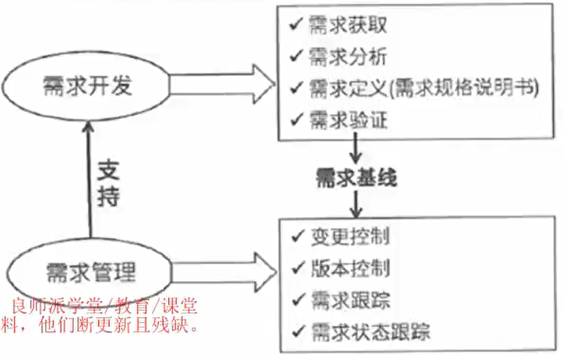

需求的分类：
- **业务需求**:反映**企业或客户对系统高层次的目标要求**,通常来自项目投资人、客户、市场营销部门或产品策划部门。通过业务需求可以确确定项目视图和范围。
- **用户需求**:描述的是**用户的具体目标,或用户要求系统必须能完成的任务。即描述了用户能使用系统来做什么**。通常采取用户访谈和问卷调查等方式,对用户使用的场景进行整理,从而建立用户需求。
- **系统需求**:从**系统的角度来说明软件的需求**,包括功能需求、非功能需求和设计约束等。
  - 1)功能需求:也称为行为需求,规定了**开发人员必须在系统中实现的软件功能**,用户利用这些功能来完成任务,满足业务需要。
  - 2)非功能需求:指**系统必须具备的属性或品质**,又可以细分为软件质量属性(如可维护性、可靠性、效率等)和其他非功能需求。
  - 3)设计约束:也称为限制条件或补充规约,通常是**对系统的一些约束说明**,例如必须采用国有自主知识产权的数据库系统,必须运行在UNIX操作系统之下等。

### 需求获取
**需求获取**:是一个确定和理解不同的项目干系人的需求和约束的过程。

常见的需求获取法包括:
1. 用户访谈:1对1-3,有代表性的用户。其形式包括结构化和非洁构化两种。
2. 问卷调查:用户多,无法一一访谈。
3. 采样:从种群中系统地选出有代表性的样本集的过程。样本数量=0.25(可信度因子/错误率)^2
4. 情节串联板:一系列图片,通过这些图片来讲故事。
5. **联合需求计划(JRP):**通过联合各个关键用户代表、系统分析师、开发团队代表一起,通过有组织的会议来讨论需求。
6. 需求记录技术:任务卡片、场景说明、用户故事、Volere白卡。

### 需求分析
需求分析:一个好的需求应该具有**无二义性、完整性**、一致性、可测试性、确定性、可跟踪性、正确性、必要性等特性,因此,需要分析人员**把杂乱无章的用户要求和期望转化为用户需求**,这就是需求分析的工作。

需求分析的任务：
1. 绘制系统上下文范围关系图
2. 创建用户界面原型
3. 分析需求的可行性
4. 确定需求的优先级
5. 为需求建立模型
6. 创建数据字典
7. 使用**QFD(质量功能部署)**

**结构化的需求分析**

结构化特点:**自顶向下,逐步分解,面向数据**。

三大模型:**功能模型(数据流图)、行为模型(状态转换图)、数据模型(E-R图)以及数据字典**。

- **数据流图DFD**

基本图形元素:外部实体、加工、数据存储、数据流。

具体实例：
1. 数据流:由一组固定成分的数据组成,表示数据的流向。在DFD中,**数据流的流向必须经过加工**。
2. 加工:描述了输入数据流到输出数据流之间的变换,数据流图中常见的三种错误如图所示:
- 加工3.1.2有输入但是没有输出,称之为"黑洞"。
- 加工3.1.3有输出但没有输入。称之为"奇迹"。
- 加工3.1.1中输入不足以产生输出,我们称之为"灰洞"。
3. 数据存储:用来存储数据。
4. 外部实体(外部主体):是指存在于**软件系统之外**的人员或组织,它指出系统所需数据的发源地(源)和系统所产生的数据的归宿地(宿)。
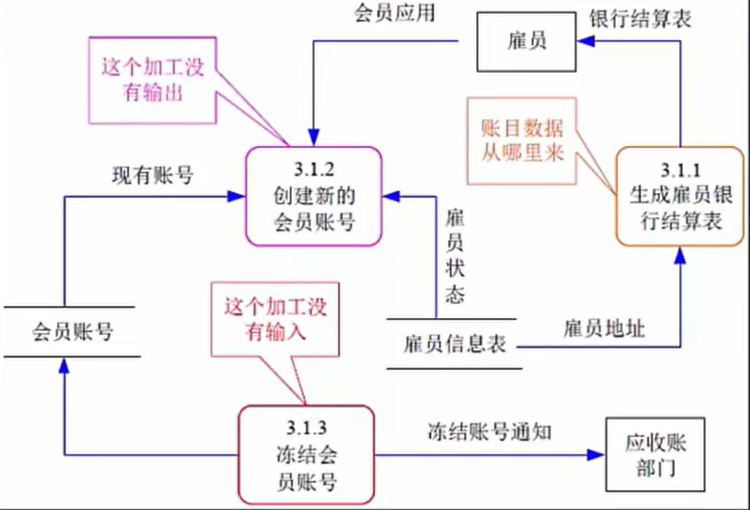

**分层数据流图**

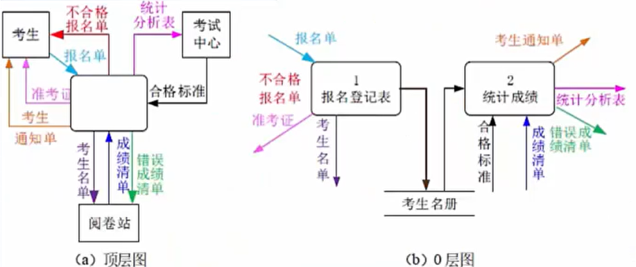

- **数据字典DD**
数据字典DD
数据流图描述了系统的分解,但没有对图中各成分进行说明。**数据字典就是为数据流图中的每个数据流、文件、加工,以及组成数据流或文件的数据项做出说明。**

数据字典有以下4类条目:**数据流、数据项、数据存储和基本加工**。

加工逻辑也称为"小说明"。常用的加工逻辑描述方法有**结构化语言、判定表和判定树**3种。

### 需求定义
**需求定义(软件需求规格说明书SRS)**:是需求开发活动的产物,编制该文档的目的是使项目干系人与开发团队对系统的初始规定有一个共同的理解,使之成为**整个开发工作的基础**。SRS是软件开发过程中最重要的文档之一,对于任何规模和性质的软件项目都不应该缺少。

需求定义方法
1. 严格定义也称为预先定义,需求的严格定义建立**在以下的基本假设**之上**所有需求都能够被预先定义**。开发人员与用户之间能够准确而青晰地交流。采用图形(或文字)可以充分体现最终系统。
2. 原型方法,**迭代的循环型开发方式**,需要注意的问题:并非所有的需求都能在系统开发前被准确地说明。项目干系人之间通常都存在交流上的困难,原型提供**了克服该困难的一个手段**。特点:需要实际的、可供用户参与的系统模型。有合适的系统开发环境。反复是完全需要和值得提倡的,需需求一旦确定,就应遵从严格的方法。

### 需求验证
需求验证:也称为需求确认,目的是**与用户一起确认需求无误**,对需求规格说明书SAS进行评审和测试,包括两个步骤:
- 需求评审:正式评审和非正式评审。
- 需求测试:设计概念测试用例。

需求验证通过后,要请用户签字确认,作为验收标准之一,此时,这个需求规格说明书就是需求基线,不可以再随意更新,如果需要更改必须走需求变更流程。

### 需求管理
定义需求基线:通过了评审的需求说明书就是需求基线,下次如果需要变更
需求,就需要按照流程来一步步进行。需求的流程及状态如下图所示:
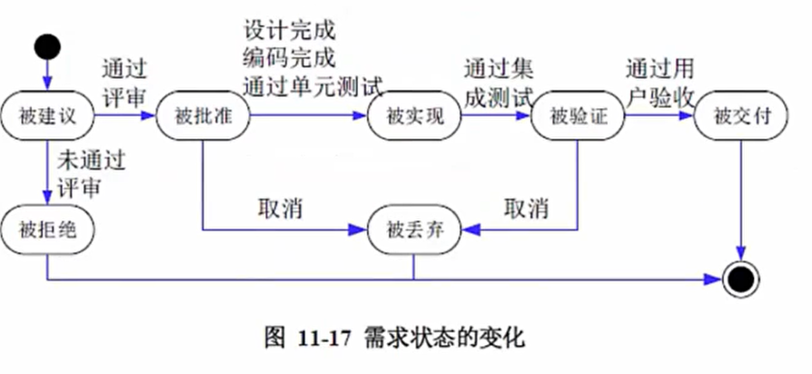

**需求变更和风险**

主要关心需求变更过程中的需求风险管理,带有风险的做法有:**无足够用户参与、忽略了用户分类、用户需求的不断增加、模棱两可的需求、不必要的特性、过于精简的SRS、不准确的估算**。

变更产生的原因:**外部环境的变化、需求和设计做的不够完整、新技术的出现、公司机构重组造成业务流程的变化**。

**变更控制委员会CCB**:也称为配置控制委员会,其任务时对建议的配置项变更做出评价、审批,以及监督已经批准变更的实施。
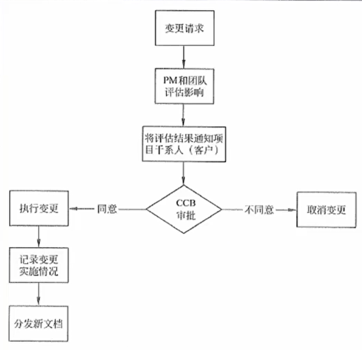

双向跟踪,两个层次,如下图所示:

正向跟踪表示**用户原始需求是否都实现了**,反向跟踪**表示软件实现的是否都是用户要求的**,不多不少,可以用原始需求和用例表格(需求)跟踪矩阵来表示:

若原始需求和用例有对应,则在对应栏打对号,若某行都没有对号,表明原始需求未实现,正向跟踪发现问题;若某列都没有对号,表明有多余功能用例软件实现了多余功能,反向跟踪发现问题。

## 系统设计
### 处理流程设计
**流程表示/设计工具**

**程序流程图(Program Flow Diagram,PFD)**用一些图框表示各种操作,它独立于任何一种程序设计语言,比较直观、清晰,易于学习掌握。任何复杂的程序流程图都应该由**顺序、选择和循环结构**组合或嵌套而成。

**IPO图**也是流程描述工具,用来描述构成软件系统的每个模块的**输入、输出和数据加工**。

**N-S(盒)图**容易表示嵌套和层次关系,并具有强烈的结构化特征。但是当问题很复杂时,N-S图可能很大,因此**不适合于复杂程序的设计**。
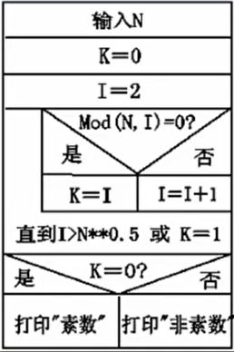

**问题分析图(PAD)**是一种支持**结构化程序设计**的图形工具。PAD具有清晰的逻辑结构、标准化的图形等优点,更重要的是,它引导设计人员使用结构化程序设计方法,从而提高程序的质量。

**业务流程重组BPR**

BPR是对企业的业务流程进行**根本性的再思考和彻底性的再议设计**,从而获得可以用诸如成本、质量、服务和速度等方面的业绩来衡量的显著性的的成就。**BPR设计原则、系统规划和步骤如下图所示**:
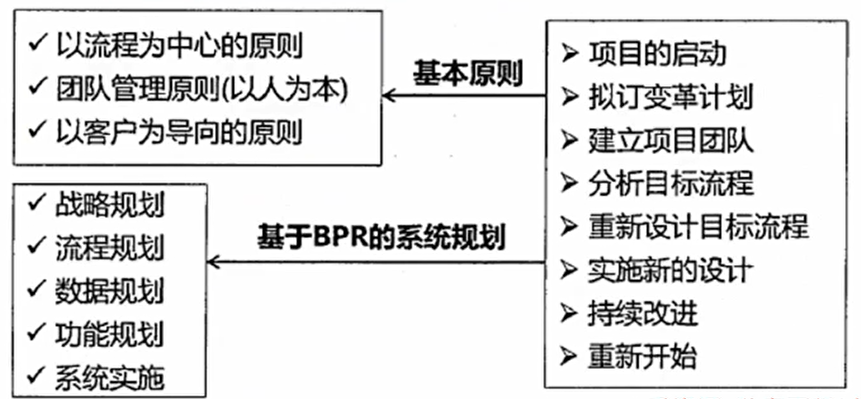

**业务流程管理BPM**

BPM是一种**以规范化的构造端到端的卓越业务流程为中心**,以持续的**提高组织业务绩效为目的**的系统化方法。

BPM与BPR管理思想最根本的不同就在于**流程管理并不要求对所有的流程进行再造**。构造卓越的业务流程并不是流程再造,而是**根据现有流程的具体情况,对流程进行规范化的设计**。

流程管理包含三个层面:**规范流程、优化流程和再造流程**。

### 系统设计
系统设计主要目的:为系统制定蓝图,在各种技术和实施方法中权衡利阵,精心设计,合理地使用各种资源,**最终勾画出新系统的详细设计方法**。

系统设计方法:**结构化设计方法,面向对象设计方法**。

系统设计的主要内容:**概要设计、详细设计**。

概要设计基本任务:又称为**系统总体结构设计**,是将系统的功能需求分配给软件模块,确定每个模块的功能和调用关系,**形成软件的模块结构图,即系统结构图**。

详细设计的基本任务:**模块内详细算法设计、模块内数据结构设计、数据库的物理设计、其他设计(代码、输入/输出格式、用户界面)**、编写详细设计说明书、评审。

**系统设计基本原理**:
- 抽象化;
- 自顶而下,逐步求精;
- 信息隐蔽;
- 模块独立(高内聚,低耦合)。

**系统设计原则**:
- 保持模块的大小适中;
- 尽可能减少调用的深度;
- 多扇入,少扇出;(扇入其实就是外部调用本身，说明价值高，复用程度高)
- 单入口,单出口;
- 模块的作用域应该在模块之内;
- 功能应该是可预测的。

**系统设计基本原理**:抽象、模块化、信息隐蔽、模块独立。
衡量模块独立程度的标准有两个:耦合性和内聚性。内聚程度从低到高如下表
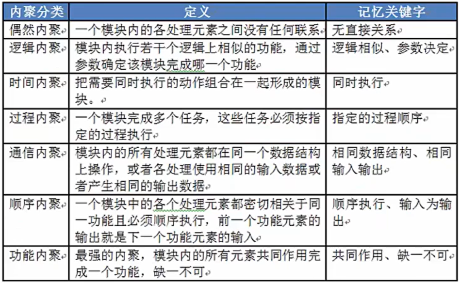
耦合程度从低到高如下表所示:
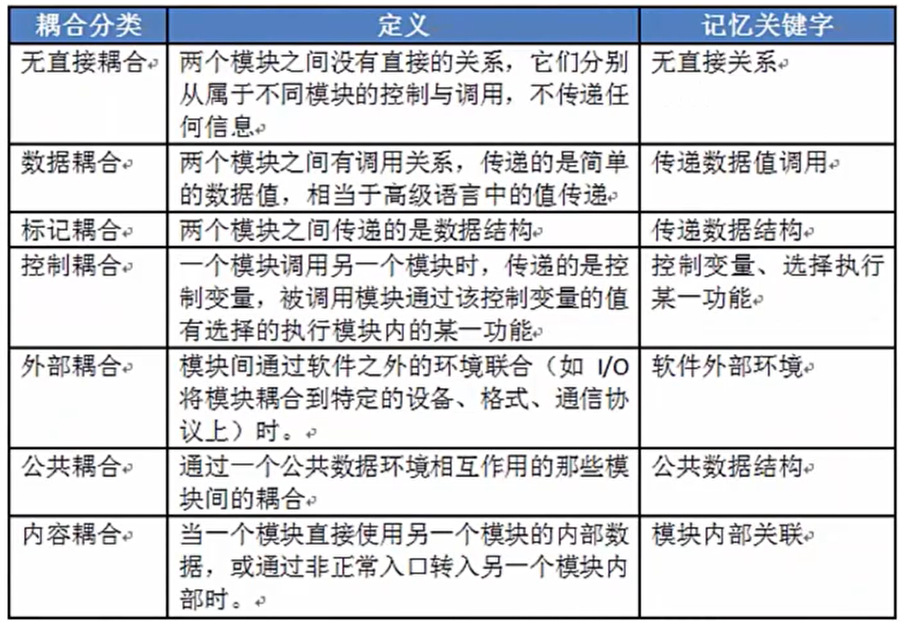

### 人机界面设计
人机界面设计三大黄金原则:
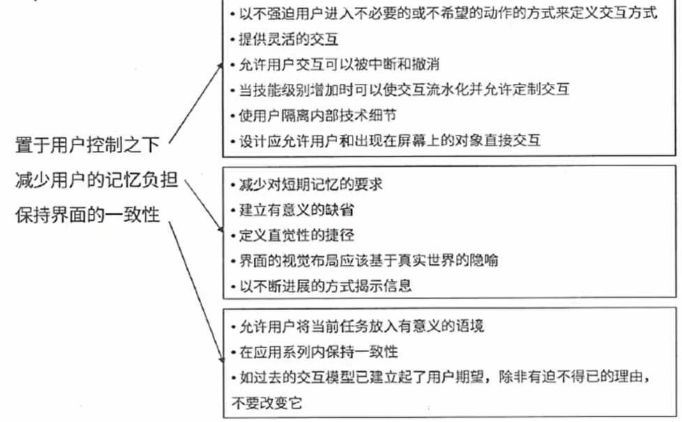

## 测试基础知识
### 测试原则和方法
系统测试是**为了发现错误而执行程序的过程,成功的测试是发现了至今尚未发现的错误的测试**。

测试原则:
- 应尽早并不断的进行测试;
- 测试工作应该避免由原开发软件的人或小组承担;
- 在设计测试方案时,不仅要确定输入数据,而且要根据系统功能确定预期的输出结果;
- 既包含有效、合理的测试用例,也包含不合理、失效的用例,
- 检验程序是否做了该做的事,且是否做了不该做的事;
- 严格按照测试计划进行;
- 妥善保存测试计划和测试用例;
- 测试用例可以重复使用或追加测试。

软件测试方法可分为静态测试和动态测试：
- **静态测试**:指被测试程序**不在机器上运行**,而采用**人工检测和计算机辅助静态分析的手段对程序进行检测**,包括对文档的静态测试和对代码的静态测试。对文档的静态测试主要以**检查单**的形式进行,而对代码的静态测试,包括**桌前检查、代码审查、代码走查**的方式。使用这种方法能够有效地发现30%-70%的逻辑设计和编码错误。
- **动态测试**:指在计算机上**实际运行程序**进行软件测试,一般采用白盒测试和黑盒测试方法：
  - 黑盒测试法:**功能性测试**,不了解软件代码结构,根据功能设计用例,测试软件功能。
  - 白盒测试法:**结构性测试**,明确代码流程,根据代码逻辑设计用例,进行用例覆盖。

### 测试阶段
1. 单元测试:也称为模块测试,测试的对象是**可独立编译或汇编的程序模块**软件构件或OO软件中的类(统称为模块),测试依据是**软件详细设计说明书**。
2. 集成测试:目的是**检查模块之间,以及模块和已集成的软件之间的接口关系**,并验证已集成的软件是否符合设计要求。测试依据是**软件概要设计文档**。
3. 确认测试:主要用于**验证软件的功能、性能和其他特性是否与用户需求一致**。根据用户的参与程度,通常包括以下类型:
   1. 内部确认测试:主要**由软件开发组织内部按照SRS（需求规格说明书）进行测试**。
   2. Alpha测试:**用户在开发环境下**进行测试。
   3. Beta测试:**用户在实际使用环境下**进行测试,通过该测试后,产品才能交付用户。
   4. 验收测试:**针对SRS,在交付前以用户为主进行的测试**。其测试对象为完整的、集成的计算机系统。验收测试的目的是,在真实的用户工作环境下,不检验软件系统是否满足开发技术合同或SRS。验收测试的结论是用户确定是否接收该软件的主要依据。除应满足一般测试的准入条件外,在进行验收测试之前前,应确认被测软件系统已通过系统测试。
4. 系统测试:**测试对象是完整的、集成的计算机系统**;测试的目的是在真实系统工作环境下,验证完成的软件配置项能否和系统正确连接,并满足系统/子系统设计文档和软件开发合同规定的要求。测试依据是**用户需求或开发合同**。主要内容包括功能测试、健壮性测试、性能测试、用户界面测试、安全性测试、安装与反安装测试等,其中,最重要的工作是进行功能测试与性能测试。功能测试主要采用黑盒测试方法;性能测试主要指标有响应时间、吞吐量、发用户数和资源利用率等。
5. 配置项测试:测试对象是**软件配置项**,测试目的是**检验软件配置项与SRS的一致性**。测试的依据是SRS。在此之间,应确认被测软件配置项已通过单元测试和集成测试。
6. 回归测试:测试目的是**测试软件变更之后,变更部分的正确性和对变更需求的符合性,以及软件原有的、正确的功能、性能和其他规定的的要求的不损害性**。

**测试策略**
- 自底向上:从**最底层模块开始测试,需要编写驱动程序**,而后开始逐一合并模块,最终完成整个系统的测试。优点是**较早的验证了底层模块**。
- 自顶向下:**先测试整个系统,需要编写桩程序,而后逐步向下直至最后测试最底层模块**。优点是**较早的验证了系统的主要控制和判断点**。
- 三明治:既有自底向上也有自顶向下的测试方法,**二者都包括。兼有二者的优点,缺点是测试工作量大**。

### 测试用例设计
**黑盒测试用例**:将程序看做一个黑盒子,只知道输入输出,不知道内部代码,由此设计出测试用例,分为下面几类:
- **等价类划分**:把所有的数据按照某种特性进行归类,而后在每类的数据里选取一个即可。等价类测试用例的设计原则:
  - **设计一个新的测试用列,使其尽可能多地覆盖尚未被覆盖的有效等价类**,重复这一步,直到所有的有效等价类都被覆盖为止;
  - **设计一个新的测试用例,使其仅覆盖一个尚未被覆盖盖的无效等价类**,重复这一步,直到所有的无效等价类都被覆盖为止。
- **边界值划分**:将每类的边界值作为测试用例,边界值一般为**范围的的两端值以及在此范围之外的与此范围间隔最小的两个值**,如年龄范围为0-150,边界值为0,150, -1,151四个。
- **错误推测**:没有固定的方法,凭经验而言,来推测有可能产生问题的地方,作为测试用例进行测试。
- **因果图**:由一个结果来反推原因的方法,具体结果具体分析,没有固定方法。

**白盒测试用例**:知道程序的代码逻辑,按照程序的代码语句,来设计覆盖代码分支的测试用例,覆盖级别从低至高分为下面几种:
1. **语句覆盖SC**:逻辑代码中的**所有语句都要被执行一遍,覆盖层级最低**,因为执行了所有的语句,不代表执行了所有的条件判断。
2. **判定覆盖DC**:逻辑代码中的**所有判断语句的条件的真假分支都要覆盖一次**。
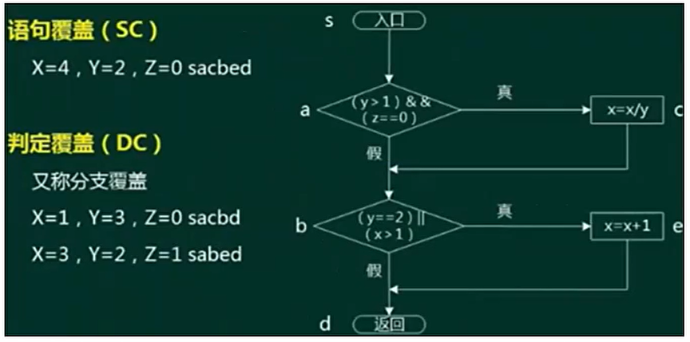
3. **条件覆盖CC**:针对每一个判断条件内的**每一个独立条件都要执行一遍真和假**。
4. **条件判定组合覆盖CDC**:**同时满足判定覆盖和条件覆盖**。
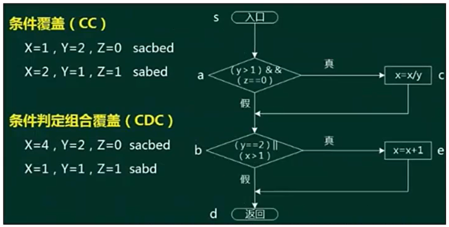
5. **路径覆盖**:逻辑代码中的**所有可行路径都覆盖了,覆盖层级最高**。
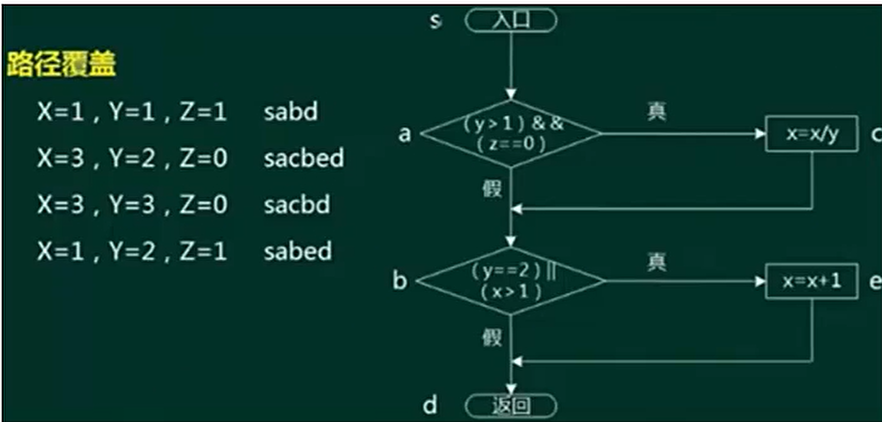

### 调试
测试是发现错误,调试是**找出错误的代码和原因**。

调试需要**确定错误的准确位置;确定问题的原因并设法改正;改正后要进行回归测试**。

调试的方法有:**蛮力法、回溯法**(从出错的地方开始,向回找)、**原因排除法**(找出所有可能的原因,逐一进行排除,具体包括演绎法、归纳法、二分法)。

### 软件度量
**软件的两种属性**:**外部属性指面向管理者和用户的属性,可直接测量**,一般为**性能指标**。内部属性指**软件产品本身的的属性,如可靠性等,只能间接测量**。

**McCabe度量法**:又称为环路复杂度,假设有向图中**有向边数为m,节点数为n,则此有向图的环路复杂度为m-n+2**.

注意m和n代表的含义不能混淆,可以用一个最简单的环路来做特殊值记忆此公式,另外,针对一个程序流程图,每一个分支边(连线)就是一条有向边,每一条语句(语句框)就是一个顶点。

## 系统运行与维护
### 系统转换
**遗留系统**是指任何基本上**不能进行修改和演化以满足新的变化了的业务需求的信息系统**,它通常具有以下特点:
1. 系统虽然完成企业中许多重要的业务管理工作,但仍然**不能完全满足要求**。一般实现业务处理电子化及部分企业管理功能,很少涉及经营决策。
2. 系统在性能上已经落后,采用**的技术已经过时**。例如，多采用主机/终端形式或小型机系统,软件使用汇编语言或第三代程序设计语言的早期版本开发,使用文件系统而不是数据库。
3. 通常是大型的软件系统,已经融入企业的业务运作和决策管理机制之中,**维护工作十分困难**。
4. 没有使用现代信息系统建设方法进行管理和开发,现在基本上已经没有文档,**很难理解**。

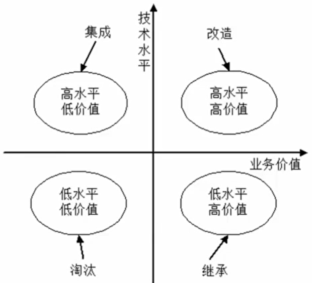

系统转换是指**新系统开发完毕,投入运行,取代现有系统的过程**,需要考虑多方面的问题,以实现与老系统的交接,有以下三种转换计划:
- **直接转换**:**现有系统被新系统直接取代了**,风险很大,适用于新系统流不复杂,或者现有系统已经不能使用的情况。优点是节省成本。
- **并行转换**:**新系统和老系统并行工作一段时间**,新系统经过试运行后再取代,若新系统在试运行过程中有问题,也不影响现有系统的运行,风险极小,在试运行过程中还可以比较新老系统的性能,适用于大型系统。缺点是耗费人力和时间资源,难以控制两个系统间的数据转换。
- **分段转换**:**分期分批逐步转换**,是直接和并行转换的集合,**将大型系统分为多个子系统**,依次试运行每个子系统,成熟一个子系统,就转换一个子系统。同样适用于大型项目,只是更耗时,而且现有系统和新系统间混合使用,需要协调好接口等问题。

**数据转换与迁移**:将数据从旧数据库迁移到新数据库中。有三种方法:**系统切换前通过工具迁移、系统切换前采用手工录入、系统切换后通过新系统生成**。

### 系统维护
系统的**可维护性**可以定义为**维护人员理解、改正、改动和改进这个软件的难易程度**,其评价指标如下:
1. **易分析性**。软件产品诊断软件中的缺陷或失效原因或识别待修改部分的能力。
2. **易改变性**。软件产品使指定的修改可以被实现的能力,实现包括编码马、设计和文档的更改。
3. **稳定性**。软件产品避免由于软件修改而造成意外结果的能力。
4. **易测试性**。软件产品使已修改软件能被确认的能力。
5. **维护性的依从性**。软件产品遵循与维护性相关的标准或约定的能力。

系统维护包括**硬件维护、软件维护和数据维护**,其中**软件维护类型如下**:
- **正确性维护**:发现了bug而进行的修改。
- **适应性维护**:由于外部环境发生了改变,被动进行的对软件的修改和升级。
- **完善性维护**:基于用户主动对软件提出更多的需求,修改软件,增加更多的功能,使其比之前的软件功能、性能更高,更加完善。
- **预防性维护**:对未来可能发生的bug进行预防性的修改。

## 净室软件工程
净室软件工程是一种**应用数学与统计学理论以经济的方式生产高质量软件的工程技术**,力图通过**严格的工程化的软件过程达到开发中的零缺陷或接近零缺陷**。净室方法不是先制作一个产品,再去消除缺陷,而是**要求在规约和设计中消除错误,然后以"净"的方式制作**,可以降低软件开发中的风险,以合理的成本开发出高质量的软件。

在净室软件工程背后的哲学是:通过在**第1次**正确地书写代码增量,并**在测试前验证它们的正确性**,来避免对成本很高的错误消除过程的依赖。它的过程模型是在代码增量积聚到系统的过程的同时,进行代码增量的统计质量验证。它甚至**提倡开发者不需要进行单元测试**,而是进行正确性验证和统计质量控制。

净室软件工程(CSE)的理论基础主要是**函数理论和抽样理论**。

净室软件工程**应用技术手段**:
1. 统计过程控制下的增量式开发。
2. 基于函数的规范与设计。
3. 正确性验证。CSE的核心
4. 统计测试和软件认证。

净室软件工程在使用过程的一些**缺点**:
1. CSE太理论化,需要更多的数学知识。其正确性验证的步骤比较团困难且比较耗时。
2. CSE开发小组不进行传统的模块测试,这是不现实的。
3. CSE也会带有传统软件工程的一些弊端。

## 基于构件的软件工程
基于构件的软件工程(CBSE)是一种基于**分布对象技术**、强调通过**可复用构件设计与构造软件系统**的软件复用途径。CBSE体现了"**购买而不是重新构造**（复用而不是重新开发）"的哲学,将软件开发的重点**从程序编写转移到了基于己有构件的组装**。用于CBSE的构件应该具备以下特征:
1. **可组装性**:对于可组装的构件,所有外部交互必须通过公开定义的接口进行。同时它还必须对自身信息的外部访问。
2. **可部署性**:软件必须是自包含的,必须能作为一个独立实体在提供其构件模型实现的构件平台上运行。构件总是二进制形式,无须在部署前编译。
3. **文档化**:构件必须是完全文档化的,用户根据文档来判断构件是否满足需求。
4. **独立性**:构件应该是独立的,应该可以在无其他特殊构件的情况下进组装和部署,如确实需要其他构件提供服务,则应显示声明。
5. **标准化**:构件标准化意味着在CBSE过程中使用的构件必须符合某种标准化的构件模型构件模型定义了构件实现、文档化以及开发的标准,其包含的模型要素为：
   - **接口**。构件通过构件接口来定义,构件模型规定应如何定义构件接口以以及在接口定义中应该包含的要素,如操作名、参数以及异常等。
   - **使用信息**。为使构件远程分布和访问,必须给构件一个特定的、全局唯一的的名字或句柄。构件元数据是构件本身相关的数据,比如构件的接口和属性信息。
   - **部署**。构件模型包括一个规格说明,指出应该如何打包构件使其部署成为为一个独立的可执行实体。部署信息中包含有关包中内容的信息和它的二进制构成的信息。

构件模型提供了一组**被构件使用的通用服务**,这种服务包括以下两种：
- **平台服务**,允许构件在分布式环境下通信和互操作。
- **支持服务**,这是很多构件需要的共性服务。例如,构件都需要的身份认证服务。**中间件**实现共性的构件服务,并提供这些服务的接口。

CBSE过程是支持基于构件组装的软件开发过程,过程中的6个主要活动:**系统需求概览、识别候选构件、根据发现的构件修改需求、体系结构设计、构件定制与适配、组装构件创建系统**。

CBSE过程与传统软件开发过程**不同点**:
1. CBSE早期**需要完整的需求**,以便尽可能多地识别出可复用的构件
2. 在过程早期阶段根据**可利用的构件来细化和修改需求**。如果可不利用的构件不能满足用户需求,就应该考虑由复用构件支持的相关需求。
3. 在系统体系结构设计完成后,会有一个**进一步的对构件搜索及设计精化的活动**。可能需要为某些构件寻找备用构件,或者修改构件以适合功能和架构的要要求。
4. 开发就是将**己经找到的构件集成在一起的组装过程**。

构件组装是指构件相互直接集成或是用专门编写的"**胶水代码**"将它们门整合在一起来创造一个系统或另一个构件的过程。常见的组装构件有以下3种组装方式：
1. **顺序组装**。通过**按顺序调用已经存在的构件**,可以用两个已经存在的构件来创造一个新的构件如上一个构件输出作为下一个构件的输入。
2. **层次组装**。这种情况发生在一个构件**直接调用自另一个构件所提是供的服务时**。被调用的构件为调用的构件提供所需的服务。二者之间接口匹配兼容。
3. **叠加组装**。这种情况发生在**两个或两个以上构件放在一起来创建一个新构件**的时候。这个新构件合并了原构件的功能,从而对外提供了新的接口。外部应用可以通过新接口来调用原有构件的接口,而原有构件不互相依赖,也不互相调用。这种组装类型适合合于构件是程序单元或者构件是服务的情况。

构件组装的**三种不兼容问题**(通过编写适配器解决):
1. **参数不兼容**。接口每一侧的操作有相同的名字,但参数类型或我参数个数不相同。
2. **操作不兼容**。提供接口和请求接口的操作名不同。
3. **操作不完备**。一个构件的提供接口是另一个构件请求接口的一个子集,或者相反。
