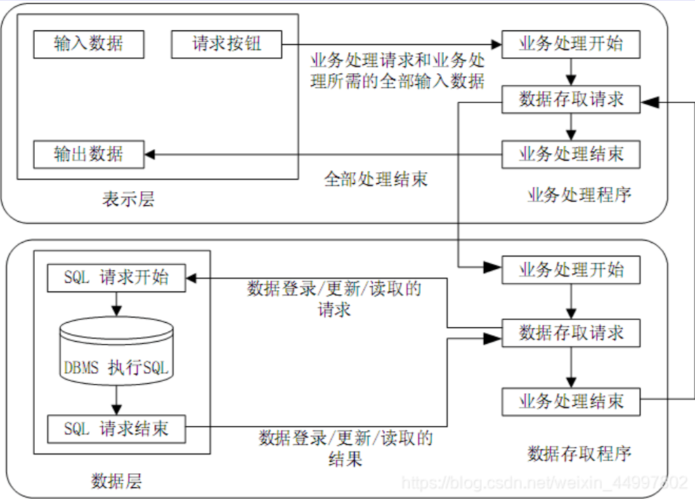

# 系统架构设计

- [系统架构设计](#系统架构设计)
  - [整体情况](#整体情况)
  - [软件架构概述](#软件架构概述)
    - [基本概念](#基本概念)
    - [软件架构设计与生命周期](#软件架构设计与生命周期)
    - [构件](#构件)
  - [软件架构风格](#软件架构风格)
    - [数据流风格](#数据流风格)
    - [调用/返回风格](#调用返回风格)
    - [独立构件风格](#独立构件风格)
    - [虚拟机风格](#虚拟机风格)
    - [仓库（数据共享）风格](#仓库数据共享风格)
    - [闭环控制风格](#闭环控制风格)
    - [C2体系结构风格](#c2体系结构风格)
    - [总结](#总结)
    - [补充-层次架构风格](#补充-层次架构风格)
      - [两层C/S架构](#两层cs架构)
      - [三层C/S架构](#三层cs架构)
      - [三层B/S架构](#三层bs架构)
      - [富互联网应用RIA](#富互联网应用ria)
      - [MVC架构](#mvc架构)
      - [MVP架构](#mvp架构)
      - [MVVM架构](#mvvm架构)
    - [补充-面向服务的架构风格SOA](#补充-面向服务的架构风格soa)
  - [软件架构复用](#软件架构复用)
  - [特定领域的软件架构（DSSA）](#特定领域的软件架构dssa)
  - [基于架构的软件开发（ABSD）](#基于架构的软件开发absd)
  - [软件系统的质量属性](#软件系统的质量属性)
  - [软件架构评估](#软件架构评估)
    - [质量属性](#质量属性)
    - [质量属性场景](#质量属性场景)
    - [架构评估](#架构评估)
      - [基本概念](#基本概念-1)
      - [架构评估方式](#架构评估方式)
  - [中间件技术](#中间件技术)
  - [典型应用架构](#典型应用架构)
    - [J2EE核心技术](#j2ee核心技术)
    - [.NET平台](#net平台)
    - [.NET和J2EE之争](#net和j2ee之争)

## 整体情况
选择题每年考察20分以上，20-25分左右。案例每年必考1-2道题。论文也是必考题。

## 软件架构概述
### 基本概念
从**需求分析到软件设计之间的过渡过程**称为软件架构。只要软件牛架构设计好了,整个软件就不会出现坍塌性的错误,即不会崩溃。

架构设计就是**需求分配,将满足需求的职责分配到组件上**。

软件架构为软件系统提供了一个**结构、行为和属性的高级抽象**,由**构件的描述、构件的相互作用(连接件)、指导构件集成的模式以及这些模式的约束**组成。

软件架构不仅**指定了系统的组织结构和拓扑结构**,并且显示了**系系统需求和构件之间的对应关系**,提供了一些设计决策的基本原理。

解决好**软件的复用、质量和维护问题,是研究软件架构的根本目的**。

软件架构设计包括**提出架构模型**,**产生架构设计和进行设计评审**等活动,是一个迭代的过程。架构设计主要关注**软件组件的结构、属性和交互作用,并通过多种视图全面描述特定系统的架构**。

软件架构能够在设计变更相对容易的阶段,考虑系统结构的可选方案,便于**技术人员与非技术人员就软件设计进行交互**,能够**展现软件的结构沟、属性与内部交互关系**。

软件架构是**项目干系人进行交流的手段**,明确了对系统实现的约束条件,决定了开发和维护组织的组织结构,制约着系统的质量属性。

软件架构**使推理和控制的更改更加简单**,有助于循序渐进的原型设计,可以作为培训的基础。

软件架构是**可传递和可复用的模型,通过研究软件架构可能预测软件的质量**。

### 软件架构设计与生命周期
1. 需求分析阶段。需求分析和SA设计面临的是不同的对象:一个是**问题空间**;另一个是**解空间**。从软件需求模型向SA模型的转换主要关注两个问题:**如何根据需求模型沟建SA模型。如何保证模型转换的可追踪性**。
2. 设计阶段。是**SA研究关注的最早和最多的阶段**,这一阶段的SA研究主要包括:**SA模型的描述、SA模型的设计与分析方法,以及对SA设计经验的总结与复用**等。有有关SA模型描述的研究分为3个层次:SA的基本概念(构件和连接子)、体系结构描述语言ADL、SA模型的多视图表示。
3. 实现阶段。最初SA研究往往只关注较高层次的系统设计、描述和验证。为了有效**实现SA设计向实现的转换**,实现阶段的体系结构研究表现在以下几个方面。
   1. 研究基于SA的**开发过程支持**,如项目组织结构、配置管理等。
   2. 寻求从**SA向实现过渡的途径**,如将程序设计语言元素引入9SA阶段、模型映射、构件组装、复用中间件平台等。
   3. 研究**基于SA的测试技术**。
4. 构件组装阶段。在SA设计模型的指导下,可复用构件的组装可以**在较高层次上实现系统**,并能够提高系统实现的效率。在构件组装的过程中,SA设计模型起到了**系统蓝图的作用**。研究内容包括如下两个方面：
   1. 如何**支持可复用构件的互联**,即对SA设计模型中规约的连接子的实现提供支持。
   2. 在组装过程中,如何**检测并消除体系结构失配问题**。在构件组装阶段的失配问题主要包括:由构件引起的失配、由连接子引起的失配、由于系统成分对全局体系结构的假设存在冲突引起的失配等。
5. 部署阶段。SA对软件部署作用如下：
   1. 提供**高层的体系结构视图**来描述部署阶段的软硬件模型。
   2. 基于SA模型可以**分析部署方案的质量属性**,从而选择合理的的部署方案。
6. 后开发阶段。是指软件**部署安装之后的阶段**。这一阶段的SA研究主要围绕**维护、演化、复用**等方面来进行。典型的研究方向包括**动态软件体系结构、体系结构恢复与重建**等：
   1. **动态软件体系结构。**现实中的软件具有动态性,**体系结构会在运行时发生改变**。运行时变化包括两类:软件**内部执行所导致的体系结构改变**;软件系统**外部的请求**对软件进行的重配置。包括两个部分的研究:体系结构**设计阶段的支持**、**运行时刻基础设施的支持**。
   2. **体系结构恢复与重建。**对于现有系统在开发时候**没有考虑SA的情况,从这些系统中恢复或重构体系结构**。从已有的系统中获取体系结构的重建方法分为4类:手工工体系结构重建、工具支持的手工重建、通过查询语言来自动建立聚集、使用其他技术(如数据挖掘等)。

### 构件
构件是一个**独立可交付的功能单元,外界通过接口访问其提供的服务**。

构件**由一组通常需要同时部署的原子构件组成**。一个原子构件是**一个模块和一组资源**。原子构件是**部署、版本控制和替换的基本单位**。原子构件通常成组地部署,但是它也能够被单独部署。

构件和原子构件之间的区别在于,**大多数原子构件永远都不会被单独部署**,尽管它们可以被单独部署。相反,**大多数原子构件都属于一个构件多家族,一次部署往往涉及整个家族**。

**一个模块是不带单独资源的原子构件**。

**一个单独的包被编译成多个单独的类文件**一一每个公共类都有一个。

**模块是一组类和可能的非面向对象的结构体**,比如过程或者函数。

> 对象、模块、构件、服务，是越来越大的概念。

构件的特性是:
1. **独立部署单元**;
2. 作为**第三方的组装单元**;
3. **没有(外部的)可见状态**。

一个构件**可以包含多个类元素,但是一个类元素只能属于一个构件**。
将一个类拆分进行部署通常没什么意义。

对象的特性是:
1. **一个实例单元**,具有唯一的标志。
2. **可能具有状态**,此状态外部可见。
3. **封装了自己的状态和行为。**

- 构件接口

接口标准化是对接口中**消息的格式、模式和协议的标准化**。它不是要将接口格式化为参数化操作的集合,而是**关注输入输出的消息的标准化**,它强调当机器在网络中互连时,标准的消息模式、格式、协议的重要性。

- 面向构件的编程(COP)

关注于**如何支持建立面向构件的解决方案**。"面向构件的编程需要下列基本的支持:
- 多态性(可替代性);
- 模块封装性(高层次信息的隐藏);
- 后期的绑定和装载(部署独立性);
- 安全性(类型和模块安全性)。"

**构建标准**

构件技术就是**利用某种编程手段**,将一些人们所关心的,但又不便于让最终用户去直接操作的**细节进行了封装**,**同时对各种业务逻辑规则进行了实现**,用于处理用户的内部操作细节。目前,国际上常用的构件标准主要有三大流派:
- **EJB**(Enterprise Java Bean)规范由Sun公司制定,有三种类型的EJB,分别是**会话Bean(Session Bean)、实体Bean(Entity Bean)和消息驱动Bean(Message-driven Bean)**.EJB实现**应用中关键的业务逻辑,创建基于构件的企业级应用程序**。
- **COM、DCOM、COM+**:**COM是微软公司的**。DCOM是COM的进一步扩展,具有位置独立性和语言无关性。COM+并不是COM的新版本,是COM的的新发展或是更高层次的应用。
- **CORBA标准**主要分为三个层次:**对象请求代理、公共对象服务和公共设施**。**最底层是对象请求代理ORB**,规定了分布对象的定义(接口)和语言映射,实现对象间的通讯和互操作,是**分布对象系统中的"软总线"**;在ORB之上**定义了很多公共服务**,可以提供诸如并发服务、名字服务、事务(交易)服务、安全服务等各种各样的服务;**最上层的公共设施则定义了组件框架**,提供可直接为业务对象使用的的服务,规定业务对象有效协作所需的协定规则。

## 软件架构风格
软件体系结构风格是描述**某一特定应用领域中系统组织方式的惯用模式**。架构风格定义一个系统家族,即**一个架构定义、一个词汇表和一组约束**。词汇表中包含**一些构件和连接件类型**,而这组约束**指出系统是如何将这些构件和连接件组合起来的**。

架构风格**反映了领域中众多系统所共有的结构和语义特性**,并**指导如何将各个模块和子系统有效地组织成一个完整的系统**。对软件架构风格的的研究和实践促进对设计的重用,一些经过实践证实的解决方案也可以可靠地用于解决新的问题。

架构设计的**一个核心问题是能否达到架构级的软件复用**。

架构风格**定义了用于描述系统的术语表和一组指导构建系统的规则**。

最基础的架构风格分为5大类：
- 数据流风格:**面向数据流,按照一定的顺序从前向后执行程序**,代表的风格有**批处理序列、管道-过滤器**。
- 调用/返回风格:构件之间**存在互相调用的关系,一般是显式的调用**,代表的风格有**主程序/子程序、面向对象、层次结构**。
- 独立构件风格:构件之间是互相独立的,不存在显式的调用关系,而是**通过某个事件触发、异步的方式来执行**,代表的风格有**进程通信、事件驱动系统(隐式调用)**。
- 虚拟机风格:**自定义了一套规则供使用者使用**,使用者基于这个规则来开发构件,能够跨平台适配,代表的风格有**解释器、基于规则的系统**。
- 仓库风格（数据共享风格）:以**数据为中心,所有的操作都是围绕建立的数据中心进行的**,代表的风格有**数据库系统、超文本系统、黑板系统**。

### 数据流风格
- 批处理序列:构件为一系列固定顺序的计算单元,**构件之间只通过数据传递交互**。每个处理步骤是一个独立的程序,**每一步必须在其前一步结束后才能开始**,数据必须是完整的,以整体的方式传递。
- 管道-过滤器:每个构件都有一组输入和输出,构件读取输入的数据流,经过内部处理,产生输出数据流。**前一个构件的输出作为后一个构件的输入**,前后数据流关联。过滤器就是构件,连接件就是管道。

**早期编译器**就是采用的这种架构,要一步一步处理的,均可考虑此架构风格。

二者区别在于**批处理前后构件不一定有关联,并且是作为整体传递**,即必须前一个执行完才能执行下一个。管道-过滤器是**前一个输出作为后一个输入,前面执行到部分可以开始下一个的执行**。

### 调用/返回风格
- 主程序/子程序:单线程控制,把**问题划分为若干个处理步骤,构件即为主程序和子程序**,子程序通常可合成为模块。**过程调用作为交互机制,充当连接件的角色**。
- 面向对象:**构件是对象**,对象是抽象数据类型的实例。**连接件即使对象间交互的方式,对象是通过函数和过程的调用来交互的**。
- 层次结构:**构件组成一个层次结构**,**连接件通过决定层间如何交互的协议来定义**。每层为上一层提供服务,使用下一层的服务,只能见到与自己邻接的层。**修改某一层,最多影响其相邻的两层(通常只能影响上层)**。
  - 层次结构优点:
    - 支持基于可增加抽象层的设计,**允许将一个复杂问题分解成一个增量步骤序列的实现**。
    - 不同的层次处于不同的抽象级别,**越靠近底层,抽象级别越高**。
    - 由于每一层最多只影响两层,同时只要给相邻层提供相同的接口,允许每层用不同的方法实现,同样为**软件复用提供了强大的支持。**
  - 缺点:
    - **并不是每个系统都可以很容易的划分为分层的模式。**
    - **很难找到一个合适的、正确的层次抽象方法。**

### 独立构件风格
- 进程通信:**构件是独立的进程,连接件是消息传递**。构件通常是命名过程,消息传递的方式可以是**点对点、异步或同步方式,以及远程过程(方法)调用等**。
- 事件驱动系统(隐式调用):构件不直接调用一个过程,而是**触发或广播一个或多个事件**。构件中的过程在一个或多个事件中注册,当**某个事件被触发时,系统自动调用在这个事件中注册的所有过程**。一个事件的触发就导:致了另一个模块中的过程调用。这种风格中的构件是匿名的过程,它们之间之间交互的连接件往往是以过程之间的隐式调用来实现的。

主要优点是**为软件复用提供了强大的支持,为构件的维护和演化带来了方便;缺点是构件放弃了对系统计算的控制**。

### 虚拟机风格
- 解释器:通常包括**一个完成解释工作的解释引擎、一个包含将被解释的代码的存储区、一个记录解释引擎当前工作状态的数据结构**,以及**一个记录源代码被解释执行的进度的数据结构**。具有解释器风格的软件中含有一个虚拟机,可以仿真硬件的执行过程和一些关键应用,缺点是**执行效率低**。
- 基于规则的系统:包括**规则集、规则解释器、规则/数据选择器和工作内存**,一般用在**人工智能领域和DSS（决策支持）**中。

### 仓库（数据共享）风格
- 数据库系统:构件主要有两大类,一类是**中央共享数据源**,保存当当前系统的数据状态;另一类是**多个独立处理单元,处理单元对数据元素进行操作**。
- 黑板系统:包括**知识源、黑板和控制**三部分。**知识源包括若干独立计算的不同单元,提供解决问题的知识**。知识源响应黑板的变化,也只修改黑板;**黑板是一个全局数据库**,包含问题域解空间的全部状态,是知识源相互作用的唯一媒介;知识源响应是通过**黑板状态的变化来控制的**。黑板系统通常应用在**对于解决问题没有确定性算法的软件中**(信号处理、问题规划和编译器优化等)。
- 超文本系统:构件以**网状链接方式相互连接**,用户可以在**构件之间进行按照人类的联想思维方式任意跳转到相关构件**。是一种非线性的网状信息组织方法,它以节点为基本单位,链作为节点之间的联想式关联。通常应用在**互联网**领域。

**现代编译器的集成开发环境一般采用数据仓库**(即以数据为中心的架构风格)架构风格进行开发,其中心数据就是程序的语法树。

### 闭环控制风格
当软件被用来操作一个物理系统时,**软件与硬件之间可以粗略的的表示为一个反馈循环**,这个反馈循环通过接受一定的输入,确定一系列的输前出,最终使环境达到一个新的状态,适合于嵌入式系统,涉及连续的动作与状态。

### C2体系结构风格
C2体系结构风格可以概括为:**通过连接件绑定在一起的按照一组规则运作的并行构件网络**。C2风格中的系统组织规则如下:
1. 系统中的**构件和连接件都有一个顶部和一个底部**;
2. **构件的顶部应连接到某连接件的底部,构件的底部则应连接到川某连接件的顶部**,而**构件与构件之间的直接连接是不允许的**;
3. 一个连接件可以和任意数目的其它构件和连接件连接件连接;
4. 当两个连接件进行直接连接时,必须由其中一个的底部到另一个的顶支部。

### 总结

### 补充-层次架构风格
> 选择不怎么考，主要是在案例分析中考。

#### 两层C/S架构
**客户端和服务器都有处理功能,现在已经不常用**,原因有:开发成本较高、客户端程序设计复杂、信息内容和形式单一、用户界面风格不一、软件移植困难、软件维护和升级困难、新技术不能轻易应用、安全性问题、服务器端压力大难以复用。

#### 三层C/S架构
将**处理功能独立出来**,表示层和数据层都变得简单。**表示层在客户机上,功能层在应用服务器上,数据层在数据库服务器上。**即将两层C/S架构中的数据从服务器中独立出来了。其优点下面四点:
- **各层在逻辑上保持相对独立**,整个系统的逻辑结构更为清晰,能提高系统和软件的可维护性和可扩展性;
- **允许灵活有效的选用相应的平台和硬件系统**,具有良好的可升级性和开放性;
- 各层可以**并行开发**,各层也可以选择各自最适合的开发语言;
- 功能层有效的隔离表示层与数据层,为严格的安全管理奠定了坚实的基础,**整个系统的管理层次也更加合理和可控制。**

三层C/S架构设计的**关键在于各层之间的通信效率**,要慎重考虑三层间的通信方法、通信频度和数据量,否则即使分配给各层的硬件能力很强,性能也不高。

#### 三层B/S架构
是三层C/S架构的变种,**将客户端变为用户客户端上的浏览器**,将**应用服务器变为网络上的WEB服务器**,又称为**0客户端架构**,虽然不用开发客户端,但有很多缺点:
- B/S架构缺乏对动态页面的支持能力,没有集成有效的数据库处理功能;
- 安全性难以控制;
- 在数据查询等响应速度上,要远远低于C/S架构;
- 数据提交一般以页面为单位,数据的动态交互性不强,不利于OLTP应用。

混合架构风格
- 内外有别模型:企业内部使用C/S,外部人员访问使用B/S。
- 查改有别模型:采用B/S查询,采用C/S修改。

混合架构实现困难,且成本高。

#### 富互联网应用RIA
(典型就是小程序):弥补三层B/S架构存在的问题,**RIA是一种用户接口**,比用HTML实现的接口更加健壮,且有可视化内容,本质还是网站模式,其优点如下:
- RIA**结合了C/S架构反应速度快、交互性强的优点与B/S架构传播范围广及容易传播**的特性;
- RIA**简化并改进了B/S架构的用户交互**;
- **数据能够被缓存在客户端**,从而可以实现一个比基于HTML的响应速度更快且数据往返于服务器的次数更少的用户界面。

**本质还是0客户端**,借助于**高速网速实现必要插件在本地的快速缓存**,增强页面对动态页面的支持能力,典型的如小程序。

#### MVC架构
(1)控制器(Controller):是应用程序中**处理用户交互的部分**。通常控制器负责从视图读取数据,控制用户输入,并向模型发送数据。
(2)模型(Model):是应用程序中用于**处理应用程序数据逻辑的部分**。通常模型对象负责在数据库中存取数据。模型表示业务数据和业务逻辑。
(3)视图(View):是应用程序中**处理数据显示的部分**。通常视图是依据模型数据创建的。是用户看到并与之交互的界面。视图向用户显示相关的数据,并能接收用户的输入数据,但是它并不进行任何实际的业务处理。

#### MVP架构
MVP:MVP是把MVC中的**Controller换成了Presenter(呈现),目的就是为了完全切断View跟Model之间的联系**,由Presenter充当桥梁,做到View-Model之间通信的完全隔离。

MVP特点:
1. M、V、P之间双向通信。
2. View与Model不通信,都通过Presenter传递。Presenter完全把Model和View进行了分离,主要的程序逻辑在Presenter里实现。
3. View非常薄,不部署任何业务逻辑,称为"被动视图"(Passive View),即没有任何主动性,而Presenter非常厚,所有逻辑都部署在
那里。
4. Presenter与具体的View是没有直接关联的,而是通过定义好的接口进行交互,从而使得在变更View时候可以保持Presenter的不变,这样就可以重用。

#### MVVM架构
MVVM:MVVM模式和MVC模式类似,主要目的是分离视图(View)和模型(Model),有几大优点:
1. 低耦合,视图(View)可以独立于Model变化和修改,一个ViewModel可以绑定到不同的"View"上,当View变化的时候Model可以不变,当Model变化的时候View也可以不变。
2. 可重用性,可以把一些视图逻辑放在一个ViewModel里面",让很多view重用这段视图逻辑。
3. 独立开发,开发人员可以专注于业务逻辑和数据的开发(ViewModel),设计人员可以专注于页面设计。
4. 可测试,界面向来是比较难于测试的,而现在测试可以针对ViewModel来写。

### 补充-面向服务的架构风格SOA
SOA是一种**粗粒度、松耦合服务架构**,服务之间通过简单、精请确定义接口进行通信,不涉及底层编程接口和通信模型。

在SOA中,**服务是一种为了满足某项业务需求的操作、规则等等的逻辑组合**,它包含一系列有序活动的交互,为实现用户目标提供支持。

SOA并不仅仅是一种开发方法,还具有管理上的优点,**管理员可直接管理开发人员所构建的相同服务。多个服务通过企业服务总线（ESB）提出服务请求**,由应用管理来进行处理,如下:

实施SOA的关键目标是**实现企业IT资产重用的最大化**,在实施SOA过程中要牢记以下特征:**可从企业外部访问、随时可用(服务请求能被及时响应)、粗粒度接口**(粗粒度提供一项特定的业务功能,而细粒度服务代表了技术构件方法)、**服务分级、松散耦合**(服务提供者和服务使用者分离)、**可重用的服务及服务接口设计管理、标准化的接口**(WSDL、SOAP、XML是核心)、**支持各种消息模式、精确定义的服务接口**。

从基于对象到基于构件再到基于服务,**架构越来越松散耦合,粒度度越来越粗,接口越来越标准**。

基于服务的构件与传统构件的区别有四点:
- 服务构件**粗粒度**,传统构件细粒度居多;
- 服务构件的**接口是标准的,主要是WSDL接口**,而传统构件常以具体API形式出现;
- 服务构件的**实现与语言是无关的**,而传统构件常绑定某种特定的话言
- 服务构件**可以通过构件容器提供QoS的服务**,而传统构件完全全由程序代码直接控制。

SOA中应用的**关键技术**如下表。

- UDDI:是一套基于WEB的、分布式的、为WebService提供的、信息注册中心的实现标准规范,同时也包含一组使企业能将自身提供的WebService注册,以使别的企业能够发现的访问协议的实现标准,**用于WEB服务注册统一描述、发现及集成**。
- WSDL(Web Service描述语言):**将Web服务描述定义为一组服务访问点**,客户端可以通过这些服务访问点对包含面向文档信息或面向过程调用的服务务进行访问(类似远程调用),用于**描述服务**。
- SOAP(简单对象访问协议):是**用于交换XML编码信息的轻量级协议,用于传递信息**。
- XML(可扩展标记语言):是WebService平台中**表示数据的基本格式,用于数据交换**。

**SOA实现方式**
- WEB Service
**服务提供者、服务注册中心(中介,提供交易平台,可有可无)、服务请求者**。服务提供者将服务描述发布到服务注册中心,供服务请求者查找,查找到后,服务请求者将绑定查找结果。如图

- 服务注册表
1. **服务注册**:应用开发者(服务提供者)在注册表中公布服务的功能。
2. **服务位置**:服务使用者(服务应用开发者),帮助他们查询注册服务,寻找符合自身要求的服务。
3. **服务绑定**:服务使用者利用检索到的服务接口来编写代码,所编写的代码将与注册的服务绑定,调用注册的服务,以及与它们实现互动。

- ESB
企业服务总线ESB:简单来说是**一根管道,用来连接各个服务节点**。ESB的存在是为了**集成基于不同协议的不同服务,ESB做了消息的转化、解释释以及路由的工作,以此来让不同的服务互联互通**。包括:**客户端(服务请求者)、基础架构服务(中间件)、核心集成服务(提供服务)**。

ESB特点:
1. SOA的一种实现方式,ESB在面向服务的架构中起到的是**总线作用**,将各种服务进行连接与整合;
2. **描述服务的元数据和服务注册管理**;
3. 在服务请求者和提供者之间**传递数据,以及对这些数据进行转换的能力**,并支持由实践中总结出来的一些模式如同步模式、异步模式等;
4. **发现、路由、匹配和选择的能力**,以支持服务之间的动态交互解耦服务请求者和服务提供者。高级一些的能力,包括对安全的支持、服务质质量保证、可管理性和负载平衡等。

## 软件架构复用
软件产品线是指**一组软件密集型系统**,它们**共享一个公共的、可管理的特性集**,满足某个特定市场或任务的具体需要,是以规定的方式用公共的**核心资产集成**开发出来的。即围绕核心资产库进行管理、复用、集成新的系统。

软件架构复用的类型包括**机会复用和系统复用**。机会复用是指开发过过程中,**只要发现有**可复用的资产,就对其进行复用。系统复用是指**在开发之前,就要进行规划**,以决定哪些需要复复用。

可复用的资产包括:需求、架构设计、元素、建模与分析、测试、项目规划、过程方法和工具、人员、样本系统、缺陷消除。

复用的基本过程主要包括3个阶段:**首先构造/获取可复用的软件资产,其次管理这些资产(构件库),最后针对特定的需求,从这些资产中选择可复用的部分,以开发满足需求的应用系统**。

## 特定领域的软件架构（DSSA）
DSSA就是**专用于一类特定类型的任务(领域)的**、在整个领域中能有效地使用的、为成功构造应用系统限定了标准的组合结构的**软件构件的集合**。

DSSA就是一个**特定的问题领域**中支持一组应用的领域模型、参考需求、参考架构等组成的开发基础,其目标就是**支持在一个特定领域中多个应用的生成**。

垂直域:在**一个特定领域中的通用的软件架构,是一个完整的架构**。

水平域:在**多个不同的特定领域之间的相同的部分的小工具**(如购物和教育都有收费系统,收费系统即是水平域)。

**DSSA的三个基本活动**
- **领域分析**:这个阶段的主要目标是**获得领域模型(领域需求)**。**识别信息源**,即整个领域工程过程中信息的来源,可能的信息源包括现存系统、技术文献、问题域和系统开发的专家、用户调查和市场分析、领域演化的历史记录等,**在此基础上就可以分析领域中系统的需求,确定哪些需求是领地或中的系统广泛共享的,从而建立领域模型**。
- **领域设计**:这个阶段的**目标是获得DSSA**。DSSA描述**在领域模型中表示的需求的解决方案**,它不是单个系统的表示,而是能够**适应领域中多多个系统的需求的一个高层次的设计**。建立了领域模型之后,就可以派生出满足足这些被建模的领域需求DSSA。
- **领域实现**:这个阶段的主要目标是依据领域模型和DSSA**开发和组织可重用信息**。这些可重用信息可能是从现有系统中提取得到,也可能需要通过新的开发得到。

**参与DSSA的四种角色人员**
- **领域专家**:包括**该领域中系统的有经验的用户、从事该领域中系统的需求分析设计、实现以及项目管理的有经验的软件工程师**等。提供关于领域中系统的需求规约和实现的知识,帮助组织规范的、一致的领域字典,帮助选择样本系统作为领域工程的依据,复审领域模型、DSSA等领域工程产品,等等。
- **领域分析人员**:由**具有知识工程背景的有经验的系统分析员来担任**。控制整个领域分析过程,进行知识获取,将获取的知识组织到领域模型中。
- **领域设计人员**:由**有经验的软件设计人员来担任**。根据领域模型和现有系统开发出DSSA,并对DSSA的准确性和一致性进行验证。
- **领域实现人员**:由**有经验的程序设计人员来担任**。根据领域模型和DSSA,开发构件。

**建立DSSA的过程**
- **定义领域范围**:领域中的应用要满足用户一系列的需求。
- **定义领域特定的元素**:建立领域的字典,归纳领域中的术语,识别出领域中相同和不相同的元素。
- **定义领域特定的设计和实现需求的约束**:识别领域中的所有约束,还这些约束对领域的设计和实现会造成什么后果。
- **定义领域模型和架构**:产生一般的架构,并描述其构件说明。
- **产生、搜集可复用的产品单元**:为DSSA增加复用构件,使可用月于新的系统

以上过程是并发的、递归的、反复的、螺旋型的。

**三层次模型**
- **领域开发环境**:领域架构师决定核心架构,**产出参考结构、参考需求、架构、领域模型、开发工具**。
- **领域特定的应用开发环境**:应用工程师根据具体环境来将核心架构实例化。
- **应用执行环境**:操作员实现实例化后的架构。

## 基于架构的软件开发（ABSD）
ABSD方法是**架构驱动**,强调由**业务、质量和功能需求的组合驱动架构设计**。它强调采用**视角和视图来描述软件架构**,采用**用例和质量属性场景来描述需求**。进一步来说,用例描述的是功能需求,质量属性场景描述的是质量需求(或侧重于非功能需求)。

使用ABSD方法,**设计活动可以从项目总体功能框架明确就开始**,这意味着需求获取和分析还没有完成,就开始了软件设计。

ABSD方法有三个基础。**第一个基础是功能的分解**,使用已有的基于模块的内聚和耦合技术;**第二个基础是通过选择架构风格来实现质量和业务需求**;**第三个基础是软件模板的使用**,软件模板利用了一些软件系统的的结构。

ABSD方法**是递归的**,且迭代的每一个步骤都是清晰定义的。因此,不管设计是否完成,架构总是清晰的,有助于降低架构设计的随意性生。

基于架构的软件开发过程可分为下列六步:

1. 架构需求:重在**掌握标识构件的三步**,如下左图。
2. 架构设计:**将需求阶段的标识构件映射成构件**,进行分析,如下右图。
3. 架构(体系结构)文档化:主要产出两种文档,即**架构(体系结构)规格说明,测试架构(体系结构)需求的质量设计说明书**。文档是至关关重要的,是所有人员通信的手段,关系开发的成败。

4. 架构复审:由**外部人员(独立于开发组织之外的人,如用户代表和领域专家等)参加的复审**,复审架构是否满足需求,质量问题,构件划分合理性等。若复审不过,则返回架构设计阶段进行重新设计、文档化,再复审。
5. 架构实现:用**实体来显示出架构。实现构件,构件组装成系系统**,如下左图:
6. 架构演化:对**架构进行改变,按需求增删构件,使架构可复用**,如下右图:

## 软件系统的质量属性
可以将**软件系统的质量属性**分为**开发期质量属性和运行期质量属性**2个部分：
1. 开发期质量属性主要指在**软件开发阶段**所关注的质量属性,主要包含6个方面：
   1. 易理解性:指设计被开发人员理解的难易程度。
   2. 可扩展性:软件因适应新需求或需求变化而增加新功能的能力,也称为灵活性。
   3. 可重用性:指重用软件系统或某一部分的难易程度。
   4. 可测试性:对软件测试以证明其满足需求规范的难易程度。
   5. 可维护性:当需要修改缺陷、增加功能、提高质量属性时,识别修改点并实施修改的难易程度。
   6. 可移植性:将软件系统从一个运行环境转移到另一个不同的运行环境的难易程度。
2. 运行期质量属性主要指在**软件运行阶段**所关注的质量属性,主要包含7个方面:
   1. 性能:性能是指软件系统及时提供相应服务的能力,如速度、吞I吐量和容量等的要求。
   2. 安全性:指软件系统同时兼顾向合法用户提供服务,以及阻止非授权使用的能力。
   3. 可伸缩性:指当用户数和数据量增加时,软件系统维持高服务质量量的能力。例如,通过增加服务器来提高能力。
   4. 互操作性:指本软件系统与其他系统交换数据和相互调用服务的难易程度。
   5. 可靠性:软件系统在一定的时间内持续无故障运行的能力。
   6. 可用性:指系统在一定时间内正常工作的时间所占的比例。可用性会受到系统错误,恶意攻击,高负载等问题的影响。
   7. 鲁棒性;是指软件系统在非正常情况(如用户进行了非法操作、相关的软硬件系统发生了故障等)下仍能够正常运行的能力,也称健壮性或容错性。

## 软件架构评估
### 质量属性
> 每个属性掌握3个点，1掌握定义，2该质量属性包含哪些子特性，3在架构中如何解决/设计/达到该质量属性
1. 性能:指**系统的响应能力**,即要经过多长时间才能对某个事件做出响应或者在某段时间内系统所能处理的事件的个数。如**响应时间、吞吐量**。
   - 设计策略:**优先级队列、增加计算资源、减少计算开销、引入并发机制制、采用资源调度**等。
2. 可靠性:是软件系统在应用或系统错误面前,**在意外或错误使用的的情况下维持软件系统的功能特性的基本能力。如MTTF(平均无故障时间)、MTBF(平均故障间隔时间)、MTTR(平均故障修复时间)。**
   - 设计策略:**心跳、Ping/Echo、冗余、选举**。
3. 可用性:是系统**能够正常运行的时间比例**,经常用两次故障之间的时间长度或在出现故障时系统能够恢复正常的速度来表示。如**故障间隔时间**。
   - 设计策略:**心跳、Ping/Echo、冗余、选举**。
4. 安全性:**是指系统在向合法用户提供服务的同时能够阻止非授权用户使用的企图或拒绝服务的能力。如保密性、完整性、不可抵赖性、可控性。**
   - 设计策略:**入侵检测、用户认证、用户授权、追踪审计。**
5. 可修改性:指能够快速的**以较高的性能价格比对系统进行变更的能力**。通常以某些具体的变更为基准,通过考察这些变更的代价衡量。
   - 设计策略:**接口-实现分类、抽象、信息隐藏**。
6. 功能性:是**系统所能完成所期望的工作的能力**。一项任务的完成我需要系统中许多或大多数构件的相互协作。
7. 可变性:指**体系结构经扩充或变更而成为新体系结构的能力**。这种新体系结构应该符合预先定义的规则,在某些具体方面不同于原有的体系结构。当要将某个体系结构作为一系列相关产品的基础时,可变性是很重要的。
8. 互操作性:**作为系统组成部分的软件不是独立存在的,经常与其他系统或自身环境相互作用**。为了支持互操作性,软件体系结构必须为外部可视的功能特性和数据结构提供精心设计的软件入口。程序和用其他编程语言编写的软件系统的交互作用就是互操作性的问题,也影响应用的软件体系结构。

### 质量属性场景
质量属性场景是一种**面向特定质量属性的需求**。它由6部分组成:
- 刺激源(Source):这是某个**生成该刺激的实体**(人、计算机系统或者任何其他刺激器)。
- 刺激(Stimulus):该刺激是**当刺激到达系统时需要考虑的条件**。
- 环境(Environment):该刺激**在某些条件内发生**。当激励发生时,系统可能处于过载、运行或者其他情况。
- 制品(Artifact):某个制品**被激励**。这可能是整个系统,也可能是系统的一部分。
- 响应(Response):该响应是**在激励到达后所采取的行动**。
- 响应度量(Measurement):当响应发生时,**应当能够以某种方式对其进行度量**,以对需求进行测试。

可修改性质量属性场景描述实例:

### 架构评估
#### 基本概念
- 敏感点:是指**为了实现某种特定的质量属性**,一个或多个构件用所具有的特性。
- 权衡点:是**影响多个质量属性的特性**,是多个质量属性的敏感点。
- 风险点与非风险点不是以标准专业术语形式出现的,只是一个常规概念,即**可能引起风险的因素,可称为风险点**。某个做法如果有隐患,有有可能导致一些问题,则为风险点;而如果**某件事是可行的可接受的,则为非风险点**。

- 软件架构评估**在架构设计之后,系统设计之前**,因此与设计、实现、测试都没有关系。评估的目的是**为了评估所采用的架构是否能解决软件系统需求**,但不是单纯的确定是否满足需求。

#### 架构评估方式
三种常用的评估方式
- **基于调查问卷(检查表)的方式**:类似于需求获取中的**问卷调查**方式,只不过是架构方面的问卷,要求评估人员对领域熟悉。
- **基于度量的方式**:制定一些**定量指标**来度量架构,如代码行数等。要制定质量属性和度量结果之间的映射,要求评估人员对架构熟悉。
- **基于场景的方式**:主要方法。首先要**确定应用领域的功能和软件架构的结构之间的映射**,然后要设计用**于体现待评估质量属性的场景**(即4+1视图中的场景),最后**分析软件架构对场景的支持程度**。要求评估人员即对领域熟悉,也对架构熟悉。从三个方面对场景进行设计:**刺激(事件);环境(事件发生的环境);响应(架构响应刺激的过程)**。

**基于场景的架构分析方法SAAM**

SAAM是一种**非功能质量属性**的架构分析方法,是**最早形成文档**并并得到广泛应用的软件架构分析方法。
- 特定目标。SAAM的目标是对**描述应用程序属性的文档,验证基本的架构假设和原则**。
- 质量属性。这一方法的基本特点是把任何形式的质量属性都具体化为场景,但**可修改性是SAAM分析的主要质量属性**。
- 架构描述。**SAAM用于架构的最后版本**,但早于详细设计。架构的描述形式应当被所有参与者理解。
- **功能、结构和分配被**定义为描述架构的3个主要方面。
- 方法活动。SAAM的**主要输入是问题描述、需求声明和架构描述**。下图描绘了SAAM分析活动的相关输入及评估过程。包括5个步骤,即**场景开发、架构描述、单个场景评估、场景交互和总体评估**。

**⭐架构权衡分析法ATAM**

**让架构师明确如何权衡多个质量目标**,参与者有评估小组、项目决策者和其他项目相关人。

ATAM被分为四个主要的活动领域,分别是**场景和需求收集、体系结构视图和场景实现、属性模型构造和分析、架构评审和折中**。**整个评估过程强调以属性作为架构评估的核心概念**。主要针对性能、可用性、安全性和可修改性,在系统开发之前,对这些质量属性进行评价和折中。

**成本效益分析法CBAM**

**用来对架构建立的成本来进行设计和建模**,**让决策者根据投资收益率来选择合适的架构**,可以看做对ATAM的补充,在ATAM确定质量合理的基础上,再对效益进行分析。有下列步骤:
- 整理场景(确定场景,并确定优先级,选择三分之一优先级最高的场景通进行分析);
- 对场景进行细化(对每个场景详细分析,确定最好、最坏的情况):
- 确定场景的优先级(项目干系人对场景投票,根据投票结果确定优先级);
- 分配效用(对场景响应级别确定效用表,建立策略、场景、响应级别的表格);
- 形成"策略-场景-响应级别的对应关系";
- 确定期望的质量属性响应级别的效用(根据效用表确定所对应的具体场景的效用表);
- 计算各架构策略的总收益;
- 根据受成本限制影响的投资报酬率选择架构策略(估算成本,用上一步的收益减去成本,得出收益,并选择收益最高的架构策略)。

**其他评估方法(仅了解)**
1. **SAEM方法**。将软件架构看作**一个最终产品以及设计过程中的一个中间产品**,从**外部质量属性**和**内部质量属性**两个角度来阐述它的评估模型,旨在为软件架构的质量评估创建一个基础框架。外部属性指**用户定义的质量属性**,而内部属性**指开发者决定的质量属性**。该软件架构评估模型包含以下几个流程。
   1. 对待评估的质量属性进行**规约建模**。
   2. 为外部和内部的质量属性**创建度量准则**,先从评估目的(如软件架构比较最终产品的质量预测),评估角度(如开发者、用户、维护者),评估环境(架构作为最终产品或设计中间产品)出发来定义架构评估的目标,再根据目标相关的属性来提出问题,然后回答每个问题并提出相应的度量准则。
   3. **评估质量属性**,包括数据收集、度量和结果分析3个活动。
2. **SAABNet方法**。是一种用**来表达和使用定性知识**以辅助架构的**定性评估**。该方法来源于**人工智能**,允许不确定、不完整知识的推理。该方法使用BBN来表示和使用开发过程中的知识,包含定性和定量的描述,其中定性的描述是所有结点的图,定量的描述是每个结点状态相关的条件概率。其中的变量可分为3类,即架构质量属性变量(如可维护性、灵活性等)、质量属性的度量准则变量(如容错性、响应性等)和架构特征变量(如继承深度、编程语言等),高层抽象的质量属性变量分解为低层抽象的度量准则变量,度量准则变量则分解为更低层抽象的架构特征变量。
3. SACMM方法。是一种**软件架构修改**的度量方法。
4. SASAM方法。通过对**预期架构**(架构设计阶段的相关描述材料)和**实际架构**(原代码中执行的架构)**进行映射和比较来静态地评估软件架构**。
5. ALRRA方法。**是一种软件架构可靠性风险评估方法**,该方法使用动态态复杂度准则和动态耦合度准则来定义组件和连接件的复杂性因素,其中,动态复杂度准则在某个场景的执行中分析组件的动态行为来度量组件的复杂性,动态耦合度准则在某个场景的执行中分析连接件的消息传递协议来度量连接件的复杂性。利用失效模式和影响分析(FMEA)技术。
6. AHP(层次分析法)方法。是**对定性问题进行定量分析的**一种简便、灵活而又实用的多准则决策方法。AHP方法的特点是把复杂问题中的各种因素通过划分为相联系的有序层次使之条理化,并在一般情况下通过两两对比,根据一定客观现实的主观判断结构,把专家意见和分析者的客观判断结果直接、有效地结合起来,将一定层次上元素的某些重要性进行定量描述,之后利用数学方法计算反映每一层次元素的相对重要性次序的权值,并最后通过所有层次次之间的总排序计算所有元素的相对权重及对权重进行排序。
7. COSMIC+UML方法。**基于度量模型来评估软件架构可维护性的方法**。针对不同表达方式的软件架构,采用统一的软件度量COSMIC方法来进行度量和评估。该方法三主要是为了辅助分析软件架构的演化方案是否可行,并在开源软件DCMMS的软件架构UML组件图上得以验证。

## 中间件技术
中间件:**在一个分布式系统环境中处于操作系统和应用程序之间的软件**,可以在**不同的技术之间共享资源**,将不同的操作系统、数据库、异构的网络环境以及若干应用**结合成一个有机的协同工作整体**。

中间件位于**客户机/服务器的操作系统之上,管理计算机资源原和网络通信**,有如下特点：
1. 中间件是**一类软件**,而非一种软件;
2. 中间件不仅仅**实现互连**,还要实现**应用之间的互操作**;
3. 中间件是**基于分布式处理的软件**,最**突出的特点是其网络通信功能**。

中间件的任务是**使应用程序开发变得更容易**,通过提供统一的程序抽象,**隐藏异构系统和分布式系统下低级别编程的复杂度。**

**主要的中间件有五类**:
- 数据库访问中间件:**通过一个抽象层访问数据库**,**从而允许使用相同或相似的代码访问不同的数据库资源。典型的技术如Windows平台的ODBC和Java平台的JDBC等。**
- 远程过程调用(RPC):是一种广泛使用的**分布式应用程序处理方法**。一个应用程序**使用RPC来"远程"执行一个位于不同地址空间内的过程,**从从效果上看和执行本地调用相同。
- 面向消息中间件(MOM):利用**高效可靠的消息传递机制进行平台无关的数据交流,并可基于数据通信进行分布系统的集成**。通过提供消息传递和消息排队模型,可在**分布环境下扩展进程间的通信,并支持多种通信协议**、语言、应用程序、硬件和软件平台。典型的产品如**IBM的MQSeries**。
- 分布式对象中间件:随着**对象技术与分布式计算技术**的发展,两者相互结合形成了分布式对象技术,并发展成为当今软件技术的主流方向。典型的产品如**OMG的CORBA、Sun的RMI/EJB、Microsoft的DCOM**等。
- 事务中间件:也称**事务处理监控器(TPM)**最早出现在大型机上。事务处理监控程序**位于客户和服务器之间,完成事务管理与协调、负载平衡、失效恢复复等任务,提高系统的整体性能**。

## 典型应用架构
### J2EE核心技术
J2EE平台采用了**多层分布式应用程序模型**,实现不同逻辑功能的应用程序被封装到不同的构件中,处于不同层次的构件被分别部署到不同的机器中。

四层结构:
- **客户层组件**:J2EE应用程序可以是基于web方式的,也可以是基于传统方式的静态的HTML(标准通用标记语言下的一个应用)页面和Applets是客户层组件
- **web层组件**:J2EE web层组件可以是JSP页面或Servlet.
- **业务层组件**:业务层代码的逻辑用来满足特定领域的业务逻辑处理。
- **信息系统层**:企业信息系统层处理企业信息系统软件包括企业基础建设系统例如企业资源计划(ERP),大型机事务处理,数据库系统,和其它的遗留信息系统.例如,J2EE应用组件可能为了数据库连接需要访问企业信息系统。

**JSP+Servlet+JavaBean+DAO**：
- JSP:用于显示、收集数据的部分。**作为MVC中的视图V**。
- Servlet:作为业务逻辑层,用于处理复杂的业务逻辑,如验证数据、实例化JavaBean、调用DAO连接数据库等。**作为MVC中的控制器C**。在其中会调Service方去处理服务。
- JavaBean:用于数据的封装,方便将查询结果在servlet与jsp页面之间进行传递等。
- DAO:用于连接数据库及进行数据库的操作如:查询、删除、更改等年。**DAO与JavaBean合在一起为MVC中的模型M**。

基本流程:JSP发一个数据到servlet,servlet收到后做下解析再根据数据调用相应的service去服务,service如果有要调用数据库就通过DAO跟数据库交互,使用javaBean完成封装,返回结果给servlet,servlet再返回给JSP。

**重量级与轻量级之争**
- 重量级框架占用资源过多,在开发的过程中效率很低;大部分时间花在配置、运行的过程上,修改复杂;单元测试也比较麻烦。但在大量运行过程中会表现出优异的效果,也即**开发麻烦,运行性能高**。
- 轻量级框架提高了开发的速度;立即可以看到结果;做单元测试非常简单;大量线程可供参考的开源代码。**开发简单,但运行性能低**。

### .NET平台
.NET框架处于操作系统和.NET应用语言之间,**只适用于微软系统**,而J2EE支持跨平台,任何安装了JVM的平台。

### .NET和J2EE之争
1. JVM(将所有JAVA代码都编译为字节码,由JVM解释执行)和CLR(.NET核心技术,类似于JVM,生成中间代码CLR,编译执行)。
2. 对多层分布式应用的支持,二者都支持多层分布式应用程序的开发:在王表示层的平台支持上,J2EE客户端支持多个平台,.NET只能在微软系统上运行,也正是因此,.NET会对微软系统上的应用进行优化;在业务层,J2EE占优势,因为有许多开源的项目和代码供参考,开发就变得简单;在数据层,二者都支持多种数据库,都非常优秀。
3. 安全性,由于JAVA在.NET之后出来,借鉴了.NET优点,JAVA在运行时动态验证,.NET是静态全面验证,二者都非常优秀,不分上下。
4. 应用程序的部署,J2EE的部署相对来说较复杂,针对不同的系统要特别布置。
5. 可移植性,显然J2EE占优势,一次开发,到处运行。
6. 外部支持:J2EE占优势,得到了很多厂家的支持,.NET只是微软一家。
