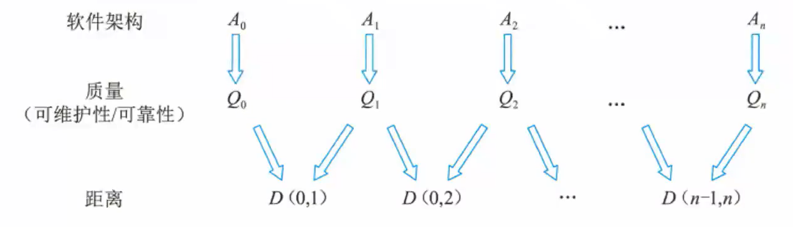
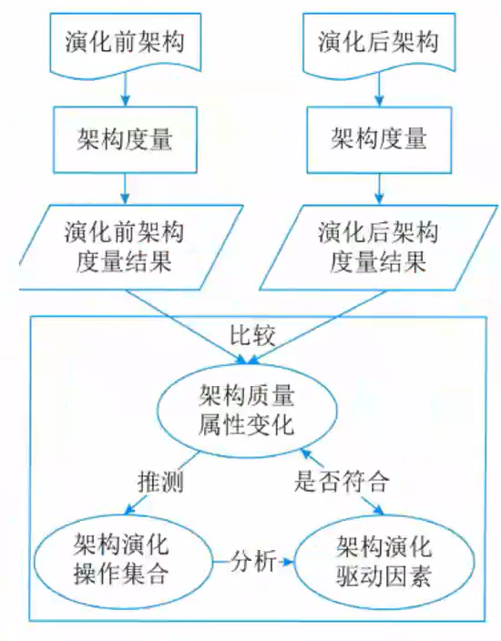
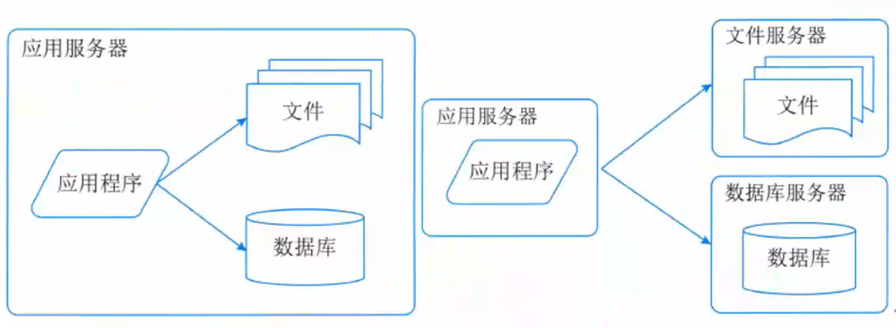
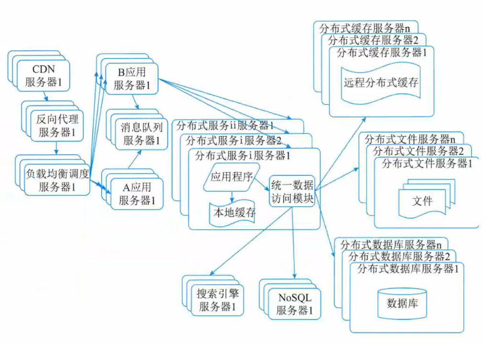

# 软件架构的演化和维护

- [软件架构的演化和维护](#软件架构的演化和维护)
  - [整体情况](#整体情况)
  - [软件架构演化和定义](#软件架构演化和定义)
  - [面向对象软件架构演化](#面向对象软件架构演化)
    - [对象演化](#对象演化)
    - [消息演化](#消息演化)
    - [复合片段演化](#复合片段演化)
    - [约束演化](#约束演化)
  - [软件架构演化方式分类](#软件架构演化方式分类)
  - [软件架构演化原则](#软件架构演化原则)
  - [软件架构演化评估](#软件架构演化评估)
  - [大型网站架构演化](#大型网站架构演化)
  - [软件架构维护](#软件架构维护)

## 整体情况
第二版纯新增章节，可能考2分。有可能在论文中出现。

## 软件架构演化和定义
软件架构的演化和维护就是对架构进行**修改和完善**的过程,目的就是为了使软件能够适应环境的变化而进行的**纠错性修改和完善性修改**等,是一个不断迭代的过程,直至满足用户需求。

本质上讲,软件架构的演化就是**软件整体结构的演化**,演化过程涵盖软件架构的**全生命周期**,包括**软件架构需求的获取、软件架构建模、软件架构文档、软件架构实现以及软件架构维护**等阶段。

软件架构演化的重要性体现在:一是架构是整个系统的骨架,是软件系统具备诸多好的特性的保障;二是软件架构作为软件蓝图为人们宏观管控软件系统的整体复杂性和变化性提供了一条有效途径。

软件架构的演化能降低软件演化的成本的原因:
1. 对系统的软件架构进行的形式化、可视化表示提高了软件的可构造性,便于软件演化。
2. 软件架构设计方案涵盖的整体结构信息、配置信息、约束信息等有助于开发人员充分考虑未来可能出现的演化问题、演化情况和演化环境。
3. 架构设计时对系统组件之间的耦合描述有助于软件系统的动态调整

软件架构的定义包含**组件、连接件、约束**三大要素,这类软件架构演化主要关注的就是**这三者之间的添加、修改和删除**等。

## 面向对象软件架构演化
### 对象演化
在顺序图中,组件的实体是对象,会对架构设计的动态行为产生影响的演化只包括Addobject (AO)和DeleteObject(DO)两种：
- AO表示在顺序图中添加一个新的对象。这种演化一般是在系统需要添加新的对象来实现某种新的功能,或需要将现有对象的某个功能独立以增加架构灵活性的时候发生。
- DO删除顺序图中现有的一个对象。这种演化一般在系统需要要移除某个现有的功能,或需要合并某些对象及其功能来降低架构的复杂度的时候发生。

### 消息演化
将消息演化分为AddMessage (AM)、DeleteMessage (DM)、SwapMessageOrder (SMO)、OverturnMessage (OM)、ChangeMessageModule (CMM) 5种。

AM 增添一条新的消息,产生在对象之间需要增加新的交互行为的时候。DM 删除当前的一条消息,产生在需要移除某个交互行为的时候,是AM的逆向演化。SMP交换两条消息的时间顺序,发生在需要改变两个交互行为之间关系的时候。OM反转消息的发送对象与接收对象,发生在需要修改某个交互行为本身的时候。CMM改变消息的发送或接收对象,发生在需要修改某个交互行为本身的时候。

### 复合片段演化
复合片段是对象交互关系的控制流描述,表示可能发生在不同场合的交互,与消息同属于连接件范畴。复合片段的演化分为AddFragment(AF)、DeleteFragment(DF)、FragmentTypeChange (FTC) 和FragmentConditionChange(FCC)。

FCC改变复合片段内部执行的条件,发生在改变当前控制流的执行条件目寸。自动机中与控制流执行条件相对应的转移包括两个,一个是符合条件时的转移,另一个是不符合条件时的转移,因此每次发生FFC演化时会同时修改这两个转移的触发事件。

AF在某几条消息上新增复合片段,发生在需要增添新的控制流E时。复合片段所产生的分支是不同类型的。

DF删除某个现有的复合片段,发生在需要移除当前某段控制流时。DF与AF互为逆向演化过程。

FTC改变复合片段的类型,发生在需要改变某段控制流时。类型演化意味着交互流程的改变,一般伴随着条件、内部执行序列的同时演化,可以视为复合片段的删除与添加的组合。

### 约束演化
即直接对约束信息进行添加和删除。

AC(Add Constraint)直接添加新的约束信息,会对架构设计产生直接的影响,需要判断当前设计是否满足新添加的约束要求。

DC(Delete Constraint)直接移除某条约束信息,发生在去除某些不必要条件的时候,一般而言架构设计均会满足演化后的约束。

## 软件架构演化方式分类
3种典型的分类方法：
1. 按照**软件架构的实现方式和实施粒度**分类:基于过程和函数数的演化、面向对象的演化、基于组件的演化和基于架构的演化。
2. 按照**研究方法**将软件架构演化方式分为4类:第1类是对演化的支持,如代码模块化的准则、可维护性的指示(如内聚和祸合)、代码重构等;第2类是版本和工程的的管理工具;第3类是架构变换的形式方法,包括系统结构和行为变换的模型,以及架构演化的重现风格等;第4类是架构演化的成本收益分析,决定如何增加系统的弹性。
3. 针对软件架构的**演化过程是否处于系统运行时期**,可以将转饮件架构演化分为**静态演化和动态演化**。

软件架构的演化时期包括:**设计时演化、运行前演化、有限制过运行时演化、运行时演化**。

软件架构静态演化主要是在设计时演化以及运行前演化。与此相对应的维护方法有3类:**更正性维护、适应性维护和完善性维护**。

软件的静态演化一般包括如下5个步骤。
1. 软件理解:查阅软件文档,分析软件架构,识别系统组成元素及及其之间的相互关系,提取系统的抽象表示形式。
2. 需求变更分析:静态演化往往是由于用户需求变化、系统运行出错和运行环境发生改变等原因所引起的,需要找出新的软件需求与原有的差异。
3. 演化计划:分析原系统,确定演化范围和成本,选择合适的演化计划。
4. 系统重构:根据演化计划对系统进行重构,使之适应当前的需求。
5. 系统测试:对演化后的系统进行测试,查找其中的错误和不足之处。

一次完整软件架构演化过程可以看作经过一系列原子演化操作组合而成。所谓原子演化操作是指基于UML模型表示的软件架构,在逻辑语义上粒度最小的架构修改操作。每经过一次原子演化操作,架构会形成一个演化中间版本。

架构演化的**可维护性度量**基于**组件图表示的软件架构**,在较高层次上评估架构的某个原子修改操作对整个架构所产生的影响。这些原子修改操作包括增加/删除模块间的依赖、增加/删除模块间的接口、增加/删除模块、拆分/聚合模块等。

架构演化的**可靠性评估**基**于用例图、部署图和顺序图**,分析在架构模块的交互过程中某个原子演化操作对交互场景的可靠程度的影响。这些原子修改操作包括增加/删除消息、增加/删除交互对象、增加/删除/修改消息片段、增加/删除用例执行、增加/删除角色等。

动态演化是在**系统运行期间**的演化,需要在不停止系统功能的情况下完成演化,较之静态演化更加困难。具体发生在有限制的运行时演化和运行时演化阶段。

架构的动态演化主要来自**两类需求**:
1. **软件内部执行所导致的体系结构改变**,例如,许多服务器端软件会在客户请求到达时创建新的组件来响应用户需求;
2. **软件系统外部的请求对软件进行的重配置**,例如,操作系统在升级时无须重新启动,在运行过程中就完成对体系结构的修改。

软件的动态性分为3个级别:
1. 交互动态性,要求数据在固定的结构下动态交互;
2. 结构动态性,允许对结构进行修改,通常的形式是组件和连接件实例的添加和删除,这种动态性是研究和应用的主流;
3. 架构动态性,允许软件架构的基本构造的变动,即结构可以被重定义,如新的组件类型的定义。

根据所修改的内容不同,软件的动态演化主要包括以下4个方面。
1. 属性改名:目前所有的ADL都支持对非功能属性的分析和规约,下而在运行过程中,用户可能会对这些指标进行重新定义(如服务响应时间)。
2. 行为变化:在运行过程中,用户需求变化或系统自身服务质量的调节都都将引发软件行为的变化。
3. 拓扑结构改变:如增删组件,增删连接件,改变组件与连接件之间的关联关系等。
4. 风格变化:一般软件演化后其架构风格应当保持不变,如果非要改变软件的架构风格,也只能将架构风格变为其衍生风格,如两层C/S到三层C/S。

目前,实现软件架构动态演化的技术主要有两种:采用动态:软件架构(DSA)和进行动态重配置(DR)。DSA是指在运行时刻会发生变化的系统框架结构,允许在过运行过程中通过框架结构的动态演化实现对架构的修改;DR从组件和连接件的配置入手,允许在过运行过程中增删组件,增删连接件,修改连接关系等操作。

实现软件架构动态演化的基本原理是使DSA在可运行应用系统中以一类有状态、有行为、可操作的实体显式地表示出来,并且被整个运行环境共享,作为整个系统运行的依据。也就是说,运行时刻体系结构相关信息的改变可用来触发、驱动系统自身的动态调整。

系统必须提供SA动态演化的一些相关功能:保存当前软件架构信息的功能、设置监控机制监视系统有无需求变化、保证演化操作原子性。

DSA实施动态演化大体遵循以下4步:
1. 捕捉并分析需求变化；
2. 获取或生成体系结构演化策略；
3. 根据步骤2得到的演化策略,选择适当的演化策略并实施演化；
4. 演化后的评估与检测。

基于软件动态重配置的软件架构动态演化主要是指在软件部署之后对配置信息的修改,常常被用于系统动态升级时需要进行的配置信息修改。一般来说,动态重配置可能涉及的修改有:
1. 简单任务的相关实现修改;
2. 工作流实例任务的添加和删除;
3. 组合任务流程中的个体修改;
4. 任务输入来源的添加和删除;
5. 任务输入来源的优先级修改;
6. 组合任务输出目标的添加和删除;
7. 组合任务输出目标的优先级修改等。

动态重配置模式:主从模式、中央控制模式、客户端/服务器器模式、分布式控制模式

## 软件架构演化原则
1. 演化成本控制原则
2. 进度可控原则
3. 风险可控原则
4. 主体维持原则:保证软件系统主体行为稳定。
5. 系统总体结构优化原则
6. 平滑演化原则:演化速率趋于稳定。
7. 目标一致原则
8. 模块独立演化原则
9. 影响可控原则
10. 复杂性可控原则
11. 有利于重构原则
12. 有利于重用原则
13. 设计原则遵从性原则:判断架构设计原则是否被破坏。
14. 适应新技术原则
15. 环境适应性原则
16. 标准依从性原则
17. 质量向好原则
18. 适应新需求原则

## 软件架构演化评估
根据演化过程是否己知可将评估过程分为:演化过程己知的评估和演化过程未知的评估。

演化过程己知的评估其目的在于通过对架构演化过程进行度量,比较架构内部结构上的差异以及由此导致的外部质量属性上的变化,对该演化过程中相关质量属性进行评估。

架构演化评估的执行过程如图所示。图中A0和An表示一次次完整演化前后的相邻版本的软件架构。每经过一次原子演化,即可得到一个架构中间演化版本Ai。对每个中间版本架构进行度量,得到架构Ai的质量属性度量值Qi。D(i-1,i)是版本间的质量属性距离。

基于度量的架构演化评估方法,其基本思路在于通过对演化前后的软件架构进行度量,比较架构内部结构上的差异以及由此导致的外部质量属性上的变化。具体包括:架构修改影响分析、监控演化过程、分析关键演化过程。

当演化过程未知时,我们无法像演化过程已知时那样追踪架构在演化过程中的每一步变化,只能根据架构演化前后的度量结果逆向推测出架构发生了哪些改变,并分析这些改变与架构相关质量属性的关联关系。

## 大型网站架构演化
主要解决大数据和高并发的问题:
- 第一阶段:单体架构;
- 第二阶段:垂直架构;

- 第三阶段:使用缓存改善网站性能
- 第四阶段:使用服务集群改善网站并发处理能力
- 第五阶段:数据库读写分离
- 第六阶段:使用反向代理和CDN加速网站响应
- 第七阶段:使用分布式文件系统和分布式数据库系统
- 第八阶段:使用NoSQL和搜索引擎
- 第九阶段:业务拆分
- 第十阶段:分布式服务

## 软件架构维护
软件架构维护过程一般涉及架构知识管理、架构修改管理和架构版本管理:
- 软件架构知识管理是对架构设计中所隐含的决策来源进行文档化表示,进而在架构维护过程中帮助维护人员对架构的修改进行完善的考虑,并能够为其他软件架构的相关活动提供参考。
  - 架构知识的定义:架构知识=架构设计+架构设计决策。即需要说明在进行架构设计时采用此种架构的原因。
  - 架构知识管理侧重于软件开发和实现过程所涉及的架构静态演化,从架构文档等信息来源中捕捉架构知识,进而提供架构的质量属性及其设计依据以进行记录和评价。
- 在软件架构修改管理中,一个主要的做法就是建立一个隔离区域保障该区域中任何修改对其他部分的影响比较小,甚至没有影响。为此,需要明确修改规则、修改类型,以及可能的影响范围和副作用等。
- 软件架构版本管理为软件架构演化的版本演化控制、使用用和评价等提供了可靠的依据,并为架构演化量化度量奠定了基础。
