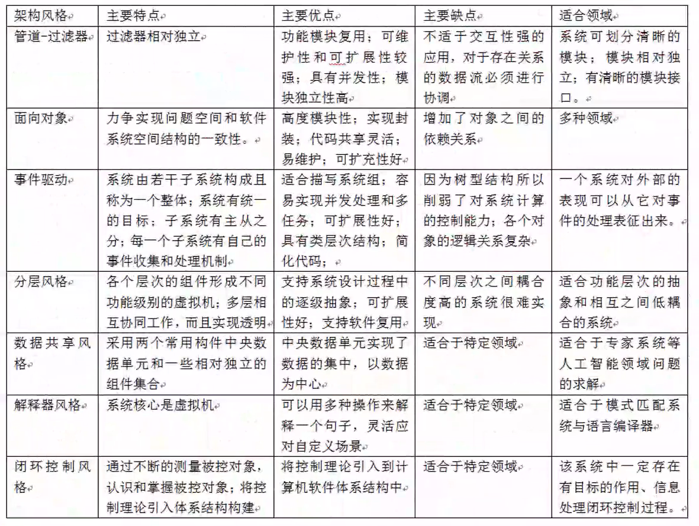
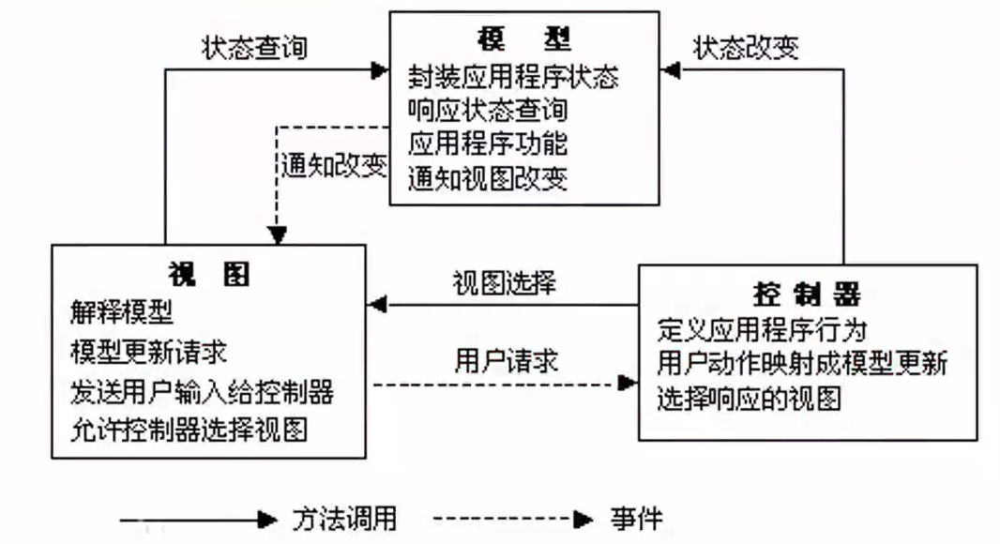
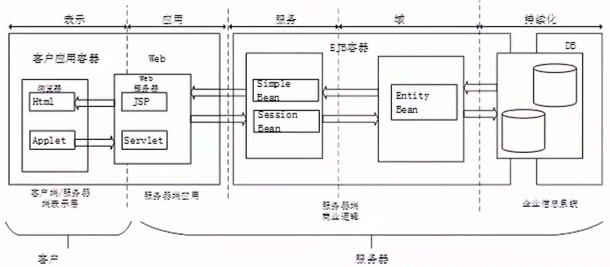
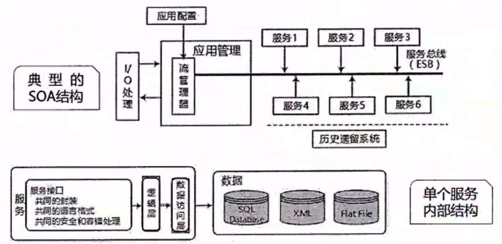

# 软件架构设计案例考点

## 质量属性效用树、质量属性判断
> 掌握质量属性定义、优化策略、典型代表参数。
1. 性能
   - 指系统的响应能力,即要经过多长时间才能对某个事件做出响应,或者在某段时间内系统所能处理的事件的个数。如响应时间、吞吐量。
   - 设计策略: 优先级队列,增加计算资源、减少计算开销、引入并发机制、采用资源调度等。
2. 可靠性
   - 是软件系统在应用或系统错误面前, 在意外或错误使用的情况下维持软件系统的功能特性的基本能力。如MTTF、MTBF。
   - 设计策略:心跳、Ping/Echo 冗余、选举。
3. 可用性
   - 是系统能够正常运行的时间比例,经常用两次故障之间的时间长度或在出现故障时系统能够恢复正常的速度来表示。如故障间隔时间。
   - 设计策略:心跳、Ping/Echo、冗余、选举。
4. 安全性
   - 是指系统在向合法用户提供服务的同时能够阻止非授权用户使用的企图或拒绝服务的能力。如保密性、完整性、不可抵赖性、可控性。
   - 设计策略:入侵检测、用户认证、用户授权、追踪审计。
5. 可修改性
   - 指能够快速的以较高的性能价格比对系统进行变更的能力。通常以某些具体的变更为基准,通过考察这些变更的代价衡量。
   - 设计策略:接口-实现分类、抽象、信息隐藏。
6. 功能性
   - 是系统所能完成所期望的工作的能力。一项任务的完成需要系统中许多或大多数构件的相互协作。
7. 可变性
   - 指体系结构经扩充或变更而成为新体系结构的能力。这种新体系结构应该符合预先定义的规则,在某些具体方面不同于原有的体系结构。当要将某个体系结构作为一系列相关产品的基础时,可变性是很重要的。
8. 互操作性
作为系统组成部分的软件不是独立存在的,**经常与其他系统或自身环境相互作用**。为了支持互操作性,软件体系结构必须为外部可视的功能特性和数据结构提供精心设计的软件入口。程序和用其他编程语言编写的软件系统的交互作用就是互操作性的问题,也影响应用的软件体系结构。

## 必背概念
- 软件架构风格

是指描述特定软件系统组织方式的惯用模式。组织方式描述了系统的组成构件和这些构件的组织方式,惯用模式则反映众多系统共有的结构和语义。

- 架构风险

是指架构设计中潜在的、存在问题的架构决策所带来的隐患。

- 风险点与非风险点

不是以标准专业术语形式出现的,只是一个常规概念,即可能引起风险的因素,可称为风险点。某个做法如果有隐患,有可能导致一些问题,则为风险点;而如果某件事是可行的、可接受的,则为非风险点。

- 敏感点

是指为了实现某种特定的质量属性,一个或多个构件所具有的特性。

- 权衡点

是影响多个质量属性的特性,是多个质量属性的敏感点。

## 架构风格对比
> 所有架构风格汇总如下,要能够看表理清楚每个架构风格的含义,有生疏的再去看上午精华知识点部分详细介绍。

**下午案例分析常考比较的架构风格对比**:

## 常考的架构
### MVC架构
MVC强制性地把一个应用的输入、处理、输出流程按照视图、控制、模型的方式进行分离,形成了三个核心模块:控制器、模型、视图。
1. 控制器(Controller)

是应用程序中**处理用户交互的部分**。通常控制器负责从视图读取数据,控制用户输入,并向模型发送数据。

2. 模型(Model)

是应用程序中用于**处理应用程序数据逻辑的部分**。通常模型对象负责在数据库中存取数据。模型表示业务数据和业务逻辑。

3. 视图(View)

是应用程序中**处理数据显示的部分**。通常视图是依据模型数据创建的。是用户看到并与之交互的界面。视图向用户显示相关的数据,并能接收用户的输入数据,但是它并不进行任何实际的业务处理。

MCV优点：
- MVC分层**有助于管理复杂的应用程序**,因为您可以**在一个时间内专门关注一个方面**。例如,您可以在不依赖业务逻辑的情况下专注于视图设计。
- 同时也让应用程序的测试更加容易。MVC分层同时也**简化了分组开发。不同的开发人员可同时开发视图、控制器逻辑和业务逻辑**。

### J2EE四层结构

- **客户层组件**:J2EE应用程序可以是基于web方式的,也可以是基于传统方式的静态的HTML(标准通用标记语言下的一个应用)页面和Applets是客户层组件
- **web层组件**:J2EE web层组件可以是ISP页面或Servlet。
- **业务层组件**:业务层代码的逻辑用来满足特定领域的业务逻辑处理。
- **信息系统层**:企业信息系统层处理企业信息系统软件包括企业基础建设系统例如企业资源计划(ERP),大型机事务处理,数据库系统,和其它的遗留信息系统例如,J2EE应用组件可能为了数据库连接需要访问企业信息系统。

JSP+Servlet+JavaBean+DAO
- JSP:用于显示、收集数据的部分。**作为MVC中的视图V**。
- Servlet:作为业务逻辑层,用于处理复杂的业务逻辑,如验证数据、实例化JavaBean调用DAO连接数据库等。**作为MVC中的控制器C**。在其中会调用Service方法处理服务
- JavaBean:用于数据的封装,方便将查询结果在servlet与jsp页面之间进行传递等。
- DAO:用于连接数据库及进行数据库的操作如:查询、删除、更改等。
- **DAO与JavaBean合在一起为MVC中的模型M**。

基本流程:JSP发一个数据到servlet,servlet收到后做下解析再根据数据调用相应的service去服务,service如果有要调用数据库就通过DAO跟数据库交互,使用javaBean完成封装,返回结果给servlet,servlet再返回给JSP。

### 面向服务的架构SOA
**SOA是一种设计理念,其中包含多个服务**,服务之间通过相互依赖最终提供一系列完整的功能。各个服务通常以独立的形式部署运行,服务之间通过网络进行调用。

企业服务总线ESB:简单来说是一根管道,用来连接各个服务节点。ESB的存在是为了集成基于不同协议的不同服务,ESB做了消息的转化、解释以及路由的工作,以此来让不同的服务互联互通。

ESB特点:
1. SOA的一种实现方式,**ESB在面向服务的架构中起到的是总线作用**,将各种服务进行连接与整合;
2. 描述**服务的元数据和服务注册管理**;
3. 在**服务请求者和提供者之间传递数据**,以及对这些数据**进行转换的能力**,并支持由实践中总结出来的一些模式如同步模式、异步模式等;
4. **发现、路由、匹配和选择的能力**,以支持服务之间的动态交互,解耦服务请求者和服务提供者。高级一些的能力,包括对安全的支持、服务质量保证、可管理性和负载平衡等。

ESB的主要功能:
1. 服务位置透明性;
2. 传输协议转换;
3. 消息格式转换;
4. 消息路由;
5. 消息增强;
6. 安全性;
7. 监控与管理。
