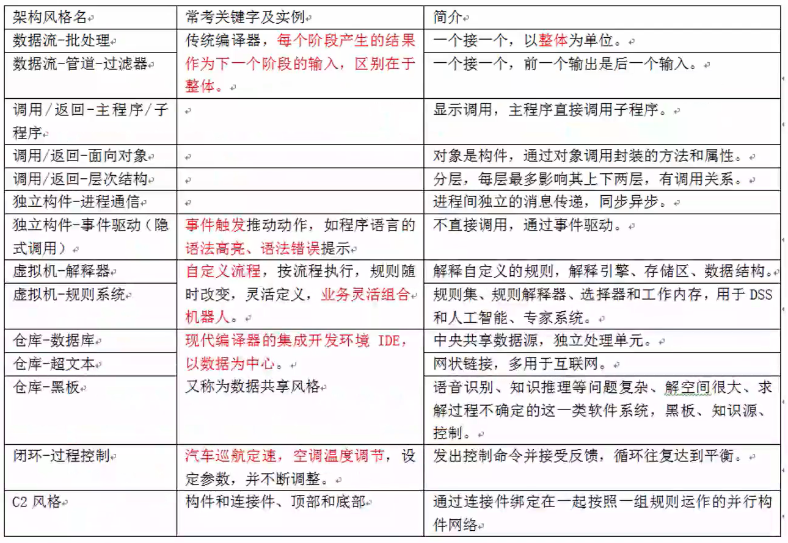

# 软件架构设计案例考点

## 质量属性效用树、质量属性判断
> 掌握质量属性定义、优化策略、典型代表参数。
1. 性能
   - 指系统的响应能力,即要经过多长时间才能对某个事件做出响应,或者在某段时间内系统所能处理的事件的个数。如响应时间、吞吐量。
   - 设计策略: 优先级队列,增加计算资源、减少计算开销、引入并发机制、采用资源调度等。
2. 可靠性
   - 是软件系统在应用或系统错误面前, 在意外或错误使用的情况下维持软件系统的功能特性的基本能力。如MTTF、MTBF。
   - 设计策略:心跳、Ping/Echo 冗余、选举。
3. 可用性
   - 是系统能够正常运行的时间比例,经常用两次故障之间的时间长度或在出现故障时系统能够恢复正常的速度来表示。如故障间隔时间。
   - 设计策略:心跳、Ping/Echo、冗余、选举。
4. 安全性
   - 是指系统在向合法用户提供服务的同时能够阻止非授权用户使用的企图或拒绝服务的能力。如保密性、完整性、不可抵赖性、可控性。
   - 设计策略:入侵检测、用户认证、用户授权、追踪审计。
5. 可修改性
   - 指能够快速的以较高的性能价格比对系统进行变更的能力。通常以某些具体的变更为基准,通过考察这些变更的代价衡量。
   - 设计策略:接口-实现分类、抽象、信息隐藏。
6. 功能性
   - 是系统所能完成所期望的工作的能力。一项任务的完成需要系统中许多或大多数构件的相互协作。
7. 可变性
   - 指体系结构经扩充或变更而成为新体系结构的能力。这种新体系结构应该符合预先定义的规则,在某些具体方面不同于原有的体系结构。当要将某个体系结构作为一系列相关产品的基础时,可变性是很重要的。
8. 互操作性
作为系统组成部分的软件不是独立存在的,**经常与其他系统或自身环境相互作用**。为了支持互操作性,软件体系结构必须为外部可视的功能特性和数据结构提供精心设计的软件入口。程序和用其他编程语言编写的软件系统的交互作用就是互操作性的问题,也影响应用的软件体系结构。

## 必背概念
- 软件架构风格

是指描述特定软件系统组织方式的惯用模式。组织方式描述了系统的组成构件和这些构件的组织方式,惯用模式则反映众多系统共有的结构和语义。

- 架构风险

是指架构设计中潜在的、存在问题的架构决策所带来的隐患。

- 风险点与非风险点

不是以标准专业术语形式出现的,只是一个常规概念,即可能引起风险的因素,可称为风险点。某个做法如果有隐患,有可能导致一些问题,则为风险点;而如果某件事是可行的、可接受的,则为非风险点。

- 敏感点

是指为了实现某种特定的质量属性,一个或多个构件所具有的特性。

- 权衡点

是影响多个质量属性的特性,是多个质量属性的敏感点。

## 架构风格对比
> 所有架构风格汇总如下,要能够看表理清楚每个架构风格的含义,有生疏的再去看上午精华知识点部分详细介绍。

