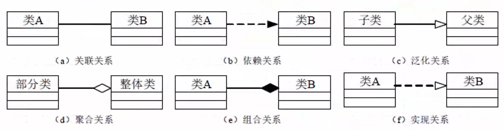
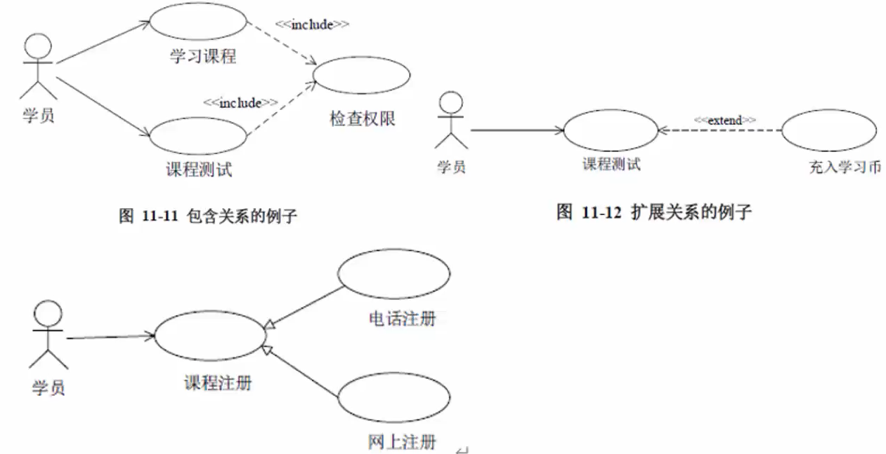
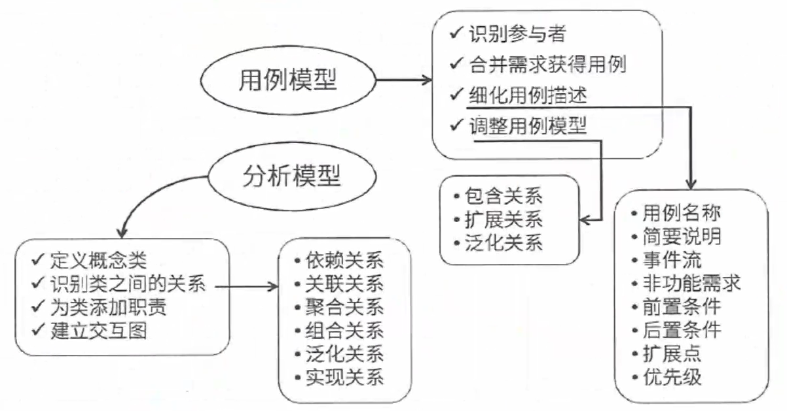
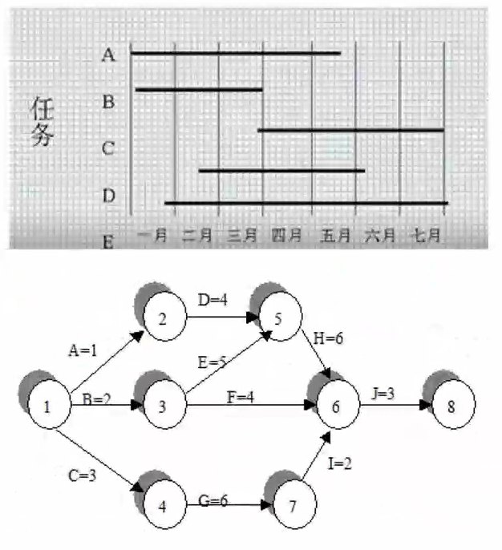
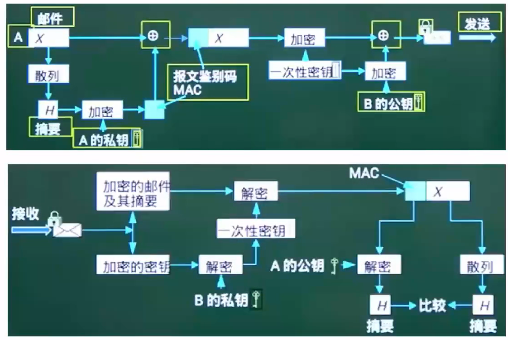

# 系统开发案例考点

- [系统开发案例考点](#系统开发案例考点)
  - [整体情况](#整体情况)
  - [结构化的需求分析](#结构化的需求分析)
  - [面向对象的分析方法](#面向对象的分析方法)
  - [面向对象的分析模型](#面向对象的分析模型)
  - [项目管理](#项目管理)
  - [信息安全](#信息安全)

## 整体情况
主要考点在结构化的需求分析和面向对象的需求分析，主要考建模。

## 结构化的需求分析
- 结构化特点:自顶向下,逐步分解,面向数据。
- 三大模型:**功能模型(数据流图)**、行为模型(状态转换图)、**数据模型(E-R图)**以及数据字典。
- 数据字典:数据字典是在DFD的基础上,对DFD中出现的所有命名元素都加以定义,使得每个图形元素的名字都有一个确切的解释。DFD和数据字典等工具相配合,就可以从图形和文字两个方面对系统的逻辑模型进行完整的描述。
- 数据字典中一般有6类条目,分别是数据元素、数据结构、数据结构、数孜据流、数据存储、加工逻辑和外部实体。不同类型的条目有不同的属性需要描述。

## 面向对象的分析方法
UML关系:依赖、关联、泛化、实现、组合、聚合。

UML图:尤其以用例图、类图、活动图、状态图最为重要。
> 用例图：包含、扩展和泛化关系。

## 面向对象的分析模型

## 项目管理
- PERT(项目评估与评审技术)图是一种图形化的网络模型,描述一个项目中任务和任务之间的关系,每个节点表示一个任务,通常包括任务编号、名称、开始和结束时间、持续时间和松弛时间。
- Gantt图是一种简单的水平条形图,它以一个日历为基准描述项目任务,横坐标表示时间,纵坐标表示任务,图中的水平线段表示对一个任务的进度安排,线段的起点和终点对应在横坐标上的时间分别表示该任务的开始时间和结束时间,线段的长度表示完成该任务所需的时
间。
- PERT图主要描述不同任务之间的依赖关系;Gantt图主
要描述不同任务之间的重叠关系。

- 关键路径:是项目的**最短工期,但却是从开始到结束时间最长的径**。进度网络图中可能有多条关键路径,因为活动会变化,因此关键路径也在不断变化中。
- 关键活动:关键路径上的活动,最早开始时间=最晚开始时间。
- 通常,每个节点的活动会有如下几个时间:
  1. 最早开始时间(ES),某项活动能够开始的最早时间。
  2. 最早结束时间(EF),某项活动能够完成的最早时间。EF=ES+工期
  3. 最迟结束时间(LF)。为了使项目按时完成,某项活动必须完成的最迟时间。
  4. 最迟开始时间(LS)。为了使项目按时完成,某项活动必须开始的最迟时间。L5=LF-工期

- 顺推:最早开始ES=所有前置活动最早完成EF的最大值;最早完成EF=最早开始ES+持续时间。
- 逆推:最晚完成LF=所有后续活动最晚开始LS的最小值;最晚开始LS=最晚完成LF-持续事件
- 总浮动时间(总时差、松弛时差):在不延误项目完工时间且不违反进度制约因素的前提下,活动可以从最早开始时间推迟或拖延的时间量,就是该活动的进度灵活性。正常情况下,关键活动的总浮动时间为零。
- 总浮动时间=最迟开始LS-最早开始ES或最迟完成LF-最早完成EF或关键路径-非关键路径时长。
- 自由浮动时间:是指在不延误任何紧后活动的最早开始时间且不违反进度制约因素的前提下,活动可以从最早开始时间推迟或拖延的时间量。
- 自由浮动时间=紧后活动最早开始时间的最小值-本活动的最早完成时间。

## 信息安全
信息安全:各种加密技术的应用,包括对称加密、非对称加密、信息摘要、数字签名、数字证书等。以PGP为例:
