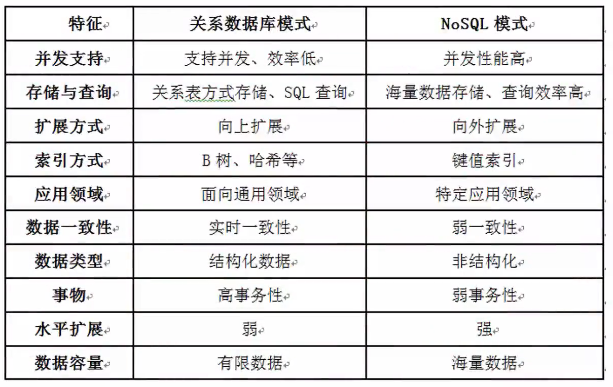
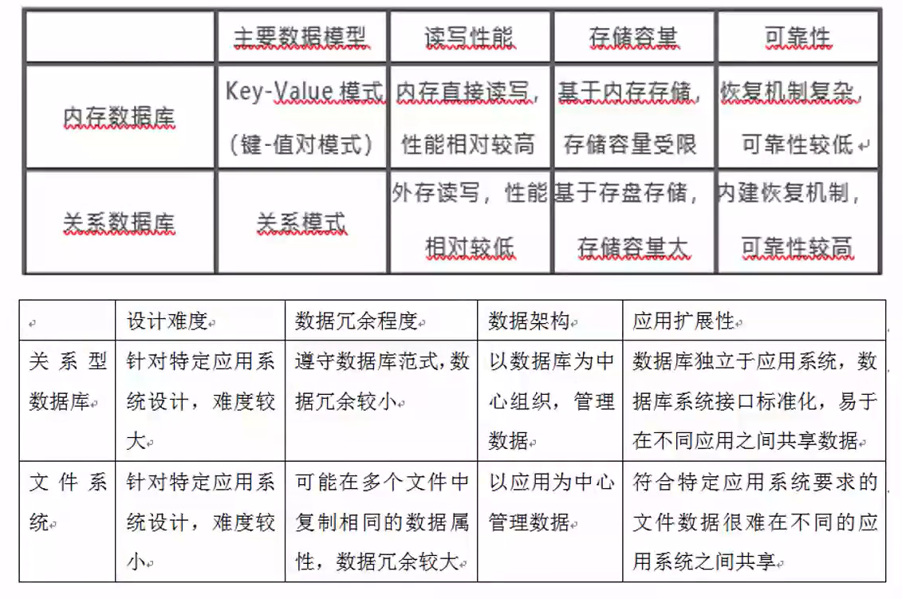
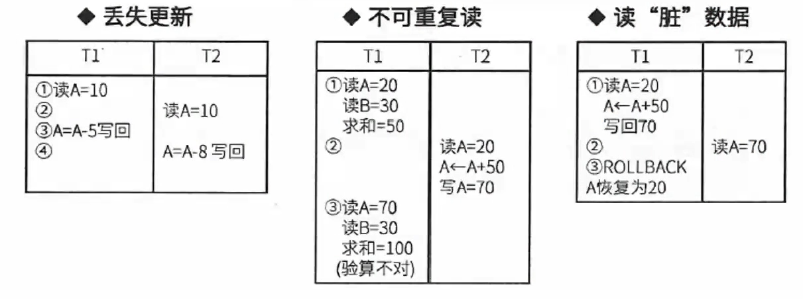

# 数据库案例考点

- [数据库案例考点](#数据库案例考点)
  - [整体情况](#整体情况)
  - [ORM](#orm)
  - [数据库分类与比较](#数据库分类与比较)
    - [缓存技术](#缓存技术)
    - [数据库比较](#数据库比较)
  - [并发控制](#并发控制)
  - [规范化与反规范化](#规范化与反规范化)
  - [分布式数据库](#分布式数据库)
  - [数据仓库](#数据仓库)

## 整体情况
案例分析主要考数据库的一些新技术，数据库结合Web一起考。案例一般考非关系型数据库NoSql、内存型数据库Redis，也会考一些反规范化的技术。

## ORM
- ORM,即Object-Relationl Mapping,它**在关系型数据库和对象之间作一个映射**,这样,我们在具体的操作数据库的时候,就**不需要再去和复杂的SQL语句打交道,只要像平时操作对象一样操作即可**。
- 面向对象编程**把所有实体看成对象(object)**,关系型数据库则是**采用实体之间的关系(relation)连接数据**。很早就有人提出,**关系也可以用对象表达**,这样的话,就能使用面向对象编程,来操作关系型数据库。

- ORM把数据库映射成对象。如:
  - 数据库的表(table)-->类(class)
  - 记录(record,行数据)-->对象(object)
  - 字段(field)-->对象的属性(attribute)

ORM优点：
1. 使用ORM可以大大降低学习和开发成本。
2. 程序员不用再写SQL来进行数据库操作。
3. 减少程序的代码量。
4. 降低由于SQL代码质量差而带来的影响。

ORM缺点：
1. 不太容易处理复杂查询语句。
2. 性能较直接用SQL差。

## 数据库分类与比较
- 关系型数据库:关系数据库,**是建立在关系模型基础上的数据库**,借助集合代数等数学概念和方法来处理数据库中的数据。现实世界中的各种实体以及实体之间的的各种联系均用关系模型来表示。简单说,关系型数据库**是由多张能互相联接的二维行列表格组成的数据库**。
- NoSQL:泛指**非关系型的数据库**。随着互联网的兴起,传统的关系数据库在应付超大规模和高并发的纯动态网站已经显得力不从心,暴露了很多难以克服的问题,而非关系型的数据库则由于其本身的特点得到了非常迅速的发展。NoSQL数据库的产生就是**为了解决大规模数据集合多重数据种类带来的挑战,尤其是大数据应用难题,包括超大规模数据的存储**。
- 内存数据库:**将数据库整体存储在内存中,提高性能**。

### 缓存技术
- MemCache:Memcache是一个**高性能的分布式的内存对象缓存系统**,用于动态Web应用以减轻数据库负载。Memcache**通过在内存里维护一个统一的巨大的hash表**,它能够用来存储**各种格式的数据**,包括图像、规频、文件以及数据库检索的结果等。
- Redis:Redis是一个**开源的使用ANSI C语言编写、支持网络、可基于内存亦可持久化的日志型、Key-Value数据库,并提供多种语言的API**。

- Redis与Memcache的差异
1. Redis和Memcache**都是将数据存放在内存中,都是内存数据库**。他们都支持**key-value数据类型**。同时**Memcache还可用于缓存其他东西**,例如图片、视频等等,Redis还支持list、set、hash等数据结构的存储。
2. **在Redis中,并不是所有的数据都一直存储在内存中的。这是和Memcache相比一个最大的区别**。当物理内存用完时,Redis可以将一些很久没用到的value交换到磁盘。
3. **Redis在很多方面支持数据库的特性,可以这样说他就是一个数据库系统,而Memcache只是简单地K/V缓存**。

### 数据库比较

## 并发控制
- **丢失更新**:事务1对数据A进行了修改并写回,事务2也对A进行了修改并写回,此时事务2写回的数据会覆盖事务1写回的数据,就丢失了事务1对A的更新。即对数据A的更新会被覆盖。
- **不可重复读**:事务2读A,而后事务1对数据A进行了修改并写回,此时若事务2再读A,发现数据不对。即一个事务重复读A两次,会发现数据A有误。
- **读脏数据**:事务1对数据A进行了修改后,事务2读数据A,而后事务1回滚,数据A恢复了原来的值,那么事务2对数据A做的事是无效的,读到了脏数据。

## 规范化与反规范化
不规范化带来的四大问题

设有一个关系模式R(SNAME,CNAME,TNAME,TADDRESS),其属性分别表示学生姓名、选修的课程名、任课教师姓名和任课教师地址。仔细分析一下,就会发现这个模式存在下列存储异常的问题:
1. **数据冗余**:数据被重复存储,如某门课程有100个学生选修,那么在R的关系中就要出现100个元组,这门课程的任课教师姓名和地址也随之重复出现1000次。
2. **修改异常**:修改导致数据不一致,如由于上述冗余问题,当需要修改这个教师的地址时,就要修改100个元组中的地址值,否则就会出现地址值不一致的现象。
3. **插入异常**:插入时异常,如不知道听课学生名单,这个教师的任课情况和家庭地址就无法进入数据库。
4. **删除异常**:删除了不该删除的数据,如当只有一条记录时,要删除这个学生选课信息,会将课程名、教师名和教师地址都给删除了。

反规范化技术:规范化设计后,数据库设计者希望**牺牲部分规范化来提高性能**。

采用反规范化技术的**益处:降低连接操作的需求、降低外码和索引的数目,还可能减少表的数目,能够提高查询效率**。

可能带来的问题:数据的**重复存储**,浪费了磁盘空间;可能出现数据的**完整性问题**,为了保障数据的一致性,增加了数据维护的复杂性,**会降低修改速度**。

具体方法:
1. 增加冗余列:在多个表中保留相同的列,通过增加数据冗余减少或避免查询时的连接操作。
2. 增加派生列:在表中增加可以由本表或其它表中数据计算生成的列,减少查询时的连接操作并避免计算或使用集合函数。
3. 重新组表:如果许多用户需要查看两个表连接出来的结果数居,则把这两个表重新组成一个表来减少连接而提高性能。
4. 水平分割表:根据一列或多列数据的值,把数据放到多个独立的表中,主要用于表数据规模很大、表中数据相对独立或数据需要存放到多个介质上时使用。
5. 垂直分割表:对表进行分割,将主键与部分列放到一个表中,主键与其它列放到另一个表中,在查询时减少I/O次数。

## 分布式数据库
分布式数据库是由一组数据组成的,这组**数据分布在计算机网络的不同计算机上**,网络中的**每个节点真有独立处理的能力(称为场地自治)**,它可以执行局部应用,同时,**每个节点也能通过网络通信子系统执行全局应用**。分布式数据库系统是在集中式数据库系统技术的基础上发展起来的,具有如下特点:
1. **数据独立性**。在分布式数据库系统中,数据独立性这一特性更加重要,并具有更多的内容。除了数据的逻辑独立性与物理独立性外,还有数据分布独立性(分布透明性)。
2. **集中与自治共享结合的控制结构**。各局部的DBMS可以独立地管理局部数据库,具有自治的功能。同时,系统又设有集中控制机制,协调各局部DBMS的工作,执行全局应用。
3. **适当增加数据冗余度**。在不同的场地存储同一数据的多个副本,这样,可以提高系统的可靠性和可用性,同时也能提高系统性能。
4. **全局的一致性、可串行性和可恢复性**。

分布式数据库的优点:
1. 分布式数据库可以解决企业部门分散而数据需要相互联系的问题。
2. 如果企业需要增加新的相对自主的部门来扩充机构,则分布式数据库系统可以在对当前机构影响最小的情况下进行扩充。
3. 分布式数据库可以满足负载均衡的需要。
4. 当企业已存在几个数据库系统,而且实现全局应用的必要性增加时,就可以由这些数据库自下而上构成分布式数据库系统。
5. 相等规模的分布式数据库系统在出现故障的概率上不会比集中式数据库系统低,但由于其故障的影响仅限于局部数据应用,因此,就整个系统来说,它的可靠性是比较高的。

## 数据仓库
数据仓库集成是把多种来源的数据集中在一起,建立数据仓库,所有数据都驻留在单个数据库服务器上,配置大型处理器和存储容量。数据仓库主要用于决策支持,在数据处理过程中强调分析。其特点是:
1. 集成的数据。
2. 面向主题。
3. 数据相对稳定。
4. 包含历史信息。

数据仓库的结构通常包含四个层次:
1. **数据源**:是数据仓库系统的基础,是整个系统的数据源泉。
2. **数据的存储与管理**:是整个数据仓库系统的核心。
3. **OLAP(联机分析处理)服务器**:对分析需要的数据进行有效集成,按多维模型组织,以便进行多角度、多层次的分析,并发现趋势。
4. **前端工具**:主要包括各种报表工具、查询工具、数据分析工具、数据挖掘工具以及各种基于数据仓库或数据集市的应用开发工具。

商业智能:BI系统主要包括数据预处理、建立数据仓库、数据分析和数据展现四个主要阶段。
