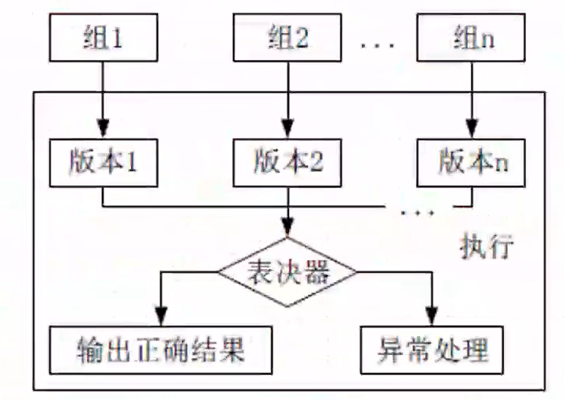

# 嵌入式系统案例考点

- [嵌入式系统案例考点](#嵌入式系统案例考点)
  - [整体情况](#整体情况)
  - [相关概念](#相关概念)
  - [提高可靠性的技术](#提高可靠性的技术)

## 整体情况
几乎每年必考一题,选做题,考察比较的多的是嵌入式系统的实时性和可可靠性以及容错等概念。大概率会考到一些嵌入式领域陌生技术,如果是完全没见过的技术,不选即可。

## 相关概念
- 系统可靠性是系统在规定的时间内及规定的环境条件下,完成规定功能的能力,也就是系统无故障运行的概率。
- 系统可用性是指在某个给定时间点上系统能够按照需求执行的概率。
- 可靠度就是系统在规定的条件下、规定的时间内不发生失效的概摔。
- 失效率又称风险函数,也可以称为条件失效强度,是指运行至此刻系统未出现失效的情况下,单位时间系统出现失效的概率。

- 软件可靠性和硬件可靠性区别
  - 复杂性:软件复杂性比硬件高,大部分失效来自于软件失效。
  - 物理退化:硬件失效主要是物理退化所致,软件不存在物理退化。
  - 唯一性:软件是唯一的,每个COPY版本都一样,而两个硬件不可能完全一样
  - 版本更新周期:硬件较慢,软件较快。

## 提高可靠性的技术
提高系统可靠性的技术可以分为避错(排错)技术和容错技术：
- 避错是通过技术评审、系统测试和正确性证明等技术,在系统正式运行之前避免、发现和改正错误。
- 容错是指系统在运行过程中发生一定的硬件故障或软件错误!时,仍能保持正常工作而不影响正确结果的一种性能或措施。容错技术主要是采用冗余方法来消除故障的影响。

冗余是指在正常系统运行所需的基础上加上一定数量的资源,包括信息、时间、硬件和软件。冗余是容错技术的基础,通过冗余资源的加入,可以使系统的可靠性得到较大的提高。主要的冗余技术有结构冗余(静态、动态、混合)、信息冗余、时间冗余和冗余附加4种。

软件容错的主要方法是提供足够的冗余信息和算法程序,使系统在实际运行时能够及时发现程序设计错误,采取补救措施,以提高系统可靠性,保证整个系统的正常运行。

软件容错技术主要有N版本程序设计、恢复块方法和防卫式程序设计等。
- N版本程序设计:其设计思想是用N个具有相同功能的程序同时执行一项计算,结果通过多数表决来选择。其中N个版本的程序必须由不同的人独立设计,使用不同的方法、设计语言、开发环境和工具来实现,目的是减少N个版本的程序在表决点上相关错误的概率。

- 恢复块设计(动态冗余):动态冗余又称为主动冗余,它是通过故障检测、故障定位及故障恢复等手段达到容错的目的。其主要方式是多重模块待机储备,当系统检测到某工作模块出现错误时,就用一个备用的模块来替代它并重新运行。各备用模块在其待机时,可与主模块一样工作,也可以不工作。前者叫热备份系统(双重系统),后者叫冷备份系统(双工系统、双份系统)。

- 防卫式程序设计:是一种不采用任何传统的容错技术就能实现软件容错的方法,对于程序中存在的错误和不一致性,防卫式程序设计的基本思想是通过在程序中包含错误检查代码和错误恢复代码,使得一旦发生错误,程序就能撤销错误状态,恢复到一个已知的正确状态中去。其实现策略包括错误检测、破坏估计和错误恢复三个方面。

**双机容错技术**:是一种软硬件结合的容错应用方案。该方案是由两台服务子器和一个外接共享磁盘阵列及相应的双机软件组成。

双机容错系统采用"心跳"方法保证主系统与备用系统的联系。所谓谓心跳,是指主从系统之间相互按照一定的时间间隔发送通信信号,表明各自系统当前的运行状态。一旦心跳信号表明主机系统发生故障,或者备用系统无法收到主系统的心跳信号,则系统的为高可用性管理软件认为主系统发生故障,立即将系统资源转移到备用系统上,备用系统替代主系统工作,以保证系统正常运行和网络服务不间断。

工作模式:双机热备模式;双机互备模式;双机双工模式。

**集群技术**就是将多台计算机组织起来进行协同工作,它是提高系统可用性和可靠性的一种技术。在集群系统中,每台计算机均承担部分计算任务和容错任务,当其中一台计算机出现故障时,系统使用集群软件将这台计算机从系统中隔出离去,通过各计算机之间间的负载转嫁机制完成新的负载分担,同时向系统管理人员发出警报。集群系统通过功能整合和故障过渡,实现了系统的高可用性和可靠性。

特点:可伸缩性、高可用性、可管理性、高性价比、高透明性。

分类:高性能计算集群、负载均衡集群、高可用性集群。

**负载均衡**是集群系统中的一项重要技术,可以提高集群系统的整体处理能力,也提高了系统的可靠性,最终目的是加快集群系统的响应速度,提高客户端访问的成功概率。集群的最大特征是多个节点的并行和共同工作,如何让所有节点承受的负荷平均,不出现局部过大负载或过轻负载的情况,是负载均衡的重要目的。比较常用的负载均衡实现技术主要有以下几种:
1. 基于特定软件的负载均衡(应用层)。很多网络协议都支持重定向功能,例如,基于HTTP重定向服务,其主要原理是服务器使用HTTP重定向指令,将一个客户端重重新定位到另一个位置。服务器返回一个重定向响应,而不是返回请求的对象。客户端确认新地址然后重发请求,从而达到负载均衡的目的。
2. 基于DNS的负载均衡属于传输层负载均衡技术,其主要原理是在DNS服务器中为同一个主机名配置多个地址,在应答DNS查询时,DNS服务器对每个查询将以DNS文件中主机记录的IP地址按顺序返回不同的解析结果,将客户端的访问引导到不同的节点上去,使得不同的客户端访问不同的节点,从而达到负载均衡的目的。
3. 基于NAT的负载均衡。将一个外部IP地址映射为多个内部IP地址,对每次连接需求动态地转换为一个内部节点的地址,将外部连接请求引到转换得到地址的那个节点,上从而达到负载均衡的目的目的。
4. 反向代理负载均衡。将来自Internet上的连接请求以反向代理的方式动态地转发给内部网络上的多个节点进行处理,从而达到负载均衡的目的。
5. 混合型负载均衡。
