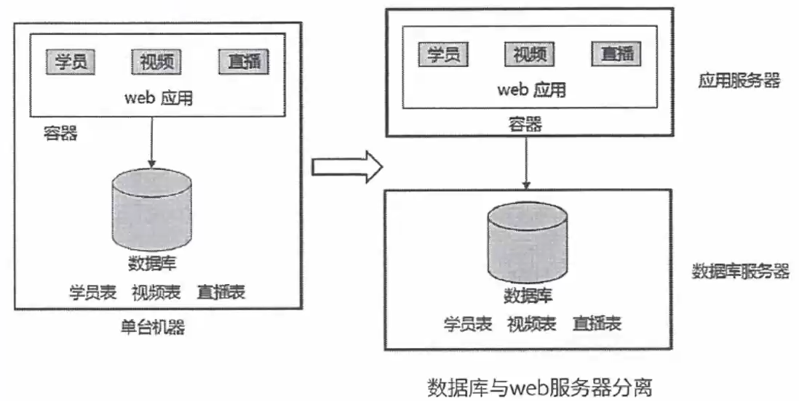
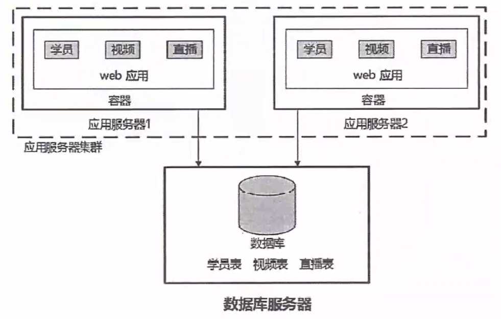
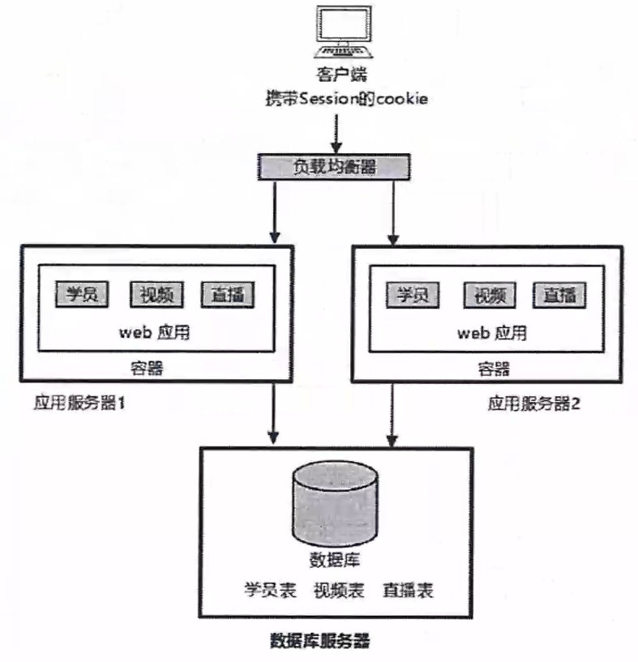
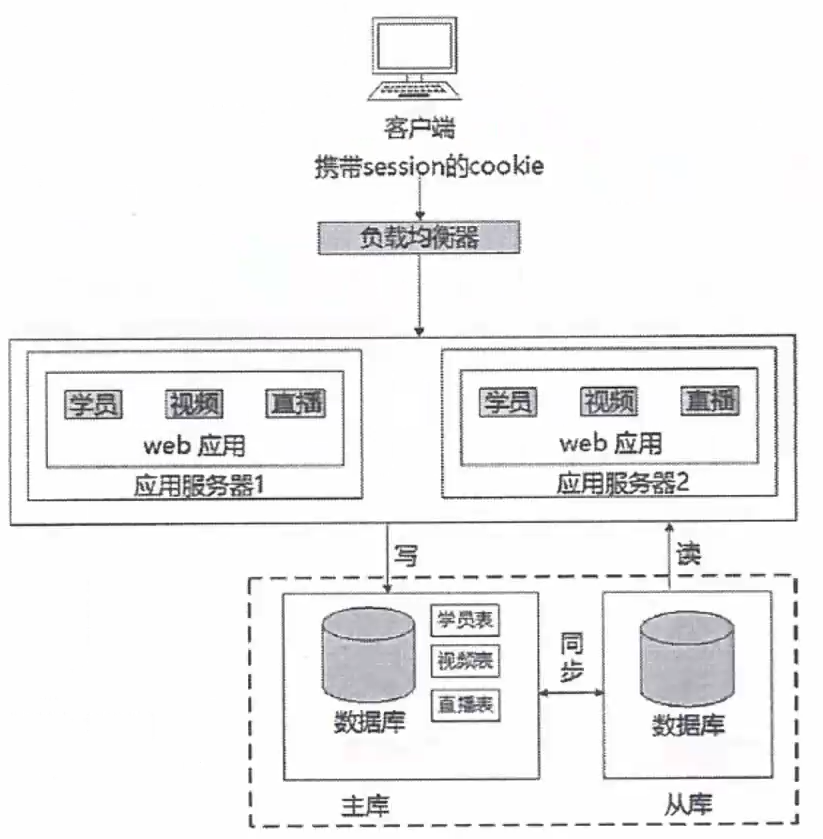
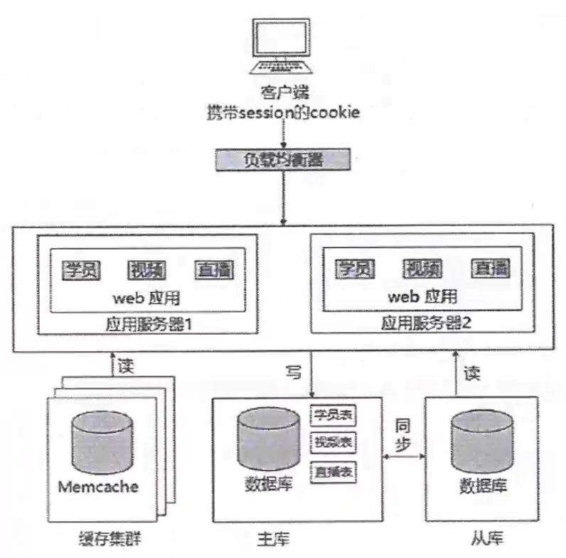

# Web应用开发案例考点

- [Web应用开发案例考点](#web应用开发案例考点)
  - [整体情况](#整体情况)
  - [Web应用技术分类](#web应用技术分类)
  - [Web技术演变](#web技术演变)
  - [CDN](#cdn)
  - [REST(表述性状态传递)](#rest表述性状态传递)
  - [微服务](#微服务)
  - [XML和JSON](#xml和json)
  - [有/无状态服务与响应式](#有无状态服务与响应式)

## 整体情况
可能结合架构、数据库一起考，也可能会考一些新技术。

## Web应用技术分类
- 从架构来看:**MVC, MVP, MVVM, REST, Webservice, 微服务**。
- 从缓存来看:**MemCache, Redis, Squid**。
- 从并发分流来看:**集群(负载均衡)、CDN**。
- 从数据库来看:**主从库(主从复制), 内存数据库, 反规范化技术, NOSQL, 分区(分表)技术, 视图**。
- 从持久化来看:Hibernate, Mybatis。
- 从分布存储来看:Hadoop, FastDFS, 区块链。
- 从数据编码看:**XML, JSON**。
- 从Web应用服务器来看:Apache, WebSphere, Weblogic, Tomcat, JBOSS, IIS.
- 其它:**有状态与无状态, 响应式Web设计**。

## Web技术演变
- 单台机器到数据库与Web服务器分离

- 应用服务器集群,存在问题:用户的请求由谁来转发到具体的应用服务器;用户如果每次访问到的服务器不一样,那么如何维护session的为一致性。

  - 采用负载均衡技术:
    
- 数据库集群:分为主从库

- 用缓存缓解库读取压力

## CDN
CDN的全称是Content Delivery Network,即**内容分发网络**。

CDN是构建在网络之上的内容分发网络,依靠部署在各地的边缘服务器,通过中心平台的负载均衡、内容分发、调度等功能模块,使用户就近获取所需内容,降低网络拥塞,提高用户访问响应速度和命中率。CDN的关键技术主要有内容存储和分发技术。

CDN的基本原理是广泛采用各种缓存服务器,将这些缓存服务器分布到用户访问相对集中的地区或网络中,在用户访问网站时,利用全局负载技术将用户的访问指向距离最近的工作正常的缓存服务器上,由缓存服务器直接响应用户请求。

## REST(表述性状态传递)
REST(Representational State Transfer,表述性状态转移)是一种中只使用HTTP和XML进行基于Web通信的技术,可以降低开发的复杂性,提高系统的可伸缩性。

REST的5个原则：
1. 网络上的所有事物都被抽象为资源。
2. 每个资源对应一个唯一的资源标识。
3. 通过通用的连接件接口对资源进行操作。
4. 对资源的各种操作不会改变资源标识。
5. 所有的操作都是无状态的。

## 微服务
微服务架构建议将大型复杂的单体架构应用划分为一组微小的服务,每个微服务根据其负责的具体业务职责提炼为单一的业务功能;每个服务可以很容易地部署并发布到生产环境里隔离和独立的进程内部,它可以很容易地扩展和变更;对于一个具体的服务来说可以采用任何适用的语言和工具来快速实现;服务之间基于基础设施互相协同工作。

微服务的优势:
1. 解决了复杂性问题。它把庞大的单一模块应用分解为一系列的服务,同时保持总体功能不变。
2. 让每个服务能够独立开发,开发者能够自由选择可行的技术,让服务来决定API约定。
3. 每个微服务都能独立配置,开发者不必协调对于本地服务配置上的变化，这种变化一旦测试完成就被配置了。
4. 让每个服务都可以独立调整,你可以给每个服务配置正好满足容量和可用性限制的实例数。

微服务架构带来的挑战:
1. 并非所有的系统都能转成微服务。例如一些数据库层的底层操作是不推荐服务化的。
2. 部署较以往架构更加复杂:系统由众多微服务搭建,每个微服务需要单独部署,从而增加部署的复杂度,容器技术能够解决这一问题。
3. 性能问题:由于微服务注重独立性,互相通信时只能通过标准接口,可能产生延迟或调用出错。例如一个服务需要访问另一个服务的数据,只能通过服务间接口来进行数据传输,如果是频繁访问,则可能带来较大的延迟。
4. 数据一致性问题:作为分布式部署的微服务,在保持数据一致性方面需要比传统架构更加困难。

## XML和JSON
扩展标记语言(Extensible Markup Language,XML),用于标记电子文件使其具有结构性的标记语言,可以用来标记数据、定义数据类型,是一种允许用户对自己的标记语言进行定义的源语言。

XML的优点：
- 格式统一,符合标准;
- 容易与其他系统选行远程交互,数据共享比较方便。

XML的缺点：
- XML文件庞大,文件格式复杂,传输占带宽;
- 服务器端和客户端都需要花费大量代码来解析XML,导致服务器瑞和客户端代码变得异常复杂且不易维护;
- 客户端不同浏览器之间解析XML的方式不一致,需要重复编写很多代码;

JSON(JavaScript Object Notation)一种轻量级的数据交换格式具有良好的可读和便于快速编写的特性。可在不同平台之间进行数据交换。

JSON的优点
- 数据格式比较简单,易于读写,格式都是压缩的,占用带宽小;
- 易于解析,客户端JavaScript可以简单的通过eval()进行JSON数据的类取;
- 支持多种语言,包括ActionScript,C,C#,ColdFusion,Java,Javascript, Perl,PHP,Python,Ruby等服务器端语言,便于服务器端的解析;
- 因为JSON格式能直接为服务器端代码使用,大大简化了服务器端和客户端的代码开发量,旦完成任务不变,并且易于维护。

JSON的缺点：
- 没有XML格式这么推广的深入人心和使用广泛,没有XML那么通用性

## 有/无状态服务与响应式
无状态服务(stateless service)对单次请求的处理,不依赖其他请求也就是说,处理一次请求所需的全部信息,要么都包含在这个请求里,要么可以从外部获取到(比如说数据库),服务器本身不存储任何信息。

有状态服务(stateful service)则相反,它会在自身保存一些数据,先后的请求是有关联的。

响应式web设计:是一种网络页面设计布局,其理念是:集中创建页面的图片排版大小,可以智能地根据用户行为以及使用的设备环境进行相对应的布局。

方法与策略
1. 采用流式布局和弹性化设计:使用相对单位,设定百分比而非具体直的方式设置页面元素的大小。
2. 响应式图片:不仅要同比的缩放图片,还要在小设备上降低图片自身的分辨率。
